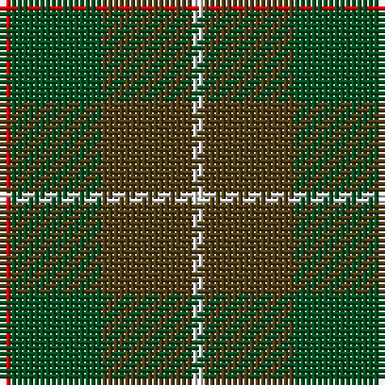

This page is one **sett** — a single exact thread-count. It belongs to the [tartan](/tartans/r1g8t8ln1/)
(the same proportion at any scale), whose colour order is pattern [RGGW](/stripes/rggw/).

Sourced from register-of-tartans.  It is a [4 stripe tartan](/stripes/stripes4/).

Original link https://www.tartanregister.gov.uk/tartanDetails.aspx?ref=2556

## Also known as

This cloth is also recorded under:

- MacKinnon Hunting #2

## Register references

External register numbers recorded for this tartan.

- Scottish Register of Tartans: [2556](https://www.tartanregister.gov.uk/tartanDetails.aspx?ref=2556)
- Scottish Tartans World Register: 1542

## Thread count
R/2 G16 T16 LN/2

## Palette
Each colour and the base-6 reference it is a variant of.

| Colour | Shade | Base |
|---|---|---|
| G | <code style="background-color:#005020;">#005020</code> `oklch(37.7% 0.105 149.6)` <small>#005020</small> | G <code style="background-color:#006100;">#006100</code> |
| LN | <code style="background-color:#E0E0E0;">#E0E0E0</code> `oklch(90.7% 0.000 89.9)` <small>#E0E0E0</small> | W <code style="background-color:#F7F7F7;">#F7F7F7</code> |
| R | <code style="background-color:#DC0000;">#DC0000</code> `oklch(56.2% 0.230 29.2)` <small>#DC0000</small> | R <code style="background-color:#CC0000;">#CC0000</code> |
| T | <code style="background-color:#503C14;">#503C14</code> `oklch(37.0% 0.062 81.8)` <small>#503C14</small> | G <code style="background-color:#006100;">#006100</code> |

# Sample pattern

## Nearest tartans

The nearest existing variants by ΔTartan distance, with this tartan at the top so the swatches line up against it.

ΔTartan

Tartan

Sett

—

<a href="/ttd/edit/#slug=r1dg8dy8w1~x2">MacKinnon Hunting #2</a> <a class="nn-out" href="/setts/s4/r1dg8dy8w1~x2/" title="open its dictionary page">↗</a>

0.70

<a href="/ttd/edit/#slug=r1g8dy8w1~x2">MacKinnon Hunting (Var) Clan Tartan Tartan Number: 1542. Earliest known date: pre 2003 Two times actual count given in letter from MacKinnon of MacKinnon 1908 as 'the Composition of the MacKinnon tartan...' See products available Copyright © Blair Urquhart, Comrie, 2015</a> <a class="nn-out" href="/setts/s4/r1g8dy8w1~x2/" title="open its dictionary page">↗</a>

1.31

<a href="/ttd/edit/#slug=r1g8o8w1~x2">MacKinnon, hunting</a> <a class="nn-out" href="/setts/s4/r1g8o8w1~x2/" title="open its dictionary page">↗</a>

1.39

<a href="/ttd/edit/#slug=dg15r3n11b2~x2">MacNab WI 2</a> <a class="nn-out" href="/setts/s4/dg15r3n11b2~x2/" title="open its dictionary page">↗</a>

1.39

<a href="/ttd/edit/#slug=dg15r3n11b2">MacNab WI2</a> <a class="nn-out" href="/setts/s4/dg15r3n11b2/" title="open its dictionary page">↗</a>

1.54

<a href="/ttd/edit/#slug=dy46g23b23r4ly4~x2">McMoosie Htg (Fashion)</a> <a class="nn-out" href="/setts/s5/dy46g23b23r4ly4~x2/" title="open its dictionary page">↗</a>

1.65

<a href="/ttd/edit/#slug=dg14r3db9t2~x2">Unidentified #4</a> <a class="nn-out" href="/setts/s4/dg14r3db9t2~x2/" title="open its dictionary page">↗</a>

1.68

<a href="/ttd/edit/#slug=dt1dy1dt7dy5y7lr1~x4">Dewar (WCWM)</a> <a class="nn-out" href="/setts/s6/dt1dy1dt7dy5y7lr1~x4/" title="open its dictionary page">↗</a>

1.68

<a href="/ttd/edit/#slug=dg6ly3dg26k10n30lb3~x2">Montrose (1983)</a> <a class="nn-out" href="/setts/s6/dg6ly3dg26k10n30lb3~x2/" title="open its dictionary page">↗</a>

1.71

<a href="/ttd/edit/#slug=dg15r3db11t2~x2">MacNab</a> <a class="nn-out" href="/setts/s4/dg15r3db11t2~x2/" title="open its dictionary page">↗</a>

1.72

<a href="/ttd/edit/#slug=lo5y33dg33r6w2~x2">Symington</a> <a class="nn-out" href="/setts/s5/lo5y33dg33r6w2~x2/" title="open its dictionary page">↗</a>

## Neighbour map

Every grey dot is one of 14299 variants placed by the first two principal components of the ΔTartan feature space (44% of its variance). Red is this tartan; blue dots are its nearest — click one to open its page.

<svg viewBox="0 0 640 380" role="img" style="max-width:100%;height:auto;border:1px solid #e0e0e0;border-radius:4px;display:block" xmlns="http://www.w3.org/2000/svg"><image href="/nn/cloud.v1.png" width="640" height="380"/><a href="/setts/s4/r1g8dy8w1~x2/"><circle cx="305.6" cy="273.0" r="4" fill="#3465a4"><title>MacKinnon Hunting (Var) Clan Tartan Tartan Number: 1542. Earliest known date: pre 2003 Two times actual count given in letter from MacKinnon of MacKinnon 1908 as 'the Composition of the MacKinnon tartan...' See products available Copyright © Blair Urquhart, Comrie, 2015</title></circle></a><a href="/setts/s4/r1g8o8w1~x2/"><circle cx="301.8" cy="267.7" r="4" fill="#3465a4"><title>MacKinnon, hunting</title></circle></a><a href="/setts/s4/dg15r3n11b2~x2/"><circle cx="335.6" cy="299.8" r="4" fill="#3465a4"><title>MacNab WI 2</title></circle></a><a href="/setts/s4/dg15r3n11b2/"><circle cx="335.6" cy="299.8" r="4" fill="#3465a4"><title>MacNab WI2</title></circle></a><a href="/setts/s5/dy46g23b23r4ly4~x2/"><circle cx="283.5" cy="238.9" r="4" fill="#3465a4"><title>McMoosie Htg (Fashion)</title></circle></a><a href="/setts/s4/dg14r3db9t2~x2/"><circle cx="292.1" cy="284.5" r="4" fill="#3465a4"><title>Unidentified #4</title></circle></a><a href="/setts/s6/dt1dy1dt7dy5y7lr1~x4/"><circle cx="256.2" cy="272.5" r="4" fill="#3465a4"><title>Dewar (WCWM)</title></circle></a><a href="/setts/s6/dg6ly3dg26k10n30lb3~x2/"><circle cx="254.3" cy="228.2" r="4" fill="#3465a4"><title>Montrose (1983)</title></circle></a><a href="/setts/s4/dg15r3db11t2~x2/"><circle cx="282.7" cy="277.8" r="4" fill="#3465a4"><title>MacNab</title></circle></a><a href="/setts/s5/lo5y33dg33r6w2~x2/"><circle cx="305.9" cy="219.0" r="4" fill="#3465a4"><title>Symington</title></circle></a><circle cx="309.1" cy="277.8" r="5" fill="#c00000"/></svg>

ID: /setts/s4/r1dg8dy8w1~x2/
