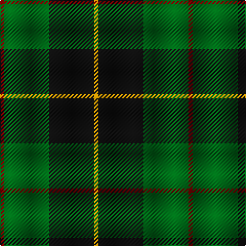

This page is one **sett** — a single exact thread-count. It belongs to the [tartan](/tartans/r1g11k11lo1/)
(the same proportion at any scale), whose colour order is pattern [RGKY](/stripes/rgky/).

Sourced from tartans-authority.  It is a [4 stripe tartan](/stripes/stripes4/).

Original link http://www.tartansauthority.com/tartan-ferret/display/3736/

2 attestations — the source records this cloth was collapsed from (oldest owns this page)

<ul>
<li>pre 2002 — Brooks Brothers (Corporate) (tartans-authority, <a href="http://www.tartansauthority.com/tartan-ferret/display/3736/">record</a>)</li>
<li>undated — Brooks Brothers (register-of-tartans, <a href="https://www.tartanregister.gov.uk/tartanDetails.aspx?ref=5378">record</a>)</li>
</ul>

## Register references

External register numbers recorded for this tartan.

- Scottish Register of Tartans: [5378](https://www.tartanregister.gov.uk/tartanDetails.aspx?ref=5378)
- Scottish Tartans Authority (ITI): 3736

## Thread count
DR/4 G44 K44 DY/4

## Palette

Palette: <strong>Tartan Register</strong> <small style="color:#888">(3 of 4 colours)</small>
<table><thead><tr><th>Colour</th><th>Threads</th><th>Shade</th><th>Base</th><th>OKLCh</th></tr></thead><tbody><tr><td>DR/</td><td style="text-align:right;font-variant-numeric:tabular-nums">4</td><td><code style="background-color:#880000;">#880000</code> <small style="color:#888">#880000</small></td><td>R <code style="background-color:#CC0000;">#CC0000</code></td><td><small style="color:#888">oklch(39.4% 0.162 29.2)</small></td></tr><tr><td>G</td><td style="text-align:right;font-variant-numeric:tabular-nums">44</td><td><code style="background-color:#006818;">#006818</code> <small style="color:#888">#006818</small></td><td>G <code style="background-color:#006100;">#006100</code></td><td><small style="color:#888">oklch(45.0% 0.142 145.0)</small></td></tr><tr><td>K</td><td style="text-align:right;font-variant-numeric:tabular-nums">44</td><td><code style="background-color:#101010;">#101010</code> <small style="color:#888">#101010</small></td><td>K <code style="background-color:#000000;">#000000</code></td><td><small style="color:#888">oklch(17.3% 0.000 89.9)</small></td></tr><tr><td>DY/</td><td style="text-align:right;font-variant-numeric:tabular-nums">4</td><td><code style="background-color:#D09800;">#D09800</code> <small style="color:#888">#D09800</small></td><td>Y <code style="background-color:#F2BF00;">#F2BF00</code></td><td><small style="color:#888">oklch(71.4% 0.147 82.1)</small></td></tr></tbody></table>

# Sample pattern

## Nearest tartans

The nearest existing variants by ΔTartan distance, with this tartan at the top so the swatches line up against it.

ΔTartan

Tartan

Sett

—

<a href="/ttd/edit/#slug=r1g11k11lo1~x4">Brooks Brothers (Corporate)</a> <a class="nn-out" href="/setts/s4/r1g11k11lo1~x4/" title="open its dictionary page">↗</a>

0.80

<a href="/ttd/edit/#slug=k6db4g44k41w4~x2">Douglas (alternative threadcount)</a> <a class="nn-out" href="/setts/s5/k6db4g44k41w4~x2/" title="open its dictionary page">↗</a>

0.82

<a href="/ttd/edit/#slug=k6g4g44k41w4~x2">Raeside</a> <a class="nn-out" href="/setts/s5/k6g4g44k41w4~x2/" title="open its dictionary page">↗</a>

0.85

<a href="/ttd/edit/#slug=g3r1k14g14lo1~x4">Wcwm 1255</a> <a class="nn-out" href="/setts/s5/g3r1k14g14lo1~x4/" title="open its dictionary page">↗</a>

1.09

<a href="/ttd/edit/#slug=k8lo1k8dg13r2~x4">Tolmie</a> <a class="nn-out" href="/setts/s5/k8lo1k8dg13r2~x4/" title="open its dictionary page">↗</a>

1.12

<a href="/ttd/edit/#slug=r3g30k12g6k16ly2~x2">MacArthur (Variant)</a> <a class="nn-out" href="/setts/s6/r3g30k12g6k16ly2~x2/" title="open its dictionary page">↗</a>

1.16

<a href="/ttd/edit/#slug=k6db4dg44k41w4~x2">Douglas (Clan)</a> <a class="nn-out" href="/setts/s5/k6db4dg44k41w4~x2/" title="open its dictionary page">↗</a>

1.32

<a href="/ttd/edit/#slug=k5g40db20ly3~x2">Robert Byers Family - Dooballagh, Ireland</a> <a class="nn-out" href="/setts/s4/k5g40db20ly3~x2/" title="open its dictionary page">↗</a>

1.34

<a href="/ttd/edit/#slug=r3k9g20k16g7b3~x2">Holman (Personal)</a> <a class="nn-out" href="/setts/s6/r3k9g20k16g7b3~x2/" title="open its dictionary page">↗</a>

1.36

<a href="/ttd/edit/#slug=k7w1g7t1~x2">Wilson's No.079</a> <a class="nn-out" href="/setts/s4/k7w1g7t1~x2/" title="open its dictionary page">↗</a>

1.41

<a href="/ttd/edit/#slug=k30lb7g36k5~x2">Innes Hunting</a> <a class="nn-out" href="/setts/s4/k30lb7g36k5~x2/" title="open its dictionary page">↗</a>

## Neighbour map

Every grey dot is one of 14299 variants placed by the first two principal components of the ΔTartan feature space (44% of its variance). Red is this tartan; blue dots are its nearest — click one to open its page.

<svg viewBox="0 0 640 380" role="img" style="max-width:100%;height:auto;border:1px solid #e0e0e0;border-radius:4px;display:block" xmlns="http://www.w3.org/2000/svg"><image href="/nn/cloud.v1.png" width="640" height="380"/><a href="/setts/s5/k6db4g44k41w4~x2/"><circle cx="293.3" cy="222.6" r="4" fill="#3465a4"><title>Douglas (alternative threadcount)</title></circle></a><a href="/setts/s5/k6g4g44k41w4~x2/"><circle cx="289.7" cy="220.9" r="4" fill="#3465a4"><title>Raeside</title></circle></a><a href="/setts/s5/g3r1k14g14lo1~x4/"><circle cx="337.7" cy="223.3" r="4" fill="#3465a4"><title>Wcwm 1255</title></circle></a><a href="/setts/s5/k8lo1k8dg13r2~x4/"><circle cx="307.7" cy="245.6" r="4" fill="#3465a4"><title>Tolmie</title></circle></a><a href="/setts/s6/r3g30k12g6k16ly2~x2/"><circle cx="319.5" cy="213.9" r="4" fill="#3465a4"><title>MacArthur (Variant)</title></circle></a><a href="/setts/s5/k6db4dg44k41w4~x2/"><circle cx="317.9" cy="235.7" r="4" fill="#3465a4"><title>Douglas (Clan)</title></circle></a><a href="/setts/s4/k5g40db20ly3~x2/"><circle cx="353.5" cy="237.3" r="4" fill="#3465a4"><title>Robert Byers Family - Dooballagh, Ireland</title></circle></a><a href="/setts/s6/r3k9g20k16g7b3~x2/"><circle cx="252.3" cy="262.9" r="4" fill="#3465a4"><title>Holman (Personal)</title></circle></a><a href="/setts/s4/k7w1g7t1~x2/"><circle cx="222.0" cy="251.2" r="4" fill="#3465a4"><title>Wilson's No.079</title></circle></a><a href="/setts/s4/k30lb7g36k5~x2/"><circle cx="264.6" cy="276.9" r="4" fill="#3465a4"><title>Innes Hunting</title></circle></a><circle cx="296.6" cy="244.7" r="5" fill="#c00000"/></svg>

ID: /setts/s4/r1g11k11lo1~x4/
