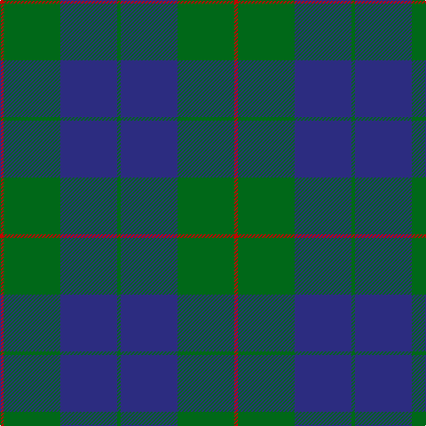

This page is one **sett** — a single exact thread-count. It belongs to the [tartan](/tartans/r1g16db16g1/)
(the same proportion at any scale), whose colour order is pattern [GBGR](/stripes/gbgr/).

Sourced from tartans-authority.  It is a [4 stripe tartan](/stripes/stripes4/).

Original link http://www.tartansauthority.com/tartan-ferret/display/705/

## Also known as

This cloth is also recorded under:

- Barclay Htg
- Barclay Hunting

## Register references

External register numbers recorded for this tartan.

- Scottish Tartans Authority (ITI): 705

## Thread count
R/4 G64 DB64 G/4

## Palette

Palette: <strong>Tartan Register</strong>
<table><thead><tr><th>Colour</th><th>Threads</th><th>Shade</th><th>Base</th><th>OKLCh</th></tr></thead><tbody><tr><td>R/</td><td style="text-align:right;font-variant-numeric:tabular-nums">4</td><td><code style="background-color:#C80000;">#C80000</code> <small style="color:#888">#C80000</small></td><td>R <code style="background-color:#CC0000;">#CC0000</code></td><td><small style="color:#888">oklch(52.3% 0.215 29.2)</small></td></tr><tr><td>G</td><td style="text-align:right;font-variant-numeric:tabular-nums">64</td><td><code style="background-color:#006818;">#006818</code> <small style="color:#888">#006818</small></td><td>G <code style="background-color:#006100;">#006100</code></td><td><small style="color:#888">oklch(45.0% 0.142 145.0)</small></td></tr><tr><td>DB</td><td style="text-align:right;font-variant-numeric:tabular-nums">64</td><td><code style="background-color:#2C2C80;">#2C2C80</code> <small style="color:#888">#2C2C80</small></td><td>B <code style="background-color:#2A418A;">#2A418A</code></td><td><small style="color:#888">oklch(35.0% 0.138 276.6)</small></td></tr><tr><td>G/</td><td style="text-align:right;font-variant-numeric:tabular-nums">4</td><td><code style="background-color:#006818;">#006818</code> <small style="color:#888">#006818</small></td><td>G <code style="background-color:#006100;">#006100</code></td><td><small style="color:#888">oklch(45.0% 0.142 145.0)</small></td></tr></tbody></table>

# Sample pattern

## Nearest tartans

The nearest existing variants by ΔTartan distance, with this tartan at the top so the swatches line up against it.

ΔTartan

Tartan

Sett

—

<a href="/ttd/edit/#slug=r1g16db16g1~x4">Barclay Htg (Clan)</a> <a class="nn-out" href="/setts/s4/r1g16db16g1~x4/" title="open its dictionary page">↗</a>

0.00

<a href="/ttd/edit/#slug=r1g16db16g1~x2">Barclay</a> <a class="nn-out" href="/setts/s4/r1g16db16g1~x2/" title="open its dictionary page">↗</a>

0.94

<a href="/ttd/edit/#slug=dg1db16dg16r1">Barclay Hunting</a> <a class="nn-out" href="/setts/s4/dg1db16dg16r1/" title="open its dictionary page">↗</a>

1.14

<a href="/ttd/edit/#slug=dg1db16dg16r1~x2">Barclay Hunting</a> <a class="nn-out" href="/setts/s4/dg1db16dg16r1~x2/" title="open its dictionary page">↗</a>

1.27

<a href="/ttd/edit/#slug=t9dt3t1dt12ly1~x4">North Sea Commission</a> <a class="nn-out" href="/setts/s5/t9dt3t1dt12ly1~x4/" title="open its dictionary page">↗</a>

1.28

<a href="/ttd/edit/#slug=r2g5db27g11o2~x2">Hector James</a> <a class="nn-out" href="/setts/s5/r2g5db27g11o2~x2/" title="open its dictionary page">↗</a>

1.31

<a href="/ttd/edit/#slug=g12lo1db8k1db1~x4">Rowan (Personal)</a> <a class="nn-out" href="/setts/s5/g12lo1db8k1db1~x4/" title="open its dictionary page">↗</a>

1.36

<a href="/ttd/edit/#slug=db4w1db12g12db1g4~x2">Unidentified, Tweed</a> <a class="nn-out" href="/setts/s6/db4w1db12g12db1g4~x2/" title="open its dictionary page">↗</a>

1.43

<a href="/ttd/edit/#slug=dg4db1dg12db12w1db4~x2">Unidentified Tweed</a> <a class="nn-out" href="/setts/s6/dg4db1dg12db12w1db4~x2/" title="open its dictionary page">↗</a>

1.46

<a href="/ttd/edit/#slug=db11dg2db15dg18w2~x2">Hamilton Hunting</a> <a class="nn-out" href="/setts/s5/db11dg2db15dg18w2~x2/" title="open its dictionary page">↗</a>

1.48

<a href="/ttd/edit/#slug=db6g2db29g29db2g6~x2">Harmony, 12</a> <a class="nn-out" href="/setts/s6/db6g2db29g29db2g6~x2/" title="open its dictionary page">↗</a>

## Neighbour map

Every grey dot is one of 14359 variants placed by the first two principal components of the ΔTartan feature space (44% of its variance). Red is this tartan; blue dots are its nearest — click one to open its page.

<svg viewBox="0 0 640 380" role="img" style="max-width:100%;height:auto;border:1px solid #e0e0e0;border-radius:4px;display:block" xmlns="http://www.w3.org/2000/svg"><image href="/nn/cloud.v1.png" width="640" height="380"/><a href="/setts/s4/r1g16db16g1~x2/"><circle cx="385.3" cy="256.9" r="4" fill="#3465a4"><title>Barclay</title></circle></a><a href="/setts/s4/dg1db16dg16r1/"><circle cx="381.8" cy="261.2" r="4" fill="#3465a4"><title>Barclay Hunting</title></circle></a><a href="/setts/s4/dg1db16dg16r1~x2/"><circle cx="400.5" cy="270.2" r="4" fill="#3465a4"><title>Barclay Hunting</title></circle></a><a href="/setts/s5/t9dt3t1dt12ly1~x4/"><circle cx="397.6" cy="252.7" r="4" fill="#3465a4"><title>North Sea Commission</title></circle></a><a href="/setts/s5/r2g5db27g11o2~x2/"><circle cx="378.7" cy="224.5" r="4" fill="#3465a4"><title>Hector James</title></circle></a><a href="/setts/s5/g12lo1db8k1db1~x4/"><circle cx="339.9" cy="226.8" r="4" fill="#3465a4"><title>Rowan (Personal)</title></circle></a><a href="/setts/s6/db4w1db12g12db1g4~x2/"><circle cx="339.4" cy="244.5" r="4" fill="#3465a4"><title>Unidentified, Tweed</title></circle></a><a href="/setts/s6/dg4db1dg12db12w1db4~x2/"><circle cx="385.7" cy="270.3" r="4" fill="#3465a4"><title>Unidentified Tweed</title></circle></a><a href="/setts/s5/db11dg2db15dg18w2~x2/"><circle cx="365.8" cy="292.5" r="4" fill="#3465a4"><title>Hamilton Hunting</title></circle></a><a href="/setts/s6/db6g2db29g29db2g6~x2/"><circle cx="400.5" cy="251.3" r="4" fill="#3465a4"><title>Harmony, 12</title></circle></a><circle cx="385.3" cy="256.9" r="5" fill="#c00000"/></svg>

ID: /setts/s4/r1g16db16g1~x4/
