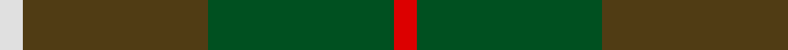
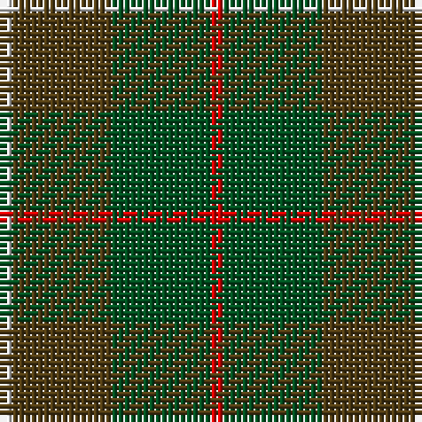

In pattern [RGGW](/patterns/rggw/).

This was sourced from register-of-tartans.  It is a [4 stripes tartan](/stripes/stripes4/).

Original link https://www.tartanregister.gov.uk/tartanDetails.aspx?ref=2556

## Register references

External register numbers recorded for this tartan.

- Scottish Register of Tartans: [2556](https://www.tartanregister.gov.uk/tartanDetails.aspx?ref=2556)
- Scottish Tartans World Register: 1542

## Thread count
LN/2 T16 G16 R/2

## Palette
Each colour and its ΔE from the base-6 reference it is a variant of.

| Colour | Shade | Base | ΔE (OKLab) |
|---|---|---|---|
| G | <code style="background-color:#005020;">#005020</code> `#005020` | G <code style="background-color:#006100;">#006100</code> | 0.07 |
| LN | <code style="background-color:#E0E0E0;">#E0E0E0</code> `#E0E0E0` | W <code style="background-color:#F7F7F7;">#F7F7F7</code> | 0.07 |
| R | <code style="background-color:#DC0000;">#DC0000</code> `#DC0000` | R <code style="background-color:#CC0000;">#CC0000</code> | 0.03 |
| T | <code style="background-color:#503C14;">#503C14</code> `#503C14` | G <code style="background-color:#006100;">#006100</code> | 0.14 |

# Sample pattern

## Nearest tartans

The nearest existing variants by ΔTartan distance.

1. [MacKinnon Hunting (Var) Clan Tartan Tartan Number: 1542. Earliest known date: pre 2003 Two times actual count given in letter from MacKinnon of MacKinnon 1908 as 'the Composition of the MacKinnon tartan...' See products available Copyright © Blair Urquhart, Comrie, 2015](/setts/s4/r1g8ga8w1~g006818-ga604000-rc80000-we0e0e0~x2/) — ΔT 0.70
1. [MacKinnon, hunting](/setts/s4/r1g8ra8w1~g008000-rc00000-ra806050-we0e0e0~x2/) — ΔT 1.31
1. [MacNab WI 2](/setts/s4/g15r3b11ba2~b6e5058-ba4367ae-g11450d-raa0000~x2/) — ΔT 1.39
1. [MacNab WI2](/setts/s4/g15r3b11ba2~b6e5058-ba4367ae-g11450d-raa0000/) — ΔT 1.39
1. [McMoosie Htg (Fashion)](/setts/s5/g46ga23b23r4y4~b1870a4-g604000-ga00643c-rcc4438-ye8c000~x2/) — ΔT 1.54
1. [Unidentified #4](/setts/s4/g14r3b9ba2~b2c4084-ba3c82af-g005020-rdc0000~x2/) — ΔT 1.66
1. [Dewar (WCWM)](/setts/s6/b1g1b7g5ga7y1~b084848-g604000-ga8c7038-yb8b8b8~x4/) — ΔT 1.68
1. [Montrose (1983)](/setts/s6/g6y3g26k10b30w3~b5c5c5c-g004c2c-k101010-wc0c0c0-ybca010~x2/) — ΔT 1.69
1. [MacNab](/setts/s4/g15r3b11ba2~b141e46-ba3c82af-g005020-rdc0000~x2/) — ΔT 1.72
1. [Symington](/setts/s5/y5g33ga33r6w2~g5c6428-ga004c10-rc80000-we0e0e0-ybc8c00~x2/) — ΔT 1.72

## Neighbour map

Every grey dot is one of 15726 variants placed by the first two principal components of the ΔTartan feature space (44% of its variance). Red is this tartan; blue dots are its nearest — click one to open its page.

<svg viewBox="0 0 640 380" role="img" style="max-width:100%;height:auto;border:1px solid #e0e0e0;border-radius:4px;display:block" xmlns="http://www.w3.org/2000/svg"><image href="/nn/cloud.v1.png" width="640" height="380"/><a href="/setts/s4/r1g8ga8w1~g006818-ga604000-rc80000-we0e0e0~x2/"><circle cx="304.3" cy="267.2" r="4" fill="#3465a4"><title>MacKinnon Hunting (Var) Clan Tartan Tartan Number: 1542. Earliest known date: pre 2003 Two times actual count given in letter from MacKinnon of MacKinnon 1908 as 'the Composition of the MacKinnon tartan...' See products available Copyright © Blair Urquhart, Comrie, 2015</title></circle></a><a href="/setts/s4/r1g8ra8w1~g008000-rc00000-ra806050-we0e0e0~x2/"><circle cx="300.5" cy="262.5" r="4" fill="#3465a4"><title>MacKinnon, hunting</title></circle></a><a href="/setts/s4/g15r3b11ba2~b6e5058-ba4367ae-g11450d-raa0000~x2/"><circle cx="334.6" cy="290.1" r="4" fill="#3465a4"><title>MacNab WI 2</title></circle></a><a href="/setts/s4/g15r3b11ba2~b6e5058-ba4367ae-g11450d-raa0000/"><circle cx="334.6" cy="290.1" r="4" fill="#3465a4"><title>MacNab WI2</title></circle></a><a href="/setts/s5/g46ga23b23r4y4~b1870a4-g604000-ga00643c-rcc4438-ye8c000~x2/"><circle cx="282.0" cy="229.9" r="4" fill="#3465a4"><title>McMoosie Htg (Fashion)</title></circle></a><a href="/setts/s4/g14r3b9ba2~b2c4084-ba3c82af-g005020-rdc0000~x2/"><circle cx="289.9" cy="279.0" r="4" fill="#3465a4"><title>Unidentified #4</title></circle></a><a href="/setts/s6/b1g1b7g5ga7y1~b084848-g604000-ga8c7038-yb8b8b8~x4/"><circle cx="254.8" cy="261.8" r="4" fill="#3465a4"><title>Dewar (WCWM)</title></circle></a><a href="/setts/s6/g6y3g26k10b30w3~b5c5c5c-g004c2c-k101010-wc0c0c0-ybca010~x2/"><circle cx="252.0" cy="219.9" r="4" fill="#3465a4"><title>Montrose (1983)</title></circle></a><a href="/setts/s4/g15r3b11ba2~b141e46-ba3c82af-g005020-rdc0000~x2/"><circle cx="280.3" cy="273.5" r="4" fill="#3465a4"><title>MacNab</title></circle></a><a href="/setts/s5/y5g33ga33r6w2~g5c6428-ga004c10-rc80000-we0e0e0-ybc8c00~x2/"><circle cx="304.4" cy="210.1" r="4" fill="#3465a4"><title>Symington</title></circle></a><circle cx="307.7" cy="271.1" r="5" fill="#c00000"/></svg>

ID: /setts/s4/r1g8ga8w1~g005020-ga503c14-rdc0000-we0e0e0~x2/
