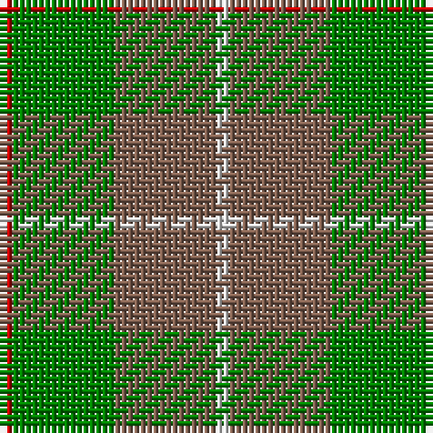

In pattern [RGRW](/stripes/rgrw/).

This was sourced from weddslist.  It is a [4 stripe tartan](/stripes/stripes4/).

Original link http://www.weddslist.com/cgi-bin/tartans/pg.pl?source=sts

## Thread count
R/2 G16 LT16 LN/2

## Palette
Each colour and the base-6 reference it is a variant of.

| Colour | Shade | Base |
|---|---|---|
| G | <code style="background-color:#008000;">#008000</code> `oklch(52.0% 0.177 142.5)` <small>#008000</small> | G <code style="background-color:#006100;">#006100</code> |
| LN | <code style="background-color:#E0E0E0;">#E0E0E0</code> `oklch(90.7% 0.000 89.9)` <small>#E0E0E0</small> | W <code style="background-color:#F7F7F7;">#F7F7F7</code> |
| LT | <code style="background-color:#806050;">#806050</code> `oklch(51.7% 0.049 47.8)` <small>#806050</small> | R <code style="background-color:#CC0000;">#CC0000</code> |
| R | <code style="background-color:#C00000;">#C00000</code> `oklch(50.7% 0.208 29.2)` <small>#C00000</small> | R <code style="background-color:#CC0000;">#CC0000</code> |

# Sample pattern

## Nearest tartans

The nearest existing variants by ΔTartan distance, with this tartan at the top so the swatches line up against it.

ΔTartan

Tartan

Sett

—

<a href="/ttd/edit/#slug=r1g8o8w1~x2">MacKinnon, hunting</a> <a class="nn-out" href="/setts/s4/r1g8o8w1~x2/" title="open its dictionary page">↗</a>

0.79

<a href="/ttd/edit/#slug=r1g8dy8w1~x2">MacKinnon Hunting (Var) Clan Tartan Tartan Number: 1542. Earliest known date: pre 2003 Two times actual count given in letter from MacKinnon of MacKinnon 1908 as 'the Composition of the MacKinnon tartan...' See products available Copyright © Blair Urquhart, Comrie, 2015</a> <a class="nn-out" href="/setts/s4/r1g8dy8w1~x2/" title="open its dictionary page">↗</a>

1.23

<a href="/ttd/edit/#slug=g30lo3t8o25~x2">Dohmen Family (Zuid-Nederland)</a> <a class="nn-out" href="/setts/s4/g30lo3t8o25~x2/" title="open its dictionary page">↗</a>

1.31

<a href="/ttd/edit/#slug=r1dg8dy8w1~x2">MacKinnon Hunting #2</a> <a class="nn-out" href="/setts/s4/r1dg8dy8w1~x2/" title="open its dictionary page">↗</a>

1.37

<a href="/setts/s4/g13r2t13~x2/">Wilson's No.161</a>

1.45

<a href="/ttd/edit/#slug=g25lo6dg5r3lo10~x4">Pendlebury, Andrew (Personal)</a> <a class="nn-out" href="/setts/s5/g25lo6dg5r3lo10~x4/" title="open its dictionary page">↗</a>

1.54

<a href="/ttd/edit/#slug=g1o8g8r1g8o8w1~x4">MacKinnon, hunting</a> <a class="nn-out" href="/setts/s7/g1o8g8r1g8o8w1~x4/" title="open its dictionary page">↗</a>

1.59

<a href="/ttd/edit/#slug=db3o10g9r1g3~x4">Bethlehem, City of (District)</a> <a class="nn-out" href="/setts/s5/db3o10g9r1g3~x4/" title="open its dictionary page">↗</a>

1.63

<a href="/ttd/edit/#slug=g14r3db9t2~x2">Unidentified 10</a> <a class="nn-out" href="/setts/s4/g14r3db9t2~x2/" title="open its dictionary page">↗</a>

1.71

<a href="/ttd/edit/#slug=g6ly1r1t2r2~x4">Wilson's, No 179</a> <a class="nn-out" href="/setts/s5/g6ly1r1t2r2~x4/" title="open its dictionary page">↗</a>

1.73

<a href="/ttd/edit/#slug=lo11g5lo10g4g26lo4~x2">North Dakota State University (Corp.</a> <a class="nn-out" href="/setts/s6/lo11g5lo10g4g26lo4~x2/" title="open its dictionary page">↗</a>

## Neighbour map

Every grey dot is one of 14299 variants placed by the first two principal components of the ΔTartan feature space (44% of its variance). Red is this tartan; blue dots are its nearest — click one to open its page.

<svg viewBox="0 0 640 380" role="img" style="max-width:100%;height:auto;border:1px solid #e0e0e0;border-radius:4px;display:block" xmlns="http://www.w3.org/2000/svg"><image href="/nn/cloud.v1.png" width="640" height="380"/><a href="/setts/s4/r1g8dy8w1~x2/"><circle cx="305.6" cy="273.0" r="4" fill="#3465a4"><title>MacKinnon Hunting (Var) Clan Tartan Tartan Number: 1542. Earliest known date: pre 2003 Two times actual count given in letter from MacKinnon of MacKinnon 1908 as 'the Composition of the MacKinnon tartan...' See products available Copyright © Blair Urquhart, Comrie, 2015</title></circle></a><a href="/setts/s4/g30lo3t8o25~x2/"><circle cx="294.8" cy="258.3" r="4" fill="#3465a4"><title>Dohmen Family (Zuid-Nederland)</title></circle></a><a href="/setts/s4/r1dg8dy8w1~x2/"><circle cx="309.1" cy="277.8" r="4" fill="#3465a4"><title>MacKinnon Hunting #2</title></circle></a><a href="/setts/s4/g13r2t13~x2/"><circle cx="289.8" cy="290.6" r="4" fill="#3465a4"><title>Wilson's No.161</title></circle></a><a href="/setts/s5/g25lo6dg5r3lo10~x4/"><circle cx="299.1" cy="241.6" r="4" fill="#3465a4"><title>Pendlebury, Andrew (Personal)</title></circle></a><a href="/setts/s7/g1o8g8r1g8o8w1~x4/"><circle cx="335.1" cy="268.0" r="4" fill="#3465a4"><title>MacKinnon, hunting</title></circle></a><a href="/setts/s5/db3o10g9r1g3~x4/"><circle cx="279.6" cy="255.3" r="4" fill="#3465a4"><title>Bethlehem, City of (District)</title></circle></a><a href="/setts/s4/g14r3db9t2~x2/"><circle cx="267.6" cy="271.4" r="4" fill="#3465a4"><title>Unidentified 10</title></circle></a><a href="/setts/s5/g6ly1r1t2r2~x4/"><circle cx="245.2" cy="243.1" r="4" fill="#3465a4"><title>Wilson's, No 179</title></circle></a><a href="/setts/s6/lo11g5lo10g4g26lo4~x2/"><circle cx="345.8" cy="279.6" r="4" fill="#3465a4"><title>North Dakota State University (Corp.</title></circle></a><circle cx="301.8" cy="267.7" r="5" fill="#c00000"/></svg>

ID: /setts/s4/r1g8o8w1~x2/
