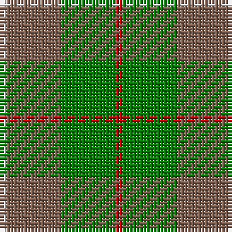

In pattern [RGRW](/patterns/rgrw/).

This was sourced from weddslist.  It is a [4 stripes tartan](/stripes/stripes4/).

Original link http://www.weddslist.com/cgi-bin/tartans/pg.pl?source=sts

## Thread count
LN/2 LT16 G16 R/2

## Palette
Each colour and its ΔE from the base-6 reference it is a variant of.

| Colour | Shade | Base | ΔE (OKLab) |
|---|---|---|---|
| G | <code style="background-color:#008000;">#008000</code> `#008000` | G <code style="background-color:#006100;">#006100</code> | 0.10 |
| LN | <code style="background-color:#E0E0E0;">#E0E0E0</code> `#E0E0E0` | W <code style="background-color:#F7F7F7;">#F7F7F7</code> | 0.07 |
| LT | <code style="background-color:#806050;">#806050</code> `#806050` | R <code style="background-color:#CC0000;">#CC0000</code> | 0.17 |
| R | <code style="background-color:#C00000;">#C00000</code> `#C00000` | R <code style="background-color:#CC0000;">#CC0000</code> | 0.03 |

# Sample pattern

## Nearest tartans

The nearest existing variants by ΔTartan distance.

1. [MacKinnon Hunting (Var) Clan Tartan Tartan Number: 1542. Earliest known date: pre 2003 Two times actual count given in letter from MacKinnon of MacKinnon 1908 as 'the Composition of the MacKinnon tartan...' See products available Copyright © Blair Urquhart, Comrie, 2015](/setts/s4/r1g8ga8w1~g006818-ga604000-rc80000-we0e0e0~x2/) — ΔT 0.79
1. [Dohmen Family (Zuid-Nederland)](/setts/s4/g30y3b8r25~b5f749c-g649848-ra32d18-ye0a126~x2/) — ΔT 1.22
1. [MacKinnon Hunting #2](/setts/s4/r1g8ga8w1~g005020-ga503c14-rdc0000-we0e0e0~x2/) — ΔT 1.31
1. [Wilson's No.161](/setts/s4/b13r2g13r2~b5c8ca8-g006818-rc80000~x2/) — ΔT 1.37
1. [Pendlebury, Andrew (Personal)](/setts/s5/g25y6ga5r3y10~g289c18-ga005020-rdc0000-yd87c00~x4/) — ΔT 1.45
1. [MacKinnon, hunting](/setts/s7/g1r8g8ra1g8r8w1~g008000-r806050-rac00000-we0e0e0~x4/) — ΔT 1.54
1. [Bethlehem, City of (District)](/setts/s5/b3r10g9ra1g3~b1c0070-g006c3c-r888888-ra880000~x4/) — ΔT 1.59
1. [Unidentified 10](/setts/s4/g14r3b9ba2~b304080-ba5480b0-g008000-rc00000~x2/) — ΔT 1.63
1. [Wilson's, No 179](/setts/s5/g6y1r1b2r2~b5480b0-g008000-rc00000-yf0c000~x4/) — ΔT 1.72
1. [North Dakota State University (Corp.](/setts/s6/y11g5y10ga4g26y4~g006818-ga289c18-ybc8c00~x2/) — ΔT 1.73

## Neighbour map

Every grey dot is one of 15726 variants placed by the first two principal components of the ΔTartan feature space (44% of its variance). Red is this tartan; blue dots are its nearest — click one to open its page.

<svg viewBox="0 0 640 380" role="img" style="max-width:100%;height:auto;border:1px solid #e0e0e0;border-radius:4px;display:block" xmlns="http://www.w3.org/2000/svg"><image href="/nn/cloud.v1.png" width="640" height="380"/><a href="/setts/s4/r1g8ga8w1~g006818-ga604000-rc80000-we0e0e0~x2/"><circle cx="304.3" cy="267.2" r="4" fill="#3465a4"><title>MacKinnon Hunting (Var) Clan Tartan Tartan Number: 1542. Earliest known date: pre 2003 Two times actual count given in letter from MacKinnon of MacKinnon 1908 as 'the Composition of the MacKinnon tartan...' See products available Copyright © Blair Urquhart, Comrie, 2015</title></circle></a><a href="/setts/s4/g30y3b8r25~b5f749c-g649848-ra32d18-ye0a126~x2/"><circle cx="294.4" cy="254.3" r="4" fill="#3465a4"><title>Dohmen Family (Zuid-Nederland)</title></circle></a><a href="/setts/s4/r1g8ga8w1~g005020-ga503c14-rdc0000-we0e0e0~x2/"><circle cx="307.7" cy="271.1" r="4" fill="#3465a4"><title>MacKinnon Hunting #2</title></circle></a><a href="/setts/s4/b13r2g13r2~b5c8ca8-g006818-rc80000~x2/"><circle cx="287.7" cy="286.7" r="4" fill="#3465a4"><title>Wilson's No.161</title></circle></a><a href="/setts/s5/g25y6ga5r3y10~g289c18-ga005020-rdc0000-yd87c00~x4/"><circle cx="298.1" cy="238.5" r="4" fill="#3465a4"><title>Pendlebury, Andrew (Personal)</title></circle></a><a href="/setts/s7/g1r8g8ra1g8r8w1~g008000-r806050-rac00000-we0e0e0~x4/"><circle cx="334.0" cy="259.7" r="4" fill="#3465a4"><title>MacKinnon, hunting</title></circle></a><a href="/setts/s5/b3r10g9ra1g3~b1c0070-g006c3c-r888888-ra880000~x4/"><circle cx="277.4" cy="250.3" r="4" fill="#3465a4"><title>Bethlehem, City of (District)</title></circle></a><a href="/setts/s4/g14r3b9ba2~b304080-ba5480b0-g008000-rc00000~x2/"><circle cx="265.2" cy="268.4" r="4" fill="#3465a4"><title>Unidentified 10</title></circle></a><a href="/setts/s5/g6y1r1b2r2~b5480b0-g008000-rc00000-yf0c000~x4/"><circle cx="243.6" cy="242.5" r="4" fill="#3465a4"><title>Wilson's, No 179</title></circle></a><a href="/setts/s6/y11g5y10ga4g26y4~g006818-ga289c18-ybc8c00~x2/"><circle cx="344.7" cy="274.6" r="4" fill="#3465a4"><title>North Dakota State University (Corp.</title></circle></a><circle cx="300.5" cy="262.5" r="5" fill="#c00000"/></svg>

ID: /setts/s4/r1g8ra8w1~g008000-rc00000-ra806050-we0e0e0~x2/
