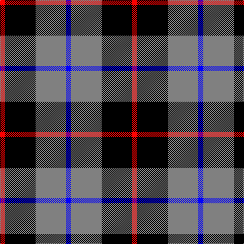

This page is one **sett** — a single exact thread-count. It belongs to the [tartan](/tartans/r1k6n6b1/)
(the same proportion at any scale), whose colour order is pattern [BGKR](/stripes/bgkr/).

Sourced from register-of-tartans.  It is a [4 stripe tartan](/stripes/stripes4/).

Original link https://www.tartanregister.gov.uk/tartanDetails.aspx?ref=10244

## Register references

External register numbers recorded for this tartan.

- Scottish Register of Tartans: [10244](https://www.tartanregister.gov.uk/tartanDetails.aspx?ref=10244)

## Thread count
R/10 K60 N60 B/10

## Palette
Each colour and the base-6 reference it is a variant of.

| Colour | Shade | Base |
|---|---|---|
| B | <code style="background-color:#0000FF;">#0000FF</code> `oklch(45.2% 0.313 264.1)` <small>#0000FF</small> | B <code style="background-color:#2A418A;">#2A418A</code> |
| K | <code style="background-color:#000000;">#000000</code> `oklch(0.0% 0.000 0.0)` <small>#000000</small> | K <code style="background-color:#000000;">#000000</code> |
| N | <code style="background-color:#808080;">#808080</code> `oklch(60.0% 0.000 89.9)` <small>#808080</small> | G <code style="background-color:#006100;">#006100</code> |
| R | <code style="background-color:#FF0000;">#FF0000</code> `oklch(62.8% 0.258 29.2)` <small>#FF0000</small> | R <code style="background-color:#CC0000;">#CC0000</code> |

# Sample pattern

## Nearest tartans

The nearest existing variants by ΔTartan distance, with this tartan at the top so the swatches line up against it.

ΔTartan

Tartan

Sett

—

<a href="/ttd/edit/#slug=r1k6y6b1~x10">Mayer, Chris (Personal)</a> <a class="nn-out" href="/setts/s4/r1k6y6b1~x10/" title="open its dictionary page">↗</a>

0.49

<a href="/ttd/edit/#slug=r5y32k31w5~x2">Loganair, Uniform Skirt</a> <a class="nn-out" href="/setts/s4/r5y32k31w5~x2/" title="open its dictionary page">↗</a>

1.09

<a href="/ttd/edit/#slug=r1dg6db6w1~x4">Salt Spring Island</a> <a class="nn-out" href="/setts/s4/r1dg6db6w1~x4/" title="open its dictionary page">↗</a>

1.09

<a href="/ttd/edit/#slug=r5o32k31w5~x2">Loganair</a> <a class="nn-out" href="/setts/s4/r5o32k31w5~x2/" title="open its dictionary page">↗</a>

1.15

<a href="/ttd/edit/#slug=r3o16k16lb3~x4">Thompson, Dress (Clan)</a> <a class="nn-out" href="/setts/s4/r3o16k16lb3~x4/" title="open its dictionary page">↗</a>

1.15

<a href="/ttd/edit/#slug=r5o32k31w5">Loganair Uniform Skirt Corporate Tartan Tartan Number: 1629. Earliest known date: c.1985 Half actual count for display. Used until 1988 See products available Copyright © Blair Urquhart, Comrie, 2015</a> <a class="nn-out" href="/setts/s4/r5o32k31w5/" title="open its dictionary page">↗</a>

1.27

<a href="/ttd/edit/#slug=k3lb3k3n10r1~x6">Greystone (Burberry Grey)</a> <a class="nn-out" href="/setts/s5/k3lb3k3n10r1~x6/" title="open its dictionary page">↗</a>

1.32

<a href="/ttd/edit/#slug=k19db18w9r3~x4">Raven (Fashion)</a> <a class="nn-out" href="/setts/s4/k19db18w9r3~x4/" title="open its dictionary page">↗</a>

1.34

<a href="/ttd/edit/#slug=k3g9t2k11p9k3~x2">Scott, Sir Walter</a> <a class="nn-out" href="/setts/s6/k3g9t2k11p9k3~x2/" title="open its dictionary page">↗</a>

1.36

<a href="/ttd/edit/#slug=r12db3g5db16ly2g2~x2">Dunbog Primary (School)</a> <a class="nn-out" href="/setts/s6/r12db3g5db16ly2g2~x2/" title="open its dictionary page">↗</a>

1.38

<a href="/ttd/edit/#slug=db5k1g1k1r3k1~x4">Clerk</a> <a class="nn-out" href="/setts/s6/db5k1g1k1r3k1~x4/" title="open its dictionary page">↗</a>

## Neighbour map

Every grey dot is one of 14299 variants placed by the first two principal components of the ΔTartan feature space (44% of its variance). Red is this tartan; blue dots are its nearest — click one to open its page.

<svg viewBox="0 0 640 380" role="img" style="max-width:100%;height:auto;border:1px solid #e0e0e0;border-radius:4px;display:block" xmlns="http://www.w3.org/2000/svg"><image href="/nn/cloud.v1.png" width="640" height="380"/><a href="/setts/s4/r5y32k31w5~x2/"><circle cx="197.4" cy="237.5" r="4" fill="#3465a4"><title>Loganair, Uniform Skirt</title></circle></a><a href="/setts/s4/r1dg6db6w1~x4/"><circle cx="199.8" cy="254.4" r="4" fill="#3465a4"><title>Salt Spring Island</title></circle></a><a href="/setts/s4/r5o32k31w5~x2/"><circle cx="210.3" cy="241.0" r="4" fill="#3465a4"><title>Loganair</title></circle></a><a href="/setts/s4/r3o16k16lb3~x4/"><circle cx="192.7" cy="253.0" r="4" fill="#3465a4"><title>Thompson, Dress (Clan)</title></circle></a><a href="/setts/s4/r5o32k31w5/"><circle cx="209.3" cy="239.4" r="4" fill="#3465a4"><title>Loganair Uniform Skirt Corporate Tartan Tartan Number: 1629. Earliest known date: c.1985 Half actual count for display. Used until 1988 See products available Copyright © Blair Urquhart, Comrie, 2015</title></circle></a><a href="/setts/s5/k3lb3k3n10r1~x6/"><circle cx="231.0" cy="209.1" r="4" fill="#3465a4"><title>Greystone (Burberry Grey)</title></circle></a><a href="/setts/s4/k19db18w9r3~x4/"><circle cx="146.2" cy="260.9" r="4" fill="#3465a4"><title>Raven (Fashion)</title></circle></a><a href="/setts/s6/k3g9t2k11p9k3~x2/"><circle cx="168.4" cy="251.1" r="4" fill="#3465a4"><title>Scott, Sir Walter</title></circle></a><a href="/setts/s6/r12db3g5db16ly2g2~x2/"><circle cx="223.9" cy="209.5" r="4" fill="#3465a4"><title>Dunbog Primary (School)</title></circle></a><a href="/setts/s6/db5k1g1k1r3k1~x4/"><circle cx="172.4" cy="233.1" r="4" fill="#3465a4"><title>Clerk</title></circle></a><circle cx="191.8" cy="243.9" r="5" fill="#c00000"/></svg>

ID: /setts/s4/r1k6y6b1~x10/
