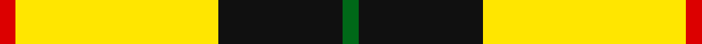
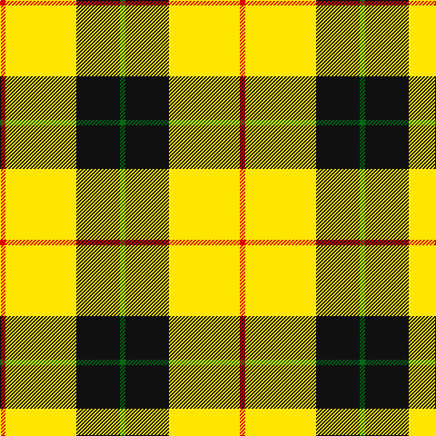

In pattern [GKYR](/stripes/gkyr/).

This was sourced from register-of-tartans.  It is a [4 stripe tartan](/stripes/stripes4/).

Original link https://www.tartanregister.gov.uk/tartanDetails.aspx?ref=11180

## Also known as

This cloth is also recorded under:

- Billy Apple® Yellow

## Attestations

This cloth appears in 2 source records; the oldest owns this page.

- 27/09/2013 — Billy Apple® Yellow (register-of-tartans, [record](https://www.tartanregister.gov.uk/tartanDetails.aspx?ref=11180))
- 2014 — Billy Apple - Yellow (tartans-authority, [record](http://www.tartansauthority.com/tartan-ferret/display/11180/))

## Register references

External register numbers recorded for this tartan.

- Scottish Register of Tartans: [11180](https://www.tartanregister.gov.uk/tartanDetails.aspx?ref=11180)

## Thread count
R/6 Y78 K48 G/6

## Palette
Each colour and the base-6 reference it is a variant of.

| Colour | Shade | Base |
|---|---|---|
| G | <code style="background-color:#006818;">#006818</code> `oklch(45.0% 0.142 145.0)` <small>#006818</small> | G <code style="background-color:#006100;">#006100</code> |
| K | <code style="background-color:#101010;">#101010</code> `oklch(17.3% 0.000 89.9)` <small>#101010</small> | K <code style="background-color:#000000;">#000000</code> |
| R | <code style="background-color:#DC0000;">#DC0000</code> `oklch(56.2% 0.230 29.2)` <small>#DC0000</small> | R <code style="background-color:#CC0000;">#CC0000</code> |
| Y | <code style="background-color:#FFE600;">#FFE600</code> `oklch(91.7% 0.192 101.4)` <small>#FFE600</small> | Y <code style="background-color:#F2BF00;">#F2BF00</code> |

# Sample pattern

## Nearest tartans

The nearest existing variants by ΔTartan distance.

1. [Jacobite](/setts/s6/ly70k30w3g30k3ly10/) — ΔT 1.40
1. [Jacobite #2](/setts/s6/ly70k30w3dg30k3ly10/) — ΔT 1.43
1. [MacDuck (Corporate)](/setts/s6/k4r5k2ly21g8k2~x2/) — ΔT 1.58
1. [Fraser Yellow #2](/setts/s6/w1ly8dg3ly1db3ly1~x4/) — ΔT 1.59
1. [Porter Drinkers', The](/setts/s6/k2ly6k2ly11k9r1~x2/) — ΔT 1.60
1. [Port Moresby City Pipes & Drums](/setts/s5/r2ly36k12w3g2~x2/) — ΔT 1.68
1. [Baileville (Personal)](/setts/s7/ly1k4ly1k4ly11r1ly1~x4/) — ΔT 1.73
1. [Loch Lomond #3](/setts/s4/g22w14r7ly2~x2/) — ΔT 1.76
1. [Barclay Dress](/setts/s4/w5ly32dt32ly5~x2/) — ΔT 1.77
1. [Englehart, City of](/setts/s4/dg27r9n2ly14~x4/) — ΔT 1.77

## Neighbour map

Every grey dot is one of 14299 variants placed by the first two principal components of the ΔTartan feature space (44% of its variance). Red is this tartan; blue dots are its nearest — click one to open its page.

<svg viewBox="0 0 640 380" role="img" style="max-width:100%;height:auto;border:1px solid #e0e0e0;border-radius:4px;display:block" xmlns="http://www.w3.org/2000/svg"><image href="/nn/cloud.v1.png" width="640" height="380"/><a href="/setts/s6/ly70k30w3g30k3ly10/"><circle cx="279.9" cy="142.3" r="4" fill="#3465a4"><title>Jacobite</title></circle></a><a href="/setts/s6/ly70k30w3dg30k3ly10/"><circle cx="288.1" cy="145.6" r="4" fill="#3465a4"><title>Jacobite #2</title></circle></a><a href="/setts/s6/k4r5k2ly21g8k2~x2/"><circle cx="227.9" cy="171.9" r="4" fill="#3465a4"><title>MacDuck (Corporate)</title></circle></a><a href="/setts/s6/w1ly8dg3ly1db3ly1~x4/"><circle cx="272.3" cy="191.6" r="4" fill="#3465a4"><title>Fraser Yellow #2</title></circle></a><a href="/setts/s6/k2ly6k2ly11k9r1~x2/"><circle cx="287.7" cy="201.8" r="4" fill="#3465a4"><title>Porter Drinkers', The</title></circle></a><a href="/setts/s5/r2ly36k12w3g2~x2/"><circle cx="348.4" cy="128.1" r="4" fill="#3465a4"><title>Port Moresby City Pipes &amp; Drums</title></circle></a><a href="/setts/s7/ly1k4ly1k4ly11r1ly1~x4/"><circle cx="335.7" cy="173.9" r="4" fill="#3465a4"><title>Baileville (Personal)</title></circle></a><a href="/setts/s4/g22w14r7ly2~x2/"><circle cx="214.9" cy="213.1" r="4" fill="#3465a4"><title>Loch Lomond #3</title></circle></a><a href="/setts/s4/w5ly32dt32ly5~x2/"><circle cx="249.2" cy="241.2" r="4" fill="#3465a4"><title>Barclay Dress</title></circle></a><a href="/setts/s4/dg27r9n2ly14~x4/"><circle cx="265.6" cy="218.1" r="4" fill="#3465a4"><title>Englehart, City of</title></circle></a><circle cx="283.4" cy="182.3" r="5" fill="#c00000"/></svg>

ID: /setts/s4/r1ly13k8g1~x6/
