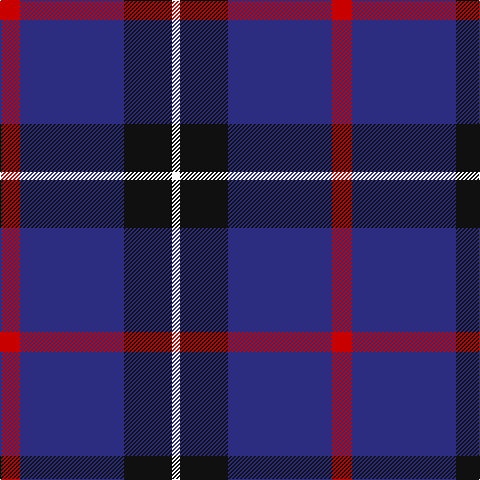

In pattern [RBKW](/patterns/rbkw/).

This was sourced from tartans-authority.  It is a [4 stripes tartan](/stripes/stripes4/).

Original link http://www.tartansauthority.com/tartan-ferret/display/6218/

## Attestations

This cloth appears in 2 source records; the oldest owns this page.

- pre 1999 — Mirror (Corporate) (tartans-authority, [record](http://www.tartansauthority.com/tartan-ferret/display/6218/))
- 01/05/2002 — Mirror (register-of-tartans, [record](https://www.tartanregister.gov.uk/tartanDetails.aspx?ref=2963))

## Thread count
R/20 DB104 K48 W/8

## Palette
Each colour and its ΔE from the base-6 reference it is a variant of.

| Colour | Shade | Base | ΔE (OKLab) |
|---|---|---|---|
| DB | <code style="background-color:#2C2C80;">#2C2C80</code> `#2C2C80` | B <code style="background-color:#2C4084;">#2C4084</code> | 0.05 |
| K | <code style="background-color:#101010;">#101010</code> `#101010` | K <code style="background-color:#000000;">#000000</code> | 0.17 |
| R | <code style="background-color:#C80000;">#C80000</code> `#C80000` | R <code style="background-color:#C80000;">#C80000</code> | 0.00 |
| W | <code style="background-color:#FCFCFC;">#FCFCFC</code> `#FCFCFC` | W <code style="background-color:#F4F4F0;">#F4F4F0</code> | 0.03 |

# Sample pattern

ID: /setts/s4/r20b104k48w8-b2c2c80-k101010-rc80000-wfcfcfc/
