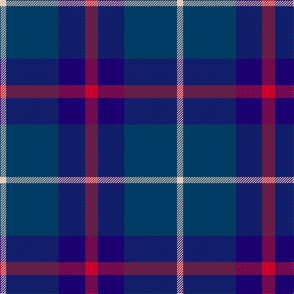

In pattern [RBBW](/patterns/rbbw/).

This was sourced from tartans-authority.  It is a [4 stripes tartan](/stripes/stripes4/).

Original link http://www.tartansauthority.com/tartan-ferret/display/10828/

## Thread count
LR/10 DB86 DBa43 R/21

## Palette
Each colour and its ΔE from the base-6 reference it is a variant of.

| Colour | Shade | Base | ΔE (OKLab) |
|---|---|---|---|
| DB | <code style="background-color:#003C64;">#003C64</code> `#003C64` | B <code style="background-color:#2C4084;">#2C4084</code> | 0.07 |
| DBa | <code style="background-color:#1C0070;">#1C0070</code> `#1C0070` | B <code style="background-color:#2C4084;">#2C4084</code> | 0.14 |
| LR | <code style="background-color:#E8CCB8;">#E8CCB8</code> `#E8CCB8` | W <code style="background-color:#F4F4F0;">#F4F4F0</code> | 0.11 |
| R | <code style="background-color:#C8002C;">#C8002C</code> `#C8002C` | R <code style="background-color:#C80000;">#C80000</code> | 0.03 |

# Sample pattern

## Nearest tartans

The nearest existing variants by ΔTartan distance.

1. [Scottish Nuclear (Corporate)](/setts/s4/r4b36k16w4-b2c2c80-k101010-rc80000-wc0c0c0/) — ΔT 1.02
1. [Mirror (Corporate)](/setts/s4/r20b104k48w8-b2c2c80-k101010-rc80000-wfcfcfc/) — ΔT 1.15
1. [Joker Fancy Tartan Tartan Number: 6769. Earliest known date: 2005 I have a photo of a fabric swatch that I am trying to match as close as possible. I have been commissioned to make a life size mannequin of Jack Nicholson as the Joker and he wore plaid/tartan pants. I could send you some photos through email and possibly you could help me. Thanks, Andy Garringer USA, January 2008. (96 threads @ 40 epi heavyweight = 2.5 inch repeat) See products available Copyright © Blair Urquhart, Comrie, 2015](/setts/s6/b22k2b6k10ba18y2-b1870a4-ba4c0470-k101010-yd87c00/) — ΔT 1.16
1. [Brazell (Personal)](/setts/s5/b42y6b42ba66r12-b1c1c50-ba2888c4-rc80000-ye8c000/) — ΔT 1.24
1. [Davidson of Tulloch Clan Tartan Tartan Number: 1360. Earliest known date: 1984 The Davidsons or Clan Dhai maintained a constant battle for precedence within Clan Chattan. The Davidsons of Tulloch in Ross-shire are one of the main branches of the Davidson family. See products available Copyright © Blair Urquhart, Comrie, 2015](/setts/s5/r6b35k36b36w6-b2c2c80-k101010-rc80000-we0e0e0/) — ΔT 1.29
1. [Fong Wedding (Personal)](/setts/s4/r21b43ba86w10-b0000cd-ba26264f-rff0000-wffffff/) — ΔT 1.30
1. [Britannia](/setts/s5/k28r8k50b60w8-b202060-k101010-rc80000-we0e0e0/) — ΔT 1.33
1. [College of Radiographers](/setts/s5/k30y4k20b36w6-b00008c-k101010-wc8c8c8-yc88c00/) — ΔT 1.35
1. [Scottish Express International](/setts/s6/b4k16w4k16ba28k4-b9058d8-ba1c0070-k101010-wa8ace8/) — ΔT 1.38
1. [Cathro](/setts/s5/b36ba24w4g16b8-b5a008c-ba2c4084-g003c14-we0e0e0/) — ΔT 1.39

## Neighbour map

Every grey dot is one of 15726 variants placed by the first two principal components of the ΔTartan feature space (44% of its variance). Red is this tartan; blue dots are its nearest — click one to open its page.

<svg viewBox="0 0 640 380" role="img" style="max-width:100%;height:auto;border:1px solid #e0e0e0;border-radius:4px;display:block" xmlns="http://www.w3.org/2000/svg"><image href="/nn/cloud.v1.png" width="640" height="380"/><a href="/setts/s4/r4b36k16w4-b2c2c80-k101010-rc80000-wc0c0c0/"><circle cx="345.0" cy="240.9" r="4" fill="#3465a4"><title>Scottish Nuclear (Corporate)</title></circle></a><a href="/setts/s4/r20b104k48w8-b2c2c80-k101010-rc80000-wfcfcfc/"><circle cx="328.5" cy="224.8" r="4" fill="#3465a4"><title>Mirror (Corporate)</title></circle></a><a href="/setts/s6/b22k2b6k10ba18y2-b1870a4-ba4c0470-k101010-yd87c00/"><circle cx="260.5" cy="224.4" r="4" fill="#3465a4"><title>Joker Fancy Tartan Tartan Number: 6769. Earliest known date: 2005 I have a photo of a fabric swatch that I am trying to match as close as possible. I have been commissioned to make a life size mannequin of Jack Nicholson as the Joker and he wore plaid/tartan pants. I could send you some photos through email and possibly you could help me. Thanks, Andy Garringer USA, January 2008. (96 threads @ 40 epi heavyweight = 2.5 inch repeat) See products available Copyright © Blair Urquhart, Comrie, 2015</title></circle></a><a href="/setts/s5/b42y6b42ba66r12-b1c1c50-ba2888c4-rc80000-ye8c000/"><circle cx="263.3" cy="234.1" r="4" fill="#3465a4"><title>Brazell (Personal)</title></circle></a><a href="/setts/s5/r6b35k36b36w6-b2c2c80-k101010-rc80000-we0e0e0/"><circle cx="304.6" cy="271.4" r="4" fill="#3465a4"><title>Davidson of Tulloch Clan Tartan Tartan Number: 1360. Earliest known date: 1984 The Davidsons or Clan Dhai maintained a constant battle for precedence within Clan Chattan. The Davidsons of Tulloch in Ross-shire are one of the main branches of the Davidson family. See products available Copyright © Blair Urquhart, Comrie, 2015</title></circle></a><a href="/setts/s4/r21b43ba86w10-b0000cd-ba26264f-rff0000-wffffff/"><circle cx="257.7" cy="236.5" r="4" fill="#3465a4"><title>Fong Wedding (Personal)</title></circle></a><a href="/setts/s5/k28r8k50b60w8-b202060-k101010-rc80000-we0e0e0/"><circle cx="283.6" cy="259.1" r="4" fill="#3465a4"><title>Britannia</title></circle></a><a href="/setts/s5/k30y4k20b36w6-b00008c-k101010-wc8c8c8-yc88c00/"><circle cx="271.3" cy="250.2" r="4" fill="#3465a4"><title>College of Radiographers</title></circle></a><a href="/setts/s6/b4k16w4k16ba28k4-b9058d8-ba1c0070-k101010-wa8ace8/"><circle cx="282.8" cy="252.5" r="4" fill="#3465a4"><title>Scottish Express International</title></circle></a><a href="/setts/s5/b36ba24w4g16b8-b5a008c-ba2c4084-g003c14-we0e0e0/"><circle cx="285.9" cy="258.4" r="4" fill="#3465a4"><title>Cathro</title></circle></a><circle cx="290.0" cy="254.4" r="5" fill="#c00000"/></svg>

ID: /setts/s4/r21b43ba86w10-b1c0070-ba003c64-rc8002c-we8ccb8/
