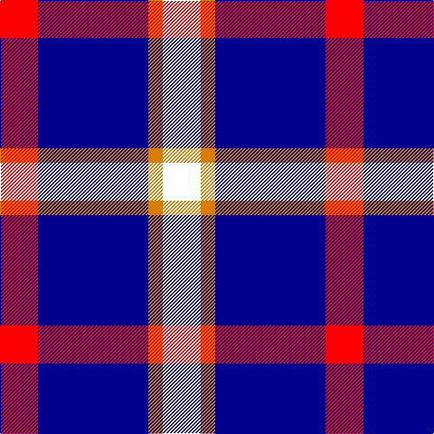

In pattern [RBYW](/patterns/rbyw/).

This was sourced from register-of-tartans.  It is a [4 stripes tartan](/stripes/stripes4/).

Original link https://www.tartanregister.gov.uk/tartanDetails.aspx?ref=10912

## Thread count
R/42 DB122 O16 W/42

## Palette
Each colour and its ΔE from the base-6 reference it is a variant of.

| Colour | Shade | Base | ΔE (OKLab) |
|---|---|---|---|
| DB | <code style="background-color:#00008C;">#00008C</code> `#00008C` | B <code style="background-color:#2A418A;">#2A418A</code> | 0.13 |
| O | <code style="background-color:#D87C00;">#D87C00</code> `#D87C00` | Y <code style="background-color:#F2BF00;">#F2BF00</code> | 0.17 |
| R | <code style="background-color:#FF0000;">#FF0000</code> `#FF0000` | R <code style="background-color:#CC0000;">#CC0000</code> | 0.11 |
| W | <code style="background-color:#FFFFFF;">#FFFFFF</code> `#FFFFFF` | W <code style="background-color:#F7F7F7;">#F7F7F7</code> | 0.02 |

# Sample pattern

## Nearest tartans

The nearest existing variants by ΔTartan distance.

1. [Kellogg College University of Oxford](/setts/s4/r21b61y8w21x2~b38409c-rc80000-wfcfcfc-ye8c000/) — ΔT 0.88
1. [MacRae Dress Purple](/setts/s4/k1w8b8r1x8~b3c0096-k101010-rdc0000-we0e0e0/) — ΔT 1.12
1. [Fong Wedding (Personal)](/setts/s4/r21b43ba86w10~b0000cd-ba26264f-rff0000-wffffff/) — ΔT 1.29
1. [Turnbull Dress, Bruce (Personal)](/setts/s5/b10g4w27b40r4x2~b1c1c50-g00801c-rc80000-we0e0e0/) — ΔT 1.38
1. [Lands of Liberty (Fashion)](/setts/s5/r15w10b48ba32r6x2~b202060-ba2888c4-rc80000-wfcfcfc/) — ΔT 1.48
1. [University of Trinity College](/setts/s5/k1r2w1b5y1x16~b000080-k101010-rff0000-w82cffd-yffe600/) — ΔT 1.51
1. [Lytley Hunting (Personal)](/setts/s5/b10r1y1ba3y2x5~b2c2c80-ba202060-rc80000-yfccc00/) — ΔT 1.62
1. [Lands of Liberty](/setts/s5/r10w5b30ba20r3x4~b2c4084-ba0596fa-rc80000-wffffff/) — ΔT 1.69
1. [Prehospital EMS Tartan (USA)](/setts/s5/k1w7r7b16y1x4~b23238e-k101010-ree5c42-wffffff-yeec900/) — ΔT 1.73
1. [Hydro-Electric (Corporate)](/setts/s6/r3k1w5k4b11r1x4~b2c2c80-k101010-rc80000-wfcfcfc/) — ΔT 1.74

## Neighbour map

Every grey dot is one of 15726 variants placed by the first two principal components of the ΔTartan feature space (44% of its variance). Red is this tartan; blue dots are its nearest — click one to open its page.

<svg viewBox="0 0 640 380" role="img" style="max-width:100%;height:auto;border:1px solid #e0e0e0;border-radius:4px;display:block" xmlns="http://www.w3.org/2000/svg"><image href="/nn/cloud.v1.png" width="640" height="380"/><a href="/setts/s4/r21b61y8w21x2~b38409c-rc80000-wfcfcfc-ye8c000/"><circle cx="240.3" cy="227.9" r="4" fill="#3465a4"><title>Kellogg College University of Oxford</title></circle></a><a href="/setts/s4/k1w8b8r1x8~b3c0096-k101010-rdc0000-we0e0e0/"><circle cx="210.3" cy="217.6" r="4" fill="#3465a4"><title>MacRae Dress Purple</title></circle></a><a href="/setts/s4/r21b43ba86w10~b0000cd-ba26264f-rff0000-wffffff/"><circle cx="256.6" cy="239.4" r="4" fill="#3465a4"><title>Fong Wedding (Personal)</title></circle></a><a href="/setts/s5/b10g4w27b40r4x2~b1c1c50-g00801c-rc80000-we0e0e0/"><circle cx="285.8" cy="206.2" r="4" fill="#3465a4"><title>Turnbull Dress, Bruce (Personal)</title></circle></a><a href="/setts/s5/r15w10b48ba32r6x2~b202060-ba2888c4-rc80000-wfcfcfc/"><circle cx="183.3" cy="224.9" r="4" fill="#3465a4"><title>Lands of Liberty (Fashion)</title></circle></a><a href="/setts/s5/k1r2w1b5y1x16~b000080-k101010-rff0000-w82cffd-yffe600/"><circle cx="162.2" cy="214.2" r="4" fill="#3465a4"><title>University of Trinity College</title></circle></a><a href="/setts/s5/b10r1y1ba3y2x5~b2c2c80-ba202060-rc80000-yfccc00/"><circle cx="305.5" cy="202.8" r="4" fill="#3465a4"><title>Lytley Hunting (Personal)</title></circle></a><a href="/setts/s5/r10w5b30ba20r3x4~b2c4084-ba0596fa-rc80000-wffffff/"><circle cx="207.8" cy="216.5" r="4" fill="#3465a4"><title>Lands of Liberty</title></circle></a><a href="/setts/s5/k1w7r7b16y1x4~b23238e-k101010-ree5c42-wffffff-yeec900/"><circle cx="221.0" cy="160.0" r="4" fill="#3465a4"><title>Prehospital EMS Tartan (USA)</title></circle></a><a href="/setts/s6/r3k1w5k4b11r1x4~b2c2c80-k101010-rc80000-wfcfcfc/"><circle cx="184.5" cy="188.5" r="4" fill="#3465a4"><title>Hydro-Electric (Corporate)</title></circle></a><circle cx="228.3" cy="227.9" r="5" fill="#c00000"/></svg>

ID: /setts/s4/r21b61y8w21x2~b00008c-rff0000-wffffff-yd87c00/
