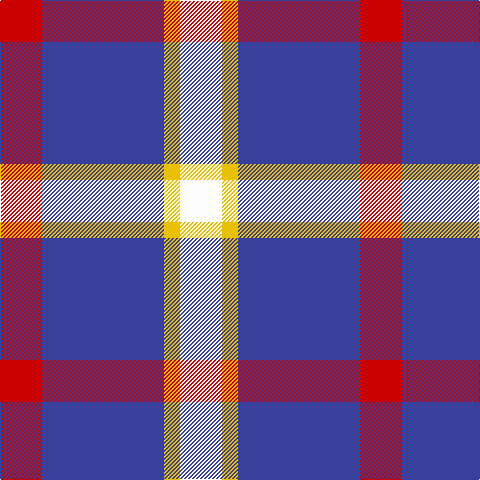

In pattern [RBYW](/patterns/rbyw/).

This was sourced from tartans-authority.  It is a [4 stripes tartan](/stripes/stripes4/).

Original link http://www.tartansauthority.com/tartan-ferret/display/10912/

## Thread count
R/42 B122 Y16 W/42

## Palette
Each colour and its ΔE from the base-6 reference it is a variant of.

| Colour | Shade | Base | ΔE (OKLab) |
|---|---|---|---|
| B | <code style="background-color:#38409C;">#38409C</code> `#38409C` | B <code style="background-color:#2A418A;">#2A418A</code> | 0.04 |
| R | <code style="background-color:#C80000;">#C80000</code> `#C80000` | R <code style="background-color:#CC0000;">#CC0000</code> | 0.01 |
| W | <code style="background-color:#FCFCFC;">#FCFCFC</code> `#FCFCFC` | W <code style="background-color:#F7F7F7;">#F7F7F7</code> | 0.01 |
| Y | <code style="background-color:#E8C000;">#E8C000</code> `#E8C000` | Y <code style="background-color:#F2BF00;">#F2BF00</code> | 0.02 |

# Sample pattern

## Nearest tartans

The nearest existing variants by ΔTartan distance.

1. [Kellogg College University of Oxford](/setts/s4/r21b61y8w21~b00008c-rff0000-wffffff-yd87c00~x2/) — ΔT 0.88
1. [MacRae Dress Purple](/setts/s4/k1w8b8r1~b3c0096-k101010-rdc0000-we0e0e0~x8/) — ΔT 1.13
1. [Boswell Dress Check (Personal)](/setts/s5/b8w13r3w2k5~b3850c8-k101010-rc80000-wf8f8f8~x2/) — ΔT 1.42
1. [MacRae - 2000 (Dress, Purple)](/setts/s4/k4w35b35r4~b780078-k101010-rb468ac-wf8f8f8~x2/) — ΔT 1.43
1. [MacRae of Conchra](/setts/s4/r1w8b8y1~b102040-rc00000-we0e0e0-yf0c000~x4/) — ΔT 1.44
1. [Turnbull Dress, Bruce (Personal)](/setts/s5/b10g4w27b40r4~b1c1c50-g00801c-rc80000-we0e0e0~x2/) — ΔT 1.48
1. [Boswell Dress (Personal)](/setts/s5/b8w13r3w2k5~b3850c8-k101010-rc80000-wffffff~x2/) — ΔT 1.49
1. [Lands of Liberty (Fashion)](/setts/s5/r15w10b48ba32r6~b202060-ba2888c4-rc80000-wfcfcfc~x2/) — ΔT 1.51
1. [MacRae of Conchra #3](/setts/s4/r7w36b36y7~b2c2c80-rc80000-wf0f0d8-ye8c000~x2/) — ΔT 1.59
1. [Drumfintley (Fashion)](/setts/s5/r30k7ra20y4k4~k101010-rb468ac-ra888888-yfccc00~x2/) — ΔT 1.60

## Neighbour map

Every grey dot is one of 15726 variants placed by the first two principal components of the ΔTartan feature space (44% of its variance). Red is this tartan; blue dots are its nearest — click one to open its page.

<svg viewBox="0 0 640 380" role="img" style="max-width:100%;height:auto;border:1px solid #e0e0e0;border-radius:4px;display:block" xmlns="http://www.w3.org/2000/svg"><image href="/nn/cloud.v1.png" width="640" height="380"/><a href="/setts/s4/r21b61y8w21~b00008c-rff0000-wffffff-yd87c00~x2/"><circle cx="228.3" cy="227.9" r="4" fill="#3465a4"><title>Kellogg College University of Oxford</title></circle></a><a href="/setts/s4/k1w8b8r1~b3c0096-k101010-rdc0000-we0e0e0~x8/"><circle cx="210.3" cy="217.6" r="4" fill="#3465a4"><title>MacRae Dress Purple</title></circle></a><a href="/setts/s5/b8w13r3w2k5~b3850c8-k101010-rc80000-wf8f8f8~x2/"><circle cx="164.6" cy="220.4" r="4" fill="#3465a4"><title>Boswell Dress Check (Personal)</title></circle></a><a href="/setts/s4/k4w35b35r4~b780078-k101010-rb468ac-wf8f8f8~x2/"><circle cx="223.0" cy="204.5" r="4" fill="#3465a4"><title>MacRae - 2000 (Dress, Purple)</title></circle></a><a href="/setts/s4/r1w8b8y1~b102040-rc00000-we0e0e0-yf0c000~x4/"><circle cx="205.6" cy="218.5" r="4" fill="#3465a4"><title>MacRae of Conchra</title></circle></a><a href="/setts/s5/b10g4w27b40r4~b1c1c50-g00801c-rc80000-we0e0e0~x2/"><circle cx="285.8" cy="206.2" r="4" fill="#3465a4"><title>Turnbull Dress, Bruce (Personal)</title></circle></a><a href="/setts/s5/b8w13r3w2k5~b3850c8-k101010-rc80000-wffffff~x2/"><circle cx="163.0" cy="219.3" r="4" fill="#3465a4"><title>Boswell Dress (Personal)</title></circle></a><a href="/setts/s5/r15w10b48ba32r6~b202060-ba2888c4-rc80000-wfcfcfc~x2/"><circle cx="183.3" cy="224.9" r="4" fill="#3465a4"><title>Lands of Liberty (Fashion)</title></circle></a><a href="/setts/s4/r7w36b36y7~b2c2c80-rc80000-wf0f0d8-ye8c000~x2/"><circle cx="159.4" cy="238.4" r="4" fill="#3465a4"><title>MacRae of Conchra #3</title></circle></a><a href="/setts/s5/r30k7ra20y4k4~k101010-rb468ac-ra888888-yfccc00~x2/"><circle cx="232.7" cy="220.7" r="4" fill="#3465a4"><title>Drumfintley (Fashion)</title></circle></a><circle cx="240.3" cy="227.9" r="5" fill="#c00000"/></svg>

ID: /setts/s4/r21b61y8w21~b38409c-rc80000-wfcfcfc-ye8c000~x2/
