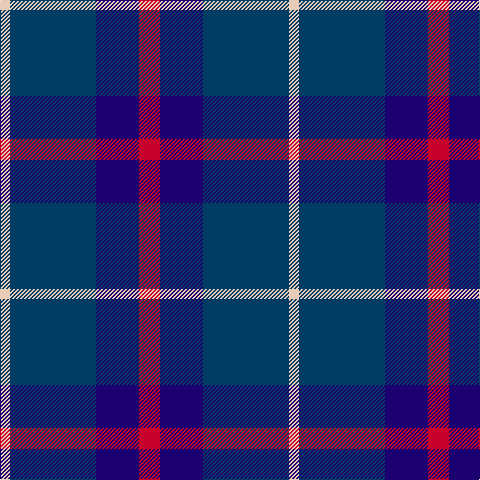

**Bands:** [RBBW](/stripes/rbbw/) · **Stripes:** [R DB DT LB](/stripes/stripes4/) R DB DT LB

This was sourced from tartans-authority.  It is a [4 band tartan](/bands/bands4/).

Original link http://www.tartansauthority.com/tartan-ferret/display/10828/

## Thread count
LR/10 DB86 DBa43 R/21

## Palette
Each colour and its ΔE from the base-6 reference it is a variant of.

| Colour | Shade | Base | ΔE (OKLab) |
|---|---|---|---|
| DB | <code style="background-color:#003C64;">#003C64</code> `#003C64` | B <code style="background-color:#2A418A;">#2A418A</code> | 0.08 |
| DBa | <code style="background-color:#1C0070;">#1C0070</code> `#1C0070` | B <code style="background-color:#2A418A;">#2A418A</code> | 0.14 |
| LR | <code style="background-color:#E8CCB8;">#E8CCB8</code> `#E8CCB8` | W <code style="background-color:#F7F7F7;">#F7F7F7</code> | 0.12 |
| R | <code style="background-color:#C8002C;">#C8002C</code> `#C8002C` | R <code style="background-color:#CC0000;">#CC0000</code> | 0.03 |

# Sample pattern

## Nearest tartans

The nearest existing variants by ΔTartan distance.

1. [Scottish Nuclear (Corporate)](/setts/s4/lb1k4db9r1~x4/) — ΔT 1.03
1. [Mirror (Corporate)](/setts/s4/r5db26k12w2~x4/) — ΔT 1.16
1. [Joker Fancy Tartan Tartan Number: 6769. Earliest known date: 2005 I have a photo of a fabric swatch that I am trying to match as close as possible. I have been commissioned to make a life size mannequin of Jack Nicholson as the Joker and he wore plaid/tartan pants. I could send you some photos through email and possibly you could help me. Thanks, Andy Garringer USA, January 2008. (96 threads @ 40 epi heavyweight = 2.5 inch repeat) See products available Copyright © Blair Urquhart, Comrie, 2015](/setts/s6/b11k1b3k5dp9lo1~x2/) — ΔT 1.16
1. [Brazell (Personal)](/setts/s5/db7ly1db7t11r2~x6/) — ΔT 1.26
1. [Fong Wedding (Personal)](/setts/s4/r21db43db86w10/) — ΔT 1.33
1. [Britannia](/setts/s5/k14r4k25db30w4~x2/) — ΔT 1.33
1. [College of Radiographers](/setts/s5/k15lo2k10db18lb3~x2/) — ΔT 1.36
1. [Scottish Express International](/setts/s6/k1db7k4lb1k4p1~x4/) — ΔT 1.38
1. [Cathro](/setts/s5/dp9db6w1dg4dp2~x4/) — ΔT 1.41
1. [Granger (Personal)](/setts/s6/db40k4db12k21g27w4~x2/) — ΔT 1.41

## Neighbour map

Every grey dot is one of 14313 variants placed by the first two principal components of the ΔTartan feature space (44% of its variance). Red is this tartan; blue dots are its nearest — click one to open its page.

<svg viewBox="0 0 640 380" role="img" style="max-width:100%;height:auto;border:1px solid #e0e0e0;border-radius:4px;display:block" xmlns="http://www.w3.org/2000/svg"><image href="/nn/cloud.v1.png" width="640" height="380"/><a href="/setts/s4/lb1k4db9r1~x4/"><circle cx="346.7" cy="243.7" r="4" fill="#3465a4"><title>Scottish Nuclear (Corporate)</title></circle></a><a href="/setts/s4/r5db26k12w2~x4/"><circle cx="330.2" cy="226.6" r="4" fill="#3465a4"><title>Mirror (Corporate)</title></circle></a><a href="/setts/s6/b11k1b3k5dp9lo1~x2/"><circle cx="263.7" cy="228.4" r="4" fill="#3465a4"><title>Joker Fancy Tartan Tartan Number: 6769. Earliest known date: 2005 I have a photo of a fabric swatch that I am trying to match as close as possible. I have been commissioned to make a life size mannequin of Jack Nicholson as the Joker and he wore plaid/tartan pants. I could send you some photos through email and possibly you could help me. Thanks, Andy Garringer USA, January 2008. (96 threads @ 40 epi heavyweight = 2.5 inch repeat) See products available Copyright © Blair Urquhart, Comrie, 2015</title></circle></a><a href="/setts/s5/db7ly1db7t11r2~x6/"><circle cx="265.5" cy="235.9" r="4" fill="#3465a4"><title>Brazell (Personal)</title></circle></a><a href="/setts/s4/r21db43db86w10/"><circle cx="259.4" cy="236.9" r="4" fill="#3465a4"><title>Fong Wedding (Personal)</title></circle></a><a href="/setts/s5/k14r4k25db30w4~x2/"><circle cx="285.3" cy="262.6" r="4" fill="#3465a4"><title>Britannia</title></circle></a><a href="/setts/s5/k15lo2k10db18lb3~x2/"><circle cx="273.6" cy="252.8" r="4" fill="#3465a4"><title>College of Radiographers</title></circle></a><a href="/setts/s6/k1db7k4lb1k4p1~x4/"><circle cx="285.5" cy="257.0" r="4" fill="#3465a4"><title>Scottish Express International</title></circle></a><a href="/setts/s5/dp9db6w1dg4dp2~x4/"><circle cx="288.0" cy="263.6" r="4" fill="#3465a4"><title>Cathro</title></circle></a><a href="/setts/s6/db40k4db12k21g27w4~x2/"><circle cx="253.8" cy="238.6" r="4" fill="#3465a4"><title>Granger (Personal)</title></circle></a><circle cx="291.9" cy="257.7" r="5" fill="#c00000"/></svg>

ID: /setts/s4/r21db43dt86lb10/
