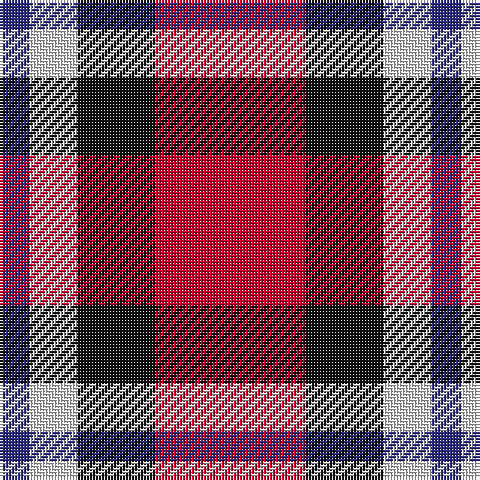

**Bands:** [RKWB](/stripes/rkwb/) · **Stripes:** [R K W DB](/stripes/stripes4/) R K W DB

This was sourced from tartans-authority.  It is a [4 band tartan](/bands/bands4/).

Original link http://www.tartansauthority.com/tartan-ferret/display/8513/

## Variants

Other setts woven to the same stripe pattern.

- [Gleneckley](/setts/s4/db3w25k25r3~x2/)

## Thread count
R/50 K26 LN16 DB/10

## Palette
Each colour and its ΔE from the base-6 reference it is a variant of.

| Colour | Shade | Base | ΔE (OKLab) |
|---|---|---|---|
| DB | <code style="background-color:#2C2C80;">#2C2C80</code> `#2C2C80` | B <code style="background-color:#2A418A;">#2A418A</code> | 0.06 |
| K | <code style="background-color:#101010;">#101010</code> `#101010` | K <code style="background-color:#000000;">#000000</code> | 0.17 |
| LN | <code style="background-color:#E0E0E0;">#E0E0E0</code> `#E0E0E0` | W <code style="background-color:#F7F7F7;">#F7F7F7</code> | 0.07 |
| R | <code style="background-color:#C8002C;">#C8002C</code> `#C8002C` | R <code style="background-color:#CC0000;">#CC0000</code> | 0.03 |

# Sample pattern

## Nearest tartans

The nearest existing variants by ΔTartan distance.

1. [Aberdeen University (1992)](/setts/s5/ly4r27k12db15ly4~x2/) — ΔT 1.02
1. [Brodie Dress](/setts/s5/k6r33k18w20db6~x2/) — ΔT 1.19
1. [Aberdeen University](/setts/s5/ly2r15k7db8ly2~x4/) — ΔT 1.25
1. [Eastern Kentucky University](/setts/s6/r15o9w4k12r15k5~x2/) — ΔT 1.37
1. [Bonhill Primary School](/setts/s4/r4k25o25w4~x2/) — ΔT 1.44
1. [SAL Cubiska Stenen](/setts/s5/r15g3w2k10w5~x2/) — ΔT 1.47
1. [McGill University](/setts/s5/w3r24db12dg8ly3~x2/) — ΔT 1.48
1. [Brice (Artefact)](/setts/s6/r6k9r12w2k2w4~x2/) — ΔT 1.48
1. [McGill University (Corporate)](/setts/s5/w3r24db12dg8lo3~x2/) — ΔT 1.50
1. [Connel (Clan)](/setts/s4/w1r8k8ly1~x4/) — ΔT 1.52

## Neighbour map

Every grey dot is one of 14299 variants placed by the first two principal components of the ΔTartan feature space (44% of its variance). Red is this tartan; blue dots are its nearest — click one to open its page.

<svg viewBox="0 0 640 380" role="img" style="max-width:100%;height:auto;border:1px solid #e0e0e0;border-radius:4px;display:block" xmlns="http://www.w3.org/2000/svg"><image href="/nn/cloud.v1.png" width="640" height="380"/><a href="/setts/s5/ly4r27k12db15ly4~x2/"><circle cx="188.0" cy="222.2" r="4" fill="#3465a4"><title>Aberdeen University (1992)</title></circle></a><a href="/setts/s5/k6r33k18w20db6~x2/"><circle cx="136.0" cy="223.9" r="4" fill="#3465a4"><title>Brodie Dress</title></circle></a><a href="/setts/s5/ly2r15k7db8ly2~x4/"><circle cx="185.9" cy="213.6" r="4" fill="#3465a4"><title>Aberdeen University</title></circle></a><a href="/setts/s6/r15o9w4k12r15k5~x2/"><circle cx="173.6" cy="261.0" r="4" fill="#3465a4"><title>Eastern Kentucky University</title></circle></a><a href="/setts/s4/r4k25o25w4~x2/"><circle cx="214.6" cy="234.9" r="4" fill="#3465a4"><title>Bonhill Primary School</title></circle></a><a href="/setts/s5/r15g3w2k10w5~x2/"><circle cx="166.1" cy="205.8" r="4" fill="#3465a4"><title>SAL Cubiska Stenen</title></circle></a><a href="/setts/s5/w3r24db12dg8ly3~x2/"><circle cx="197.2" cy="181.7" r="4" fill="#3465a4"><title>McGill University</title></circle></a><a href="/setts/s6/r6k9r12w2k2w4~x2/"><circle cx="234.0" cy="229.8" r="4" fill="#3465a4"><title>Brice (Artefact)</title></circle></a><a href="/setts/s5/w3r24db12dg8lo3~x2/"><circle cx="210.0" cy="194.9" r="4" fill="#3465a4"><title>McGill University (Corporate)</title></circle></a><a href="/setts/s4/w1r8k8ly1~x4/"><circle cx="239.7" cy="217.6" r="4" fill="#3465a4"><title>Connel (Clan)</title></circle></a><circle cx="195.6" cy="244.9" r="5" fill="#c00000"/></svg>

ID: /setts/s4/r25k13w8db5~x2/
