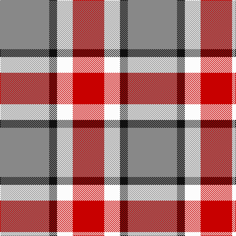

In pattern [RKWR](/patterns/rkwr/).

This was sourced from tartans-authority.  It is a [4 stripes tartan](/stripes/stripes4/).

Original link http://www.tartansauthority.com/tartan-ferret/display/10702/

## Thread count
N/100 K16 W32 R/64

## Palette
Each colour and its ΔE from the base-6 reference it is a variant of.

| Colour | Shade | Base | ΔE (OKLab) |
|---|---|---|---|
| K | <code style="background-color:#101010;">#101010</code> `#101010` | K <code style="background-color:#000000;">#000000</code> | 0.17 |
| N | <code style="background-color:#888888;">#888888</code> `#888888` | R <code style="background-color:#CC0000;">#CC0000</code> | 0.24 |
| R | <code style="background-color:#C80000;">#C80000</code> `#C80000` | R <code style="background-color:#CC0000;">#CC0000</code> | 0.01 |
| W | <code style="background-color:#FCFCFC;">#FCFCFC</code> `#FCFCFC` | W <code style="background-color:#F7F7F7;">#F7F7F7</code> | 0.01 |

# Sample pattern

## Nearest tartans

The nearest existing variants by ΔTartan distance.

1. [Buckeye](/setts/s4/g25k4w8r16x4~g75786c-k120a01-rdd1212-wf7f1e8/) — ΔT 0.33
1. [Snowbird (Corporate)](/setts/s5/r8y15b12r29w4x2~b1474b4-rc80000-we0e0e0-y48a4c0/) — ΔT 1.20
1. [Doohan (Name)](/setts/s5/b2y1r4b4w2x10~b5c8ca8-rc80000-wfcfcfc-ybc8c00/) — ΔT 1.26
1. [Doohan (New South Wales), Andrew](/setts/s5/b2y1r4b4w2x10~b5f749c-rca2625-wf9f5ef-ye0a126/) — ΔT 1.30
1. [Winnipeg Embroiders' Guild (Corp.)](/setts/s6/r12b2y2w2b4w3x2~b003c64-re87878-we8ccb8-ye8c000/) — ΔT 1.34
1. [Louisburg](/setts/s4/r22y10w3b8x2~b1c0070-r888888-wf8f8f8-ye8c000/) — ΔT 1.37
1. [Ikelman No 2](/setts/s5/g26k10r10y10g3x2~g808080-k000000-rc00000-yf0c000/) — ΔT 1.40
1. [Unidentified Lindley](/setts/s6/b6r6w1r6b6y1x8~b1474b4-re86000-wfcfcfc-ye8c000/) — ΔT 1.47
1. [MacLeod, of Argentina](/setts/s5/b10w3b12y14r4x2~b304080-rc00000-we0e0e0-yf0c000/) — ΔT 1.48
1. [Thompson, D.C. (Personal)](/setts/s6/k4b28r6w12r12w3x2~b5c8ca8-k101010-rc80000-we0e0e0/) — ΔT 1.48

## Neighbour map

Every grey dot is one of 15726 variants placed by the first two principal components of the ΔTartan feature space (44% of its variance). Red is this tartan; blue dots are its nearest — click one to open its page.

<svg viewBox="0 0 640 380" role="img" style="max-width:100%;height:auto;border:1px solid #e0e0e0;border-radius:4px;display:block" xmlns="http://www.w3.org/2000/svg"><image href="/nn/cloud.v1.png" width="640" height="380"/><a href="/setts/s4/g25k4w8r16x4~g75786c-k120a01-rdd1212-wf7f1e8/"><circle cx="208.6" cy="247.1" r="4" fill="#3465a4"><title>Buckeye</title></circle></a><a href="/setts/s5/r8y15b12r29w4x2~b1474b4-rc80000-we0e0e0-y48a4c0/"><circle cx="268.3" cy="237.8" r="4" fill="#3465a4"><title>Snowbird (Corporate)</title></circle></a><a href="/setts/s5/b2y1r4b4w2x10~b5c8ca8-rc80000-wfcfcfc-ybc8c00/"><circle cx="168.8" cy="272.8" r="4" fill="#3465a4"><title>Doohan (Name)</title></circle></a><a href="/setts/s5/b2y1r4b4w2x10~b5f749c-rca2625-wf9f5ef-ye0a126/"><circle cx="175.2" cy="274.5" r="4" fill="#3465a4"><title>Doohan (New South Wales), Andrew</title></circle></a><a href="/setts/s6/r12b2y2w2b4w3x2~b003c64-re87878-we8ccb8-ye8c000/"><circle cx="220.8" cy="204.8" r="4" fill="#3465a4"><title>Winnipeg Embroiders' Guild (Corp.)</title></circle></a><a href="/setts/s4/r22y10w3b8x2~b1c0070-r888888-wf8f8f8-ye8c000/"><circle cx="217.8" cy="239.3" r="4" fill="#3465a4"><title>Louisburg</title></circle></a><a href="/setts/s5/g26k10r10y10g3x2~g808080-k000000-rc00000-yf0c000/"><circle cx="198.5" cy="220.2" r="4" fill="#3465a4"><title>Ikelman No 2</title></circle></a><a href="/setts/s6/b6r6w1r6b6y1x8~b1474b4-re86000-wfcfcfc-ye8c000/"><circle cx="231.6" cy="249.2" r="4" fill="#3465a4"><title>Unidentified Lindley</title></circle></a><a href="/setts/s5/b10w3b12y14r4x2~b304080-rc00000-we0e0e0-yf0c000/"><circle cx="185.2" cy="260.0" r="4" fill="#3465a4"><title>MacLeod, of Argentina</title></circle></a><a href="/setts/s6/k4b28r6w12r12w3x2~b5c8ca8-k101010-rc80000-we0e0e0/"><circle cx="202.3" cy="197.7" r="4" fill="#3465a4"><title>Thompson, D.C. (Personal)</title></circle></a><circle cx="204.5" cy="245.1" r="5" fill="#c00000"/></svg>

ID: /setts/s4/r25k4w8ra16x4~k101010-r888888-rac80000-wfcfcfc/
