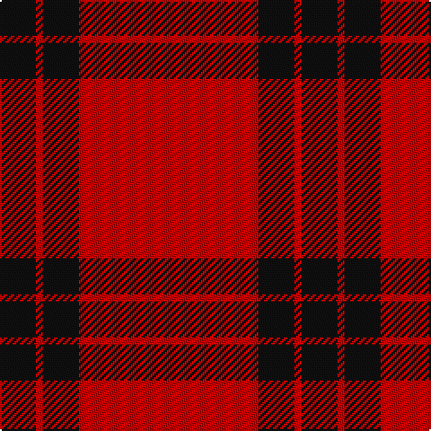

**Bands:** [KRKR](/stripes/krkr/) · **Stripes:** [K R K R](/stripes/stripes4/) K R K R

This was sourced from tartans-authority.  It is a [4 band tartan](/bands/bands4/).

Original link http://www.tartansauthority.com/tartan-ferret/display/7202/

## Variants

Other setts woven to the same stripe pattern.

- [Clan Anord (Corporate)](/setts/s4/k3r20k20r3~x2/)
- [Ettrick](/setts/s4/k6r31k31r6~x2/)
- [Ettrick (District)](/setts/s4/k5r26k26r5~x4/)
- [Lendrum (Black & Red) or MacFarlane](/setts/s4/k12r7k1r9~x4/)
- [Lendrum, or MacFarlane](/setts/s4/k67r32k6r32/)
- [MacFarlane Red & Black (Artefact)](/setts/s4/k30r17k3r17~x4/)
- [Wcwm 9275-1333-2](/setts/s4/k20r3k20r20~x2/)

## Thread count
K/20 R4 K20 R/100

## Palette
Each colour and its ΔE from the base-6 reference it is a variant of.

| Colour | Shade | Base | ΔE (OKLab) |
|---|---|---|---|
| K | <code style="background-color:#101010;">#101010</code> `#101010` | K <code style="background-color:#000000;">#000000</code> | 0.17 |
| R | <code style="background-color:#C80000;">#C80000</code> `#C80000` | R <code style="background-color:#CC0000;">#CC0000</code> | 0.01 |

# Sample pattern

## Nearest tartans

The nearest existing variants by ΔTartan distance.

1. [Masai Shuka 07 (Artefact)](/setts/s5/r75k15r4k15r4~x2/) — ΔT 0.74
1. [Masai Shuka 21 (Artefact)](/setts/s4/r40db2r6db15~x2/) — ΔT 1.28
1. [MacDonald Lord of the Isles](/setts/s4/r38dg2r5dg16/) — ΔT 1.41
1. [Oilmens (Corporate)](/setts/s8/ly4k1r30k15r24k2r4k1~x4/) — ΔT 1.72
1. [Duke of Sussex](/setts/s7/r18g1k5g1k1g1r9~x2/) — ΔT 1.75
1. [MacDonald of Sleat](/setts/s4/r36g2r5g16~x2/) — ΔT 1.78
1. [Campbell Red (artefact)](/setts/s5/r4k1r24k22r2~x2/) — ΔT 1.80
1. [MacDonald of Sleat - 1810 (Clan)](/setts/s4/r36dg2r5dg16~x2/) — ΔT 1.86
1. [Cameron Ancient](/setts/s7/r58ly3r6dg16r12dg16r6/) — ΔT 1.87
1. [Hopkins (Name)](/setts/s5/r36k18r4k7w2~x2/) — ΔT 1.94

## Neighbour map

Every grey dot is one of 14313 variants placed by the first two principal components of the ΔTartan feature space (44% of its variance). Red is this tartan; blue dots are its nearest — click one to open its page.

<svg viewBox="0 0 640 380" role="img" style="max-width:100%;height:auto;border:1px solid #e0e0e0;border-radius:4px;display:block" xmlns="http://www.w3.org/2000/svg"><image href="/nn/cloud.v1.png" width="640" height="380"/><a href="/setts/s5/r75k15r4k15r4~x2/"><circle cx="540.3" cy="193.8" r="4" fill="#3465a4"><title>Masai Shuka 07 (Artefact)</title></circle></a><a href="/setts/s4/r40db2r6db15~x2/"><circle cx="548.2" cy="225.8" r="4" fill="#3465a4"><title>Masai Shuka 21 (Artefact)</title></circle></a><a href="/setts/s4/r38dg2r5dg16/"><circle cx="528.6" cy="232.0" r="4" fill="#3465a4"><title>MacDonald Lord of the Isles</title></circle></a><a href="/setts/s8/ly4k1r30k15r24k2r4k1~x4/"><circle cx="494.1" cy="144.2" r="4" fill="#3465a4"><title>Oilmens (Corporate)</title></circle></a><a href="/setts/s7/r18g1k5g1k1g1r9~x2/"><circle cx="489.1" cy="155.8" r="4" fill="#3465a4"><title>Duke of Sussex</title></circle></a><a href="/setts/s4/r36g2r5g16~x2/"><circle cx="522.8" cy="238.0" r="4" fill="#3465a4"><title>MacDonald of Sleat</title></circle></a><a href="/setts/s5/r4k1r24k22r2~x2/"><circle cx="421.2" cy="192.4" r="4" fill="#3465a4"><title>Campbell Red (artefact)</title></circle></a><a href="/setts/s4/r36dg2r5dg16~x2/"><circle cx="532.2" cy="241.6" r="4" fill="#3465a4"><title>MacDonald of Sleat - 1810 (Clan)</title></circle></a><a href="/setts/s7/r58ly3r6dg16r12dg16r6/"><circle cx="489.5" cy="173.3" r="4" fill="#3465a4"><title>Cameron Ancient</title></circle></a><a href="/setts/s5/r36k18r4k7w2~x2/"><circle cx="399.9" cy="189.7" r="4" fill="#3465a4"><title>Hopkins (Name)</title></circle></a><circle cx="537.2" cy="201.4" r="5" fill="#c00000"/></svg>

ID: /setts/s4/r25k5r1k5~x4/
