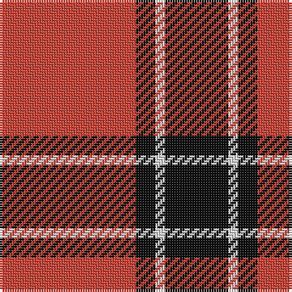

In pattern [KWKR](/stripes/kwkr/).

This was sourced from tartans-authority.  It is a [4 stripe tartan](/stripes/stripes4/).

Original link http://www.tartansauthority.com/tartan-ferret/display/1236/

## Also known as

This cloth is also recorded under:

- Dunbar Ancient

## Attestations

This cloth appears in 3 source records; the oldest owns this page.

- 1840 — Dunbar (District) (tartans-authority, [record](http://www.tartansauthority.com/tartan-ferret/display/1236/))
- undated — Dunbar (weddslist, [record](http://www.weddslist.com/cgi-bin/tartans/pg.pl?source=sts))
- undated — Dunbar (Wilson's) District Tartan Tartan Number: 1236. Earliest known date: 1840 Restricted See products available Copyright © Blair Urquhart, Comrie, 2015 (house-of-tartan, [record](http://www.house-of-tartan.scotland.net/house/TartanViewjs.asp?colr=Def&tnam=1236))

## Thread count
R/56 K8 LN4 K/26

## Palette
Each colour and the base-6 reference it is a variant of.

| Colour | Shade | Base |
|---|---|---|
| K | <code style="background-color:#101010;">#101010</code> `oklch(17.3% 0.000 89.9)` <small>#101010</small> | K <code style="background-color:#000000;">#000000</code> |
| LN | <code style="background-color:#E0E0E0;">#E0E0E0</code> `oklch(90.7% 0.000 89.9)` <small>#E0E0E0</small> | W <code style="background-color:#F7F7F7;">#F7F7F7</code> |
| R | <code style="background-color:#CC4438;">#CC4438</code> `oklch(57.7% 0.174 28.7)` <small>#CC4438</small> | R <code style="background-color:#CC0000;">#CC0000</code> |

# Sample pattern

## Nearest tartans

The nearest existing variants by ΔTartan distance.

1. [MacGregor, Black (Personal)](/setts/s5/r41k19r7k9w3~x2/) — ΔT 0.78
1. [Hopkins (Name)](/setts/s5/r36k18r4k7w2~x2/) — ΔT 0.91
1. [MacKeane](/setts/s5/r4k8r12k1ly1~x2/) — ΔT 0.97
1. [MacIver](/setts/s5/k16r2k2r12w1~x2/) — ΔT 1.00
1. [Loch Morar](/setts/s5/r38w9r3k9w3~x2/) — ΔT 1.03
1. [Glen Shiel (Fashion)](/setts/s5/r13lb3r1dg3lb1~x6/) — ΔT 1.05
1. [Masai Shuka 15 (Artefact)](/setts/s5/r20k2r2k15w1~x2/) — ΔT 1.07
1. [Billy Apple® Red](/setts/s4/g1r13k8ly1~x6/) — ΔT 1.17
1. [Dunbar Ancient](/setts/s6/r28k4w2k13~x2/) — ΔT 1.24
1. [Auld Reekie](/setts/s6/db4r3db3r22dg8r2~x2/) — ΔT 1.29

## Neighbour map

Every grey dot is one of 14299 variants placed by the first two principal components of the ΔTartan feature space (44% of its variance). Red is this tartan; blue dots are its nearest — click one to open its page.

<svg viewBox="0 0 640 380" role="img" style="max-width:100%;height:auto;border:1px solid #e0e0e0;border-radius:4px;display:block" xmlns="http://www.w3.org/2000/svg"><image href="/nn/cloud.v1.png" width="640" height="380"/><a href="/setts/s5/r41k19r7k9w3~x2/"><circle cx="382.7" cy="201.8" r="4" fill="#3465a4"><title>MacGregor, Black (Personal)</title></circle></a><a href="/setts/s5/r36k18r4k7w2~x2/"><circle cx="399.6" cy="189.5" r="4" fill="#3465a4"><title>Hopkins (Name)</title></circle></a><a href="/setts/s5/r4k8r12k1ly1~x2/"><circle cx="384.8" cy="212.9" r="4" fill="#3465a4"><title>MacKeane</title></circle></a><a href="/setts/s5/k16r2k2r12w1~x2/"><circle cx="360.3" cy="195.2" r="4" fill="#3465a4"><title>MacIver</title></circle></a><a href="/setts/s5/r38w9r3k9w3~x2/"><circle cx="390.4" cy="182.7" r="4" fill="#3465a4"><title>Loch Morar</title></circle></a><a href="/setts/s5/r13lb3r1dg3lb1~x6/"><circle cx="418.3" cy="192.4" r="4" fill="#3465a4"><title>Glen Shiel (Fashion)</title></circle></a><a href="/setts/s5/r20k2r2k15w1~x2/"><circle cx="386.4" cy="183.9" r="4" fill="#3465a4"><title>Masai Shuka 15 (Artefact)</title></circle></a><a href="/setts/s4/g1r13k8ly1~x6/"><circle cx="330.1" cy="191.1" r="4" fill="#3465a4"><title>Billy Apple® Red</title></circle></a><a href="/setts/s6/r28k4w2k13~x2/"><circle cx="334.4" cy="176.8" r="4" fill="#3465a4"><title>Dunbar Ancient</title></circle></a><a href="/setts/s6/db4r3db3r22dg8r2~x2/"><circle cx="400.1" cy="201.9" r="4" fill="#3465a4"><title>Auld Reekie</title></circle></a><circle cx="375.2" cy="209.8" r="5" fill="#c00000"/></svg>

ID: /setts/s4/r28k4w2k13~x2/
