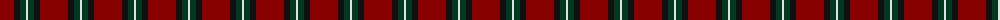

In pattern [RKGW](/patterns/rkgw/).

This was sourced from tartans-authority.  It is a [4 stripes tartan](/stripes/stripes4/).

Original link http://www.tartansauthority.com/tartan-ferret/display/3627/

## Attestations

This cloth appears in 2 source records; the oldest owns this page.

- pre 2002 — Bacon, Red (Fashion) (tartans-authority, [record](http://www.tartansauthority.com/tartan-ferret/display/3627/))
- undated — Bacon, Red (register-of-tartans, [record](https://www.tartanregister.gov.uk/tartanDetails.aspx?ref=5148))

## Thread count
DR/28 K6 DG6 LN/2

## Palette
Each colour and its ΔE from the base-6 reference it is a variant of.

| Colour | Shade | Base | ΔE (OKLab) |
|---|---|---|---|
| DG | <code style="background-color:#003820;">#003820</code> `#003820` | G <code style="background-color:#006400;">#006400</code> | 0.16 |
| DR | <code style="background-color:#880000;">#880000</code> `#880000` | R <code style="background-color:#C80000;">#C80000</code> | 0.14 |
| K | <code style="background-color:#101010;">#101010</code> `#101010` | K <code style="background-color:#000000;">#000000</code> | 0.17 |
| LN | <code style="background-color:#E0E0E0;">#E0E0E0</code> `#E0E0E0` | W <code style="background-color:#F4F4F0;">#F4F4F0</code> | 0.06 |

# Sample pattern

## Nearest tartans

The nearest existing variants by ΔTartan distance.

1. [Broberg (Scania) (Personal)](/setts/s4/r80b40k5y6-b5c8ca8-k101010-ra00000-yd09800/) — ΔT 1.22
1. [MacKintosh D](/setts/s6/r44b10r4g22r6b2-b000052-g11450d-raa0000/) — ΔT 1.47
1. [MacGregor of Cardney](/setts/s6/r72g36r8g12k4w4-g006818-k101010-ra00048-we0e0e0/) — ΔT 1.47
1. [Dunbar (District)](/setts/s6/k16r98k16w6k40y6-k101010-r880000-wc0c0c0-yd09800/) — ΔT 1.48
1. [Highlands at Wyomissing, The](/setts/s5/r70w6r16y4g22-g146400-r880000-wffffff-yfccc00/) — ΔT 1.49
1. [MacGregor Hunting Glengyle Clan Tartan Tartan Number: 1285. Earliest known date: 1960 This is the usual MacGregor sett but with a darker crimson background colour. The story goes that Alasdair MacGregor of Cardney wanted to make tartan from the wool of his own sheep. His initial dyeing attempt produced a shocking pink colour, so he dyed the wool a second time to get this dark crimson colour. He liked the result so much that he had a bolt of cloth woven and the Cardney MacGregors have worn it ever since. The addition of the term 'Hunting' to the name is, apparently a commercial attribution. Notes from the STA, quoting Sir Malcolm MacGregor of MacGregor (2006) See products available Copyright © Blair Urquhart, Comrie, 2015](/setts/s6/r96g42r16g17k4w6-g006818-k101010-ra00048-wc0c0c0/) — ΔT 1.51
1. [Loch Garth](/setts/s4/b48g24b8y4-b441800-g8c7038-yd09800/) — ΔT 1.52
1. [MacKintosh](/setts/s6/r48b12r6g24r8b2-b000052-g11450d-raa0000/) — ΔT 1.52
1. [Auld Reekie](/setts/s6/b8r6b6r44g16r4-b000050-g003000-rc00000/) — ΔT 1.52
1. [MacGregor, Glengyle](/setts/s6/r96g42r16g17k4ga6-g008000-ga808080-k000000-r900030/) — ΔT 1.55

## Neighbour map

Every grey dot is one of 15726 variants placed by the first two principal components of the ΔTartan feature space (44% of its variance). Red is this tartan; blue dots are its nearest — click one to open its page.

<svg viewBox="0 0 640 380" role="img" style="max-width:100%;height:auto;border:1px solid #e0e0e0;border-radius:4px;display:block" xmlns="http://www.w3.org/2000/svg"><image href="/nn/cloud.v1.png" width="640" height="380"/><a href="/setts/s4/r80b40k5y6-b5c8ca8-k101010-ra00000-yd09800/"><circle cx="407.5" cy="203.3" r="4" fill="#3465a4"><title>Broberg (Scania) (Personal)</title></circle></a><a href="/setts/s6/r44b10r4g22r6b2-b000052-g11450d-raa0000/"><circle cx="428.7" cy="190.5" r="4" fill="#3465a4"><title>MacKintosh D</title></circle></a><a href="/setts/s6/r72g36r8g12k4w4-g006818-k101010-ra00048-we0e0e0/"><circle cx="396.0" cy="172.4" r="4" fill="#3465a4"><title>MacGregor of Cardney</title></circle></a><a href="/setts/s6/k16r98k16w6k40y6-k101010-r880000-wc0c0c0-yd09800/"><circle cx="370.9" cy="181.7" r="4" fill="#3465a4"><title>Dunbar (District)</title></circle></a><a href="/setts/s5/r70w6r16y4g22-g146400-r880000-wffffff-yfccc00/"><circle cx="470.5" cy="182.1" r="4" fill="#3465a4"><title>Highlands at Wyomissing, The</title></circle></a><a href="/setts/s6/r96g42r16g17k4w6-g006818-k101010-ra00048-wc0c0c0/"><circle cx="429.5" cy="166.7" r="4" fill="#3465a4"><title>MacGregor Hunting Glengyle Clan Tartan Tartan Number: 1285. Earliest known date: 1960 This is the usual MacGregor sett but with a darker crimson background colour. The story goes that Alasdair MacGregor of Cardney wanted to make tartan from the wool of his own sheep. His initial dyeing attempt produced a shocking pink colour, so he dyed the wool a second time to get this dark crimson colour. He liked the result so much that he had a bolt of cloth woven and the Cardney MacGregors have worn it ever since. The addition of the term 'Hunting' to the name is, apparently a commercial attribution. Notes from the STA, quoting Sir Malcolm MacGregor of MacGregor (2006) See products available Copyright © Blair Urquhart, Comrie, 2015</title></circle></a><a href="/setts/s4/b48g24b8y4-b441800-g8c7038-yd09800/"><circle cx="450.8" cy="254.0" r="4" fill="#3465a4"><title>Loch Garth</title></circle></a><a href="/setts/s6/r48b12r6g24r8b2-b000052-g11450d-raa0000/"><circle cx="431.0" cy="191.7" r="4" fill="#3465a4"><title>MacKintosh</title></circle></a><a href="/setts/s6/b8r6b6r44g16r4-b000050-g003000-rc00000/"><circle cx="401.5" cy="203.4" r="4" fill="#3465a4"><title>Auld Reekie</title></circle></a><a href="/setts/s6/r96g42r16g17k4ga6-g008000-ga808080-k000000-r900030/"><circle cx="422.3" cy="166.6" r="4" fill="#3465a4"><title>MacGregor, Glengyle</title></circle></a><circle cx="431.3" cy="211.9" r="5" fill="#c00000"/></svg>

ID: /setts/s4/r28k6g6w2-g003820-k101010-r880000-we0e0e0/
