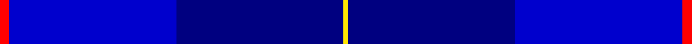

In pattern [RBBY](/stripes/rbby/).

This was sourced from register-of-tartans.  It is a [4 stripe tartan](/stripes/stripes4/).

Original link https://www.tartanregister.gov.uk/tartanDetails.aspx?ref=10583

## Attestations

This cloth appears in 2 source records; the oldest owns this page.

- 08/03/2012 — Mackaw (register-of-tartans, [record](https://www.tartanregister.gov.uk/tartanDetails.aspx?ref=10583))
- 08/03/2012 — Mackaw (Corporate) (tartans-authority, [record](http://www.tartansauthority.com/tartan-ferret/display/10583/))

## Register references

External register numbers recorded for this tartan.

- Scottish Register of Tartans: [10583](https://www.tartanregister.gov.uk/tartanDetails.aspx?ref=10583)

## Thread count
R/4 B70 DB70 Y/2

## Palette
Each colour and the base-6 reference it is a variant of.

| Colour | Shade | Base |
|---|---|---|
| B | <code style="background-color:#0000CD;">#0000CD</code> `oklch(38.3% 0.266 264.1)` <small>#0000CD</small> | B <code style="background-color:#2A418A;">#2A418A</code> |
| DB | <code style="background-color:#000080;">#000080</code> `oklch(27.1% 0.188 264.1)` <small>#000080</small> | B <code style="background-color:#2A418A;">#2A418A</code> |
| R | <code style="background-color:#FF0000;">#FF0000</code> `oklch(62.8% 0.258 29.2)` <small>#FF0000</small> | R <code style="background-color:#CC0000;">#CC0000</code> |
| Y | <code style="background-color:#FFE600;">#FFE600</code> `oklch(91.7% 0.192 101.4)` <small>#FFE600</small> | Y <code style="background-color:#F2BF00;">#F2BF00</code> |

# Sample pattern

## Nearest tartans

The nearest existing variants by ΔTartan distance.

1. [Erskine Blue (Fashion)](/setts/s6/db3db1db12db12lb1db3~x4/) — ΔT 2.19
1. [British American School (Corporate)](/setts/s7/db2b2r1b16w1db20r2~x2/) — ΔT 2.50
1. [Trotter (Personal)](/setts/s9/db23db2db2db2db2db28r2db4b2~x2/) — ΔT 2.52
1. [Edzell, U.S. Navy](/setts/s6/db45db7w3db27r1db7~x2/) — ΔT 2.60
1. [U.S.S. John Paul Jones #1](/setts/s6/b3db1db16db16db2lb2~x4/) — ΔT 2.61
1. [Edzell, U.S. Navy](/setts/s6/db104db16w8db66r3db16/) — ΔT 2.67
1. [U.S. Navy/Edzell (Military)](/setts/s6/dt45db7w3db27r1db7~x2/) — ΔT 2.87
1. [Williams (New York) (Personal)](/setts/s5/k30db6k6db41lt2~x2/) — ΔT 2.91
1. [Waters of Georgian Bay (District)](/setts/s6/db38w3db8db36dg9r3~x2/) — ΔT 2.91
1. [Deighan (Burham Kent) (Name)](/setts/s5/n4db43k20n7o2~x2/) — ΔT 2.97

## Neighbour map

Every grey dot is one of 14299 variants placed by the first two principal components of the ΔTartan feature space (44% of its variance). Red is this tartan; blue dots are its nearest — click one to open its page.

<svg viewBox="0 0 640 380" role="img" style="max-width:100%;height:auto;border:1px solid #e0e0e0;border-radius:4px;display:block" xmlns="http://www.w3.org/2000/svg"><image href="/nn/cloud.v1.png" width="640" height="380"/><a href="/setts/s6/db3db1db12db12lb1db3~x4/"><circle cx="389.0" cy="268.1" r="4" fill="#3465a4"><title>Erskine Blue (Fashion)</title></circle></a><a href="/setts/s7/db2b2r1b16w1db20r2~x2/"><circle cx="395.0" cy="196.5" r="4" fill="#3465a4"><title>British American School (Corporate)</title></circle></a><a href="/setts/s9/db23db2db2db2db2db28r2db4b2~x2/"><circle cx="415.3" cy="207.8" r="4" fill="#3465a4"><title>Trotter (Personal)</title></circle></a><a href="/setts/s6/db45db7w3db27r1db7~x2/"><circle cx="409.7" cy="179.4" r="4" fill="#3465a4"><title>Edzell, U.S. Navy</title></circle></a><a href="/setts/s6/b3db1db16db16db2lb2~x4/"><circle cx="302.7" cy="206.0" r="4" fill="#3465a4"><title>U.S.S. John Paul Jones #1</title></circle></a><a href="/setts/s6/db104db16w8db66r3db16/"><circle cx="387.3" cy="186.3" r="4" fill="#3465a4"><title>Edzell, U.S. Navy</title></circle></a><a href="/setts/s6/dt45db7w3db27r1db7~x2/"><circle cx="450.4" cy="200.4" r="4" fill="#3465a4"><title>U.S. Navy/Edzell (Military)</title></circle></a><a href="/setts/s5/k30db6k6db41lt2~x2/"><circle cx="436.3" cy="253.4" r="4" fill="#3465a4"><title>Williams (New York) (Personal)</title></circle></a><a href="/setts/s6/db38w3db8db36dg9r3~x2/"><circle cx="307.5" cy="220.5" r="4" fill="#3465a4"><title>Waters of Georgian Bay (District)</title></circle></a><a href="/setts/s5/n4db43k20n7o2~x2/"><circle cx="403.1" cy="225.5" r="4" fill="#3465a4"><title>Deighan (Burham Kent) (Name)</title></circle></a><circle cx="417.3" cy="236.4" r="5" fill="#c00000"/></svg>

ID: /setts/s4/r2db35db35ly1~x2/
