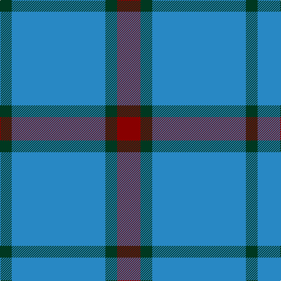

**Bands:** [GBGR](/stripes/gbgr/) · **Stripes:** [DG T DG R](/stripes/stripes4/) DG T DG R

This was sourced from register-of-tartans.  It is a [4 band tartan](/bands/bands4/).

Original link https://www.tartanregister.gov.uk/tartanDetails.aspx?ref=1565

## Register references

External register numbers recorded for this tartan.

- Scottish Register of Tartans: [1565](https://www.tartanregister.gov.uk/tartanDetails.aspx?ref=1565)
- Scottish Tartans Authority (ITI): 2692
- Scottish Tartans World Register: 2692

## Thread count
DG/20 B160 DG20 DR/40

## Palette
Each colour and its ΔE from the base-6 reference it is a variant of.

| Colour | Shade | Base | ΔE (OKLab) |
|---|---|---|---|
| B | <code style="background-color:#2888C4;">#2888C4</code> `#2888C4` | B <code style="background-color:#2A418A;">#2A418A</code> | 0.21 |
| DG | <code style="background-color:#003820;">#003820</code> `#003820` | G <code style="background-color:#006100;">#006100</code> | 0.15 |
| DR | <code style="background-color:#880000;">#880000</code> `#880000` | R <code style="background-color:#CC0000;">#CC0000</code> | 0.15 |

# Sample pattern

## Nearest tartans

The nearest existing variants by ΔTartan distance.

1. [Gyle (Corporate)](/setts/s3/t8dg1r2~x20/) — ΔT 1.13
1. [Carlisle Ancient](/setts/s5/b11lo2r1lo2r1~x4/) — ΔT 1.34
1. [North Sea Commission](/setts/s5/t9dt3t1dt12ly1~x4/) — ΔT 1.46
1. [Loch Lomond](/setts/s5/t37w9t3db9w3~x2/) — ΔT 1.52
1. [Sligo](/setts/s6/t50dr4t12dr23ly4dr4~x2/) — ΔT 1.54
1. [Blue Meadow Check (Fashion)](/setts/s4/b4g8b18w3~x2/) — ΔT 1.55
1. [Thunderlord (Corporate)](/setts/s4/n62w11k4lg17~x2/) — ΔT 1.67
1. [Rea](/setts/s6/t12ly2t1k5t4k2~x4/) — ΔT 1.70
1. [Gallaecia (Unofficial) (District)](/setts/s5/db24t13db4t4w2~x2/) — ΔT 1.74
1. [MacCallum High School Corporate Tartan Tartan Number: 1279. Earliest known date: 0 From the J. Rutledge Collection, Belfast. MacCallum High School, Philadelphia See products available Copyright © Blair Urquhart, Comrie, 2015](/setts/s5/o9db3o1db11o1~x6/) — ΔT 1.74

## Neighbour map

Every grey dot is one of 14313 variants placed by the first two principal components of the ΔTartan feature space (44% of its variance). Red is this tartan; blue dots are its nearest — click one to open its page.

<svg viewBox="0 0 640 380" role="img" style="max-width:100%;height:auto;border:1px solid #e0e0e0;border-radius:4px;display:block" xmlns="http://www.w3.org/2000/svg"><image href="/nn/cloud.v1.png" width="640" height="380"/><a href="/setts/s3/t8dg1r2~x20/"><circle cx="453.3" cy="281.0" r="4" fill="#3465a4"><title>Gyle (Corporate)</title></circle></a><a href="/setts/s5/b11lo2r1lo2r1~x4/"><circle cx="396.8" cy="209.6" r="4" fill="#3465a4"><title>Carlisle Ancient</title></circle></a><a href="/setts/s5/t9dt3t1dt12ly1~x4/"><circle cx="398.2" cy="252.1" r="4" fill="#3465a4"><title>North Sea Commission</title></circle></a><a href="/setts/s5/t37w9t3db9w3~x2/"><circle cx="382.8" cy="206.3" r="4" fill="#3465a4"><title>Loch Lomond</title></circle></a><a href="/setts/s6/t50dr4t12dr23ly4dr4~x2/"><circle cx="400.7" cy="207.1" r="4" fill="#3465a4"><title>Sligo</title></circle></a><a href="/setts/s4/b4g8b18w3~x2/"><circle cx="366.4" cy="285.5" r="4" fill="#3465a4"><title>Blue Meadow Check (Fashion)</title></circle></a><a href="/setts/s4/n62w11k4lg17~x2/"><circle cx="404.2" cy="211.0" r="4" fill="#3465a4"><title>Thunderlord (Corporate)</title></circle></a><a href="/setts/s6/t12ly2t1k5t4k2~x4/"><circle cx="364.2" cy="218.6" r="4" fill="#3465a4"><title>Rea</title></circle></a><a href="/setts/s5/db24t13db4t4w2~x2/"><circle cx="365.8" cy="234.8" r="4" fill="#3465a4"><title>Gallaecia (Unofficial) (District)</title></circle></a><a href="/setts/s5/o9db3o1db11o1~x6/"><circle cx="404.4" cy="264.8" r="4" fill="#3465a4"><title>MacCallum High School Corporate Tartan Tartan Number: 1279. Earliest known date: 0 From the J. Rutledge Collection, Belfast. MacCallum High School, Philadelphia See products available Copyright © Blair Urquhart, Comrie, 2015</title></circle></a><circle cx="406.2" cy="255.5" r="5" fill="#c00000"/></svg>

ID: /setts/s4/r2dg1t8dg1~x20/
