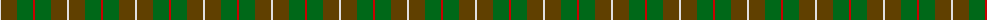
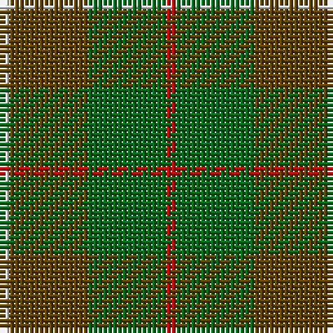

In pattern [RGGW](/patterns/rggw/).

This was sourced from house-of-tartan.  It is a [4 stripes tartan](/stripes/stripes4/).

Original link http://www.house-of-tartan.scotland.net/house/TartanViewjs.asp?colr=Def&tnam=1542

## Thread count
LN/2 T16 G16 R/2

## Palette
Each colour and its ΔE from the base-6 reference it is a variant of.

| Colour | Shade | Base | ΔE (OKLab) |
|---|---|---|---|
| G | <code style="background-color:#006818;">#006818</code> `#006818` | G <code style="background-color:#006100;">#006100</code> | 0.02 |
| LN | <code style="background-color:#E0E0E0;">#E0E0E0</code> `#E0E0E0` | W <code style="background-color:#F7F7F7;">#F7F7F7</code> | 0.07 |
| R | <code style="background-color:#C80000;">#C80000</code> `#C80000` | R <code style="background-color:#CC0000;">#CC0000</code> | 0.01 |
| T | <code style="background-color:#604000;">#604000</code> `#604000` | G <code style="background-color:#006100;">#006100</code> | 0.14 |

# Sample pattern

## Nearest tartans

The nearest existing variants by ΔTartan distance.

1. [MacKinnon Hunting #2](/setts/s4/r2g16ga16w2-g005020-ga503c14-rdc0000-we0e0e0/) — ΔT 0.69
1. [MacKinnon, hunting](/setts/s4/r2g16ra16w2-g008000-rc00000-ra806050-we0e0e0/) — ΔT 0.78
1. [Dohmen Family (Zuid-Nederland)](/setts/s4/g60y6b16r50-b5f749c-g649848-ra32d18-ye0a126/) — ΔT 1.50
1. [Ballantrae (Dalgety)](/setts/s7/g10r6g62ga40g6gb44r10-g604000-ga003820-gb289c18-rc80000/) — ΔT 1.57
1. [Doyle](/setts/s7/g48r18g8ga38y4ga12g14-g006818-ga003820-rc80000-ye8c000/) — ΔT 1.58
1. [Symington](/setts/s5/y10g66ga66r12w4-g5c6428-ga004c10-rc80000-we0e0e0-ybc8c00/) — ΔT 1.62
1. [Ballintrae Trade Tartan Tartan Number: 1541. Earliest known date: 1982 Many new designs have been given district names to promote their Scottish connections. However, these names should not be confused with the District tartans which have earned their title through 'use and wont' and not a little history. See products available Copyright © Blair Urquhart, Comrie, 2015](/setts/s7/g10r5g62ga40g5gb44r10-g604000-ga003820-gb289c18-rc80000/) — ΔT 1.65
1. [MacKinnon, hunting](/setts/s7/g4r32g32ra4g32r32w4-g008000-r806050-rac00000-we0e0e0/) — ΔT 1.69
1. [Wilson's No.161](/setts/s4/b26r4g26r4-b5c8ca8-g006818-rc80000/) — ΔT 1.69
1. [McMoosie Htg (Fashion)](/setts/s5/g92ga46b46r8y8-b1870a4-g604000-ga00643c-rcc4438-ye8c000/) — ΔT 1.70

## Neighbour map

Every grey dot is one of 15726 variants placed by the first two principal components of the ΔTartan feature space (44% of its variance). Red is this tartan; blue dots are its nearest — click one to open its page.

<svg viewBox="0 0 640 380" role="img" style="max-width:100%;height:auto;border:1px solid #e0e0e0;border-radius:4px;display:block" xmlns="http://www.w3.org/2000/svg"><image href="/nn/cloud.v1.png" width="640" height="380"/><a href="/setts/s4/r2g16ga16w2-g005020-ga503c14-rdc0000-we0e0e0/"><circle cx="307.6" cy="271.8" r="4" fill="#3465a4"><title>MacKinnon Hunting #2</title></circle></a><a href="/setts/s4/r2g16ra16w2-g008000-rc00000-ra806050-we0e0e0/"><circle cx="300.8" cy="263.0" r="4" fill="#3465a4"><title>MacKinnon, hunting</title></circle></a><a href="/setts/s4/g60y6b16r50-b5f749c-g649848-ra32d18-ye0a126/"><circle cx="294.8" cy="254.7" r="4" fill="#3465a4"><title>Dohmen Family (Zuid-Nederland)</title></circle></a><a href="/setts/s7/g10r6g62ga40g6gb44r10-g604000-ga003820-gb289c18-rc80000/"><circle cx="259.3" cy="220.9" r="4" fill="#3465a4"><title>Ballantrae (Dalgety)</title></circle></a><a href="/setts/s7/g48r18g8ga38y4ga12g14-g006818-ga003820-rc80000-ye8c000/"><circle cx="301.1" cy="231.6" r="4" fill="#3465a4"><title>Doyle</title></circle></a><a href="/setts/s5/y10g66ga66r12w4-g5c6428-ga004c10-rc80000-we0e0e0-ybc8c00/"><circle cx="302.7" cy="211.9" r="4" fill="#3465a4"><title>Symington</title></circle></a><a href="/setts/s7/g10r5g62ga40g5gb44r10-g604000-ga003820-gb289c18-rc80000/"><circle cx="267.7" cy="213.2" r="4" fill="#3465a4"><title>Ballintrae Trade Tartan Tartan Number: 1541. Earliest known date: 1982 Many new designs have been given district names to promote their Scottish connections. However, these names should not be confused with the District tartans which have earned their title through 'use and wont' and not a little history. See products available Copyright © Blair Urquhart, Comrie, 2015</title></circle></a><a href="/setts/s7/g4r32g32ra4g32r32w4-g008000-r806050-rac00000-we0e0e0/"><circle cx="333.8" cy="261.1" r="4" fill="#3465a4"><title>MacKinnon, hunting</title></circle></a><a href="/setts/s4/b26r4g26r4-b5c8ca8-g006818-rc80000/"><circle cx="288.8" cy="286.5" r="4" fill="#3465a4"><title>Wilson's No.161</title></circle></a><a href="/setts/s5/g92ga46b46r8y8-b1870a4-g604000-ga00643c-rcc4438-ye8c000/"><circle cx="280.7" cy="231.9" r="4" fill="#3465a4"><title>McMoosie Htg (Fashion)</title></circle></a><circle cx="304.4" cy="267.8" r="5" fill="#c00000"/></svg>

ID: /setts/s4/r2g16ga16w2-g006818-ga604000-rc80000-we0e0e0/
