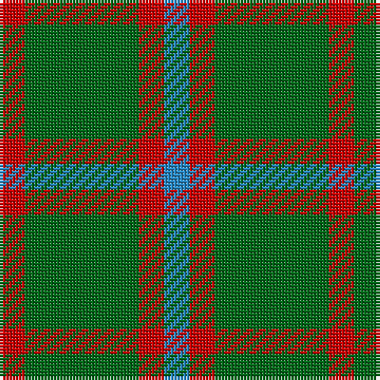

In pattern [BRGR](/stripes/brgr/).

This was sourced from register-of-tartans.  It is a [4 stripe tartan](/stripes/stripes4/).

Original link https://www.tartanregister.gov.uk/tartanDetails.aspx?ref=4743

## Register references

External register numbers recorded for this tartan.

- Scottish Register of Tartans: [4743](https://www.tartanregister.gov.uk/tartanDetails.aspx?ref=4743)
- Scottish Tartans Authority (ITI): 506
- Scottish Tartans World Register: 506

## Thread count
R/8 G36 R8 B/8

## Palette
Each colour and its ΔE from the base-6 reference it is a variant of.

| Colour | Shade | Base | ΔE (OKLab) |
|---|---|---|---|
| B | <code style="background-color:#2888C4;">#2888C4</code> `#2888C4` | B <code style="background-color:#2A418A;">#2A418A</code> | 0.21 |
| DG | <code style="background-color:#003820;">#003820</code> `#003820` | G <code style="background-color:#006100;">#006100</code> | 0.15 |
| G | <code style="background-color:#006818;">#006818</code> `#006818` | G <code style="background-color:#006100;">#006100</code> | 0.02 |
| LG | <code style="background-color:#789484;">#789484</code> `#789484` | G <code style="background-color:#006100;">#006100</code> | 0.24 |
| R | <code style="background-color:#C80000;">#C80000</code> `#C80000` | R <code style="background-color:#CC0000;">#CC0000</code> | 0.01 |
| Ra | <code style="background-color:#C80000;">#C80000</code> `#C80000` | R <code style="background-color:#CC0000;">#CC0000</code> | 0.01 |

# Sample pattern

## Nearest tartans

The nearest existing variants by ΔTartan distance.

1. [Romsdal](/setts/s5/g22dt5r4dt5r3~x2/) — ΔT 1.25
1. [Confederate Cavalry (Military)](/setts/s6/dg2y14dg8y3dg12lo2~x2/) — ΔT 1.36
1. [Bacon, Green (Fashion)](/setts/s4/g14k3r3lr2~x2/) — ΔT 1.44
1. [O'Neill (Australia) (Name)](/setts/s4/g9o20g40w5~x2/) — ΔT 1.45
1. [MacArthur-Fox (Personal)](/setts/s5/k8g3k4g20r4~x2/) — ΔT 1.46
1. [Confederate Artillery](/setts/s6/dg2o14dg8o3dg12r2~x2/) — ΔT 1.47
1. [Cub Scouts of America](/setts/s5/g10db2r8lo2g5~x4/) — ΔT 1.49
1. [Confederate Infantry](/setts/s6/dg2o14dg8o3dg12db2~x2/) — ΔT 1.58
1. [Leeds University Corporate Tartan Tartan Number: 980. Earliest known date: pre 2003 Leeds University Scottish Country Dance Club. See products available Copyright © Blair Urquhart, Comrie, 2015](/setts/s8/g9m2g2m2g2m8g11w2~x4/) — ΔT 1.67
1. [Skene Clan Tartan Tartan Number: 516. Earliest known date: 1886 Smith No 53 has ROSE in place of RED. Grant's version is similar to the sample named Skene in the 1830 pattern book of Wilson's of Bannockburn. See products available Copyright © Blair Urquhart, Comrie, 2015](/setts/s7/db6r3g2r3g12r3g2~x2/) — ΔT 1.69

## Neighbour map

Every grey dot is one of 14299 variants placed by the first two principal components of the ΔTartan feature space (44% of its variance). Red is this tartan; blue dots are its nearest — click one to open its page.

<svg viewBox="0 0 640 380" role="img" style="max-width:100%;height:auto;border:1px solid #e0e0e0;border-radius:4px;display:block" xmlns="http://www.w3.org/2000/svg"><image href="/nn/cloud.v1.png" width="640" height="380"/><a href="/setts/s5/g22dt5r4dt5r3~x2/"><circle cx="342.0" cy="256.5" r="4" fill="#3465a4"><title>Romsdal</title></circle></a><a href="/setts/s6/dg2y14dg8y3dg12lo2~x2/"><circle cx="337.0" cy="273.8" r="4" fill="#3465a4"><title>Confederate Cavalry (Military)</title></circle></a><a href="/setts/s4/g14k3r3lr2~x2/"><circle cx="347.5" cy="250.5" r="4" fill="#3465a4"><title>Bacon, Green (Fashion)</title></circle></a><a href="/setts/s4/g9o20g40w5~x2/"><circle cx="413.2" cy="286.9" r="4" fill="#3465a4"><title>O'Neill (Australia) (Name)</title></circle></a><a href="/setts/s5/k8g3k4g20r4~x2/"><circle cx="355.9" cy="277.8" r="4" fill="#3465a4"><title>MacArthur-Fox (Personal)</title></circle></a><a href="/setts/s6/dg2o14dg8o3dg12r2~x2/"><circle cx="320.3" cy="262.9" r="4" fill="#3465a4"><title>Confederate Artillery</title></circle></a><a href="/setts/s5/g10db2r8lo2g5~x4/"><circle cx="279.6" cy="282.4" r="4" fill="#3465a4"><title>Cub Scouts of America</title></circle></a><a href="/setts/s6/dg2o14dg8o3dg12db2~x2/"><circle cx="313.8" cy="262.0" r="4" fill="#3465a4"><title>Confederate Infantry</title></circle></a><a href="/setts/s8/g9m2g2m2g2m8g11w2~x4/"><circle cx="350.3" cy="249.9" r="4" fill="#3465a4"><title>Leeds University Corporate Tartan Tartan Number: 980. Earliest known date: pre 2003 Leeds University Scottish Country Dance Club. See products available Copyright © Blair Urquhart, Comrie, 2015</title></circle></a><a href="/setts/s7/db6r3g2r3g12r3g2~x2/"><circle cx="284.0" cy="253.3" r="4" fill="#3465a4"><title>Skene Clan Tartan Tartan Number: 516. Earliest known date: 1886 Smith No 53 has ROSE in place of RED. Grant's version is similar to the sample named Skene in the 1830 pattern book of Wilson's of Bannockburn. See products available Copyright © Blair Urquhart, Comrie, 2015</title></circle></a><circle cx="343.7" cy="288.2" r="5" fill="#c00000"/></svg>

ID: /setts/s4/r2g9r2t2~x4/
