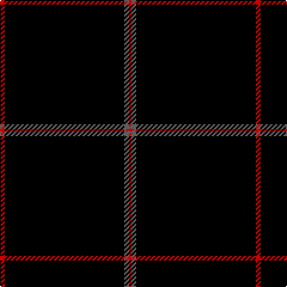

This page is one **sett** — a single exact thread-count. It belongs to the [tartan](/tartans/r2k50n2r1/)
(the same proportion at any scale), whose colour order is pattern [RGKR](/stripes/rgkr/).

Sourced from register-of-tartans.  It is a [4 stripe tartan](/stripes/stripes4/).

Original link https://www.tartanregister.gov.uk/tartanDetails.aspx?ref=10087

## Also known as

This cloth is also recorded under:

- Galloway Family

## Register references

External register numbers recorded for this tartan.

- Scottish Register of Tartans: [10087](https://www.tartanregister.gov.uk/tartanDetails.aspx?ref=10087)

## Thread count
R/4 K100 N4 R/2

## Palette
Each colour and the base-6 reference it is a variant of.

| Colour | Shade | Base |
|---|---|---|
| K | <code style="background-color:#000000;">#000000</code> `oklch(0.0% 0.000 0.0)` <small>#000000</small> | K <code style="background-color:#000000;">#000000</code> |
| N | <code style="background-color:#696969;">#696969</code> `oklch(52.1% 0.000 89.9)` <small>#696969</small> | G <code style="background-color:#006100;">#006100</code> |
| R | <code style="background-color:#FF0000;">#FF0000</code> `oklch(62.8% 0.258 29.2)` <small>#FF0000</small> | R <code style="background-color:#CC0000;">#CC0000</code> |

# Sample pattern

## Nearest tartans

The nearest existing variants by ΔTartan distance, with this tartan at the top so the swatches line up against it.

ΔTartan

Tartan

Sett

—

<a href="/ttd/edit/#slug=r2k50y2r1~x2">Galloway Family</a> <a class="nn-out" href="/setts/s4/r2k50y2r1~x2/" title="open its dictionary page">↗</a>

1.91

<a href="/ttd/edit/#slug=k160w6k2w3k3~x2">Black Camel Tartan Tartan Number: 3333. Earliest known date: Marton Mills Jura./Threadcount and colours aren't 100% original. Generated manually./ See products available Copyright © Blair Urquhart, Comrie, 2015</a> <a class="nn-out" href="/setts/s5/k160w6k2w3k3~x2/" title="open its dictionary page">↗</a>

2.04

<a href="/ttd/edit/#slug=k31r2k10db1k1w1~x4">NewGeneration Alchemy (NGA) Inc</a> <a class="nn-out" href="/setts/s6/k31r2k10db1k1w1~x4/" title="open its dictionary page">↗</a>

2.31

<a href="/ttd/edit/#slug=k72w3k11db9">Dunnotar (School)</a> <a class="nn-out" href="/setts/s4/k72w3k11db9/" title="open its dictionary page">↗</a>

2.35

<a href="/ttd/edit/#slug=k8ly3k120ly3k40t2k4~x2">Lochaber (Hesketh)</a> <a class="nn-out" href="/setts/s7/k8ly3k120ly3k40t2k4~x2/" title="open its dictionary page">↗</a>

2.38

<a href="/ttd/edit/#slug=k60t3k9g7">Wallington (Corporate?)</a> <a class="nn-out" href="/setts/s4/k60t3k9g7/" title="open its dictionary page">↗</a>

2.56

<a href="/ttd/edit/#slug=r2k50n2r1~x2">Galloway (Name)</a> <a class="nn-out" href="/setts/s4/r2k50n2r1~x2/" title="open its dictionary page">↗</a>

2.57

<a href="/ttd/edit/#slug=k45db2r4ly1w1~x2">McHattie (Personal)</a> <a class="nn-out" href="/setts/s5/k45db2r4ly1w1~x2/" title="open its dictionary page">↗</a>

2.59

<a href="/ttd/edit/#slug=k45b2r4ly1w1~x2">McHattie (Personal)</a> <a class="nn-out" href="/setts/s5/k45b2r4ly1w1~x2/" title="open its dictionary page">↗</a>

2.60

<a href="/ttd/edit/#slug=k72r3k11t9k11r3k37">Chafyn House (School)</a> <a class="nn-out" href="/setts/s7/k72r3k11t9k11r3k37/" title="open its dictionary page">↗</a>

2.60

<a href="/ttd/edit/#slug=k50dt3lp2r3w1~x2">Fettes Personal Tartan Tartan Number: 7565. Earliest known date: 2008 Designed online for four kilts by Fiona Fettes. See products available Copyright © Blair Urquhart, Comrie, 2015</a> <a class="nn-out" href="/setts/s5/k50dt3lp2r3w1~x2/" title="open its dictionary page">↗</a>

## Neighbour map

Every grey dot is one of 14299 variants placed by the first two principal components of the ΔTartan feature space (44% of its variance). Red is this tartan; blue dots are its nearest — click one to open its page.

<svg viewBox="0 0 640 380" role="img" style="max-width:100%;height:auto;border:1px solid #e0e0e0;border-radius:4px;display:block" xmlns="http://www.w3.org/2000/svg"><image href="/nn/cloud.v1.png" width="640" height="380"/><a href="/setts/s5/k160w6k2w3k3~x2/"><circle cx="626.0" cy="177.4" r="4" fill="#3465a4"><title>Black Camel Tartan Tartan Number: 3333. Earliest known date: Marton Mills Jura./Threadcount and colours aren't 100% original. Generated manually./ See products available Copyright © Blair Urquhart, Comrie, 2015</title></circle></a><a href="/setts/s6/k31r2k10db1k1w1~x4/"><circle cx="626.0" cy="172.4" r="4" fill="#3465a4"><title>NewGeneration Alchemy (NGA) Inc</title></circle></a><a href="/setts/s4/k72w3k11db9/"><circle cx="626.0" cy="233.0" r="4" fill="#3465a4"><title>Dunnotar (School)</title></circle></a><a href="/setts/s7/k8ly3k120ly3k40t2k4~x2/"><circle cx="626.0" cy="169.5" r="4" fill="#3465a4"><title>Lochaber (Hesketh)</title></circle></a><a href="/setts/s4/k60t3k9g7/"><circle cx="626.0" cy="231.3" r="4" fill="#3465a4"><title>Wallington (Corporate?)</title></circle></a><a href="/setts/s4/r2k50n2r1~x2/"><circle cx="626.0" cy="204.2" r="4" fill="#3465a4"><title>Galloway (Name)</title></circle></a><a href="/setts/s5/k45db2r4ly1w1~x2/"><circle cx="620.9" cy="133.3" r="4" fill="#3465a4"><title>McHattie (Personal)</title></circle></a><a href="/setts/s5/k45b2r4ly1w1~x2/"><circle cx="612.6" cy="129.2" r="4" fill="#3465a4"><title>McHattie (Personal)</title></circle></a><a href="/setts/s7/k72r3k11t9k11r3k37/"><circle cx="626.0" cy="213.8" r="4" fill="#3465a4"><title>Chafyn House (School)</title></circle></a><a href="/setts/s5/k50dt3lp2r3w1~x2/"><circle cx="624.1" cy="131.7" r="4" fill="#3465a4"><title>Fettes Personal Tartan Tartan Number: 7565. Earliest known date: 2008 Designed online for four kilts by Fiona Fettes. See products available Copyright © Blair Urquhart, Comrie, 2015</title></circle></a><circle cx="626.0" cy="184.4" r="5" fill="#c00000"/></svg>

ID: /setts/s4/r2k50y2r1~x2/
