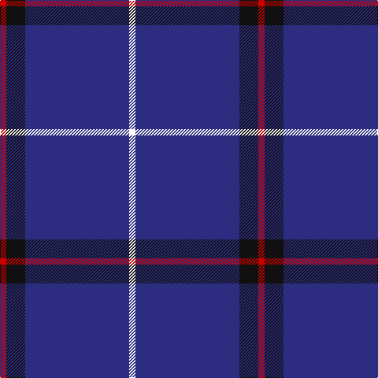

In pattern [RKBW](/patterns/rkbw/).

This was sourced from register-of-tartans.  It is a [4 stripes tartan](/stripes/stripes4/).

Original link https://www.tartanregister.gov.uk/tartanDetails.aspx?ref=2871

## Attestations

This cloth appears in 2 source records; the oldest owns this page.

- 15/01/2004 — McCallie (register-of-tartans, [record](https://www.tartanregister.gov.uk/tartanDetails.aspx?ref=2871))
- pre 2004 — McCallie (Name) (tartans-authority, [record](http://www.tartansauthority.com/tartan-ferret/display/6212/))

## Thread count
R/8 K24 DB132 W/8

## Palette
Each colour and its ΔE from the base-6 reference it is a variant of.

| Colour | Shade | Base | ΔE (OKLab) |
|---|---|---|---|
| DB | <code style="background-color:#2C2C80;">#2C2C80</code> `#2C2C80` | B <code style="background-color:#2A418A;">#2A418A</code> | 0.06 |
| K | <code style="background-color:#101010;">#101010</code> `#101010` | K <code style="background-color:#000000;">#000000</code> | 0.17 |
| R | <code style="background-color:#C80000;">#C80000</code> `#C80000` | R <code style="background-color:#CC0000;">#CC0000</code> | 0.01 |
| W | <code style="background-color:#FCFCFC;">#FCFCFC</code> `#FCFCFC` | W <code style="background-color:#F7F7F7;">#F7F7F7</code> | 0.01 |

# Sample pattern

## Nearest tartans

The nearest existing variants by ΔTartan distance.

1. [Waugh (Name)](/setts/s5/b100ba10k5ba10r8~b1c0070-ba7098b0-k101010-r980000/) — ΔT 0.91
1. [Steffen, Morris (Personal)](/setts/s6/b35w4b10r3ra3r3x4~b2c2c80-r901c38-rac80000-we0e0e0/) — ΔT 1.11
1. [Waugh](/setts/s5/b100g10k5g10r8~b000080-g65909a-k000000-rb22222/) — ΔT 1.32
1. [Lochcarron (1985)](/setts/s5/b12w1k2b1r1x8~b000064-k000000-rc80000-wc8c8c8/) — ΔT 1.41
1. [Gulfmark (Corporate)](/setts/s5/b72ba6b12ba17w6x2~b2c2c80-ba2888c4-we0e0e0/) — ΔT 1.51
1. [Elliott](/setts/s4/b16r4b3ra1x2~b000064-r900000-rac80000/) — ΔT 1.53
1. [Kucher, Gregory](/setts/s4/b8r1k1y1x10~b000080-k101010-rb22222-ybebebe/) — ΔT 1.58
1. [Wheadon (Name)](/setts/s6/b40g7y3g7b15r5x2~b34349c-g008c20-rc80000-ye8c000/) — ΔT 1.59
1. [Balmer (Personal)](/setts/s6/w2b49r5y2r5y2x2~b2c2c80-rc80000-we0e0e0-ye8c000/) — ΔT 1.59
1. [Volunteer Lifesaving Corps (Corp.)](/setts/s5/r5w4k4b80w4x2~b38409c-k101010-rc80000-wf8f8f8/) — ΔT 1.59

## Neighbour map

Every grey dot is one of 15726 variants placed by the first two principal components of the ΔTartan feature space (44% of its variance). Red is this tartan; blue dots are its nearest — click one to open its page.

<svg viewBox="0 0 640 380" role="img" style="max-width:100%;height:auto;border:1px solid #e0e0e0;border-radius:4px;display:block" xmlns="http://www.w3.org/2000/svg"><image href="/nn/cloud.v1.png" width="640" height="380"/><a href="/setts/s5/b100ba10k5ba10r8~b1c0070-ba7098b0-k101010-r980000/"><circle cx="509.9" cy="185.0" r="4" fill="#3465a4"><title>Waugh (Name)</title></circle></a><a href="/setts/s6/b35w4b10r3ra3r3x4~b2c2c80-r901c38-rac80000-we0e0e0/"><circle cx="493.1" cy="199.4" r="4" fill="#3465a4"><title>Steffen, Morris (Personal)</title></circle></a><a href="/setts/s5/b100g10k5g10r8~b000080-g65909a-k000000-rb22222/"><circle cx="498.1" cy="185.9" r="4" fill="#3465a4"><title>Waugh</title></circle></a><a href="/setts/s5/b12w1k2b1r1x8~b000064-k000000-rc80000-wc8c8c8/"><circle cx="472.5" cy="207.4" r="4" fill="#3465a4"><title>Lochcarron (1985)</title></circle></a><a href="/setts/s5/b72ba6b12ba17w6x2~b2c2c80-ba2888c4-we0e0e0/"><circle cx="494.3" cy="234.1" r="4" fill="#3465a4"><title>Gulfmark (Corporate)</title></circle></a><a href="/setts/s4/b16r4b3ra1x2~b000064-r900000-rac80000/"><circle cx="552.6" cy="253.1" r="4" fill="#3465a4"><title>Elliott</title></circle></a><a href="/setts/s4/b8r1k1y1x10~b000080-k101010-rb22222-ybebebe/"><circle cx="420.0" cy="235.1" r="4" fill="#3465a4"><title>Kucher, Gregory</title></circle></a><a href="/setts/s6/b40g7y3g7b15r5x2~b34349c-g008c20-rc80000-ye8c000/"><circle cx="425.8" cy="203.7" r="4" fill="#3465a4"><title>Wheadon (Name)</title></circle></a><a href="/setts/s6/w2b49r5y2r5y2x2~b2c2c80-rc80000-we0e0e0-ye8c000/"><circle cx="507.0" cy="145.1" r="4" fill="#3465a4"><title>Balmer (Personal)</title></circle></a><a href="/setts/s5/r5w4k4b80w4x2~b38409c-k101010-rc80000-wf8f8f8/"><circle cx="560.0" cy="168.1" r="4" fill="#3465a4"><title>Volunteer Lifesaving Corps (Corp.)</title></circle></a><circle cx="505.6" cy="207.6" r="5" fill="#c00000"/></svg>

ID: /setts/s4/r2k6b33w2x4~b2c2c80-k101010-rc80000-wfcfcfc/
