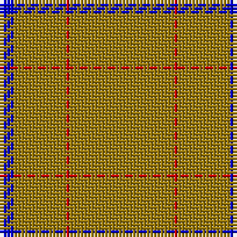

In pattern [BRRR](/patterns/brrr/).

This was sourced from weddslist.  It is a [4 stripes tartan](/stripes/stripes4/).

Original link http://www.weddslist.com/cgi-bin/tartans/pg.pl?source=rb

## Thread count
B/4 LG15 R1 LG/30

## Palette
Each colour and its ΔE from the base-6 reference it is a variant of.

| Colour | Shade | Base | ΔE (OKLab) |
|---|---|---|---|
| B | <code style="background-color:#0000C8;">#0000C8</code> `#0000C8` | B <code style="background-color:#2C4084;">#2C4084</code> | 0.15 |
| G | <code style="background-color:#00C800;">#00C800</code> `#00C800` | Y <code style="background-color:#E8C000;">#E8C000</code> | 0.21 |
| LG | <code style="background-color:#9B7A0B;">#9B7A0B</code> `#9B7A0B` | R <code style="background-color:#C80000;">#C80000</code> | 0.20 |
| R | <code style="background-color:#C80000;">#C80000</code> `#C80000` | R <code style="background-color:#C80000;">#C80000</code> | 0.00 |
| T | <code style="background-color:#8B4513;">#8B4513</code> `#8B4513` | R <code style="background-color:#C80000;">#C80000</code> | 0.13 |

# Sample pattern

ID: /setts/s4/r30ra1r15b4-b0000c8-r9b7a0b-rac80000/
