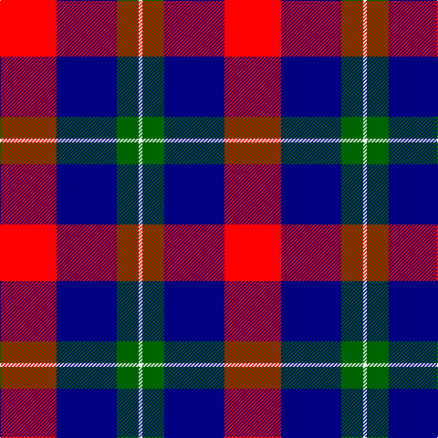

In pattern [RBGW](/patterns/rbgw/).

This was sourced from register-of-tartans.  It is a [4 stripes tartan](/stripes/stripes4/).

Original link https://www.tartanregister.gov.uk/tartanDetails.aspx?ref=10353

## Register references

External register numbers recorded for this tartan.

- Scottish Register of Tartans: [10353](https://www.tartanregister.gov.uk/tartanDetails.aspx?ref=10353)

## Thread count
R/62 DB66 G24 W/4

## Palette
Each colour and its ΔE from the base-6 reference it is a variant of.

| Colour | Shade | Base | ΔE (OKLab) |
|---|---|---|---|
| DB | <code style="background-color:#000080;">#000080</code> `#000080` | B <code style="background-color:#2A418A;">#2A418A</code> | 0.14 |
| G | <code style="background-color:#006400;">#006400</code> `#006400` | G <code style="background-color:#006100;">#006100</code> | 0.01 |
| R | <code style="background-color:#FF0000;">#FF0000</code> `#FF0000` | R <code style="background-color:#CC0000;">#CC0000</code> | 0.11 |
| W | <code style="background-color:#FFFFFF;">#FFFFFF</code> `#FFFFFF` | W <code style="background-color:#F7F7F7;">#F7F7F7</code> | 0.02 |

# Sample pattern

## Nearest tartans

The nearest existing variants by ΔTartan distance.

1. [Highland Spring Dress (2004) (Corp)](/setts/s5/w4b30g10r25w2~b2c2c80-g289c18-r880000-wfcfcfc~x2/) — ΔT 1.08
1. [Common Ground Dress (Fashion)](/setts/s5/w3r27w16b27y3~b2c2c80-r880000-we0e0e0-ybc8c00~x2/) — ΔT 1.35
1. [Manor of Wrentnall (Personal)](/setts/s4/r31b33g12w2~b003c64-g006818-rc8002c-wfcfcfc~x2/) — ΔT 1.38
1. [MacTavish](/setts/s6/b2r12ba2b6k6b1~b4367ae-ba000052-k000000-raa0000~x2/) — ΔT 1.42
1. [MacTavish](/setts/s6/b2r12ba2b6k6b1~b4367ae-ba000052-k000000-raa0000/) — ΔT 1.42
1. [O2 (Corporate)](/setts/s5/k15b2r15ba6bb1~b2c2c80-ba1474b4-bb2474e8-k00002c-rc80000~x2/) — ΔT 1.45
1. [Thompson/Thomson/MacTavish](/setts/s6/b2r12ba2b6k6b1~b3c82af-ba2c4084-k101010-rdc0000~x4/) — ΔT 1.47
1. [Common Ground (Dress)](/setts/s5/w3r27w16b27y3~b001f5c-r930601-wffffff-yf0e200~x2/) — ΔT 1.49
1. [Unidentified 27](/setts/s4/b8k3r4y1~b304080-k000000-rc00000-yf0c000~x2/) — ΔT 1.51
1. [Unidentified #17](/setts/s4/b8k3r4y1~b2c4084-k101010-rdc0000-ye8c000~x2/) — ΔT 1.53

## Neighbour map

Every grey dot is one of 15726 variants placed by the first two principal components of the ΔTartan feature space (44% of its variance). Red is this tartan; blue dots are its nearest — click one to open its page.

<svg viewBox="0 0 640 380" role="img" style="max-width:100%;height:auto;border:1px solid #e0e0e0;border-radius:4px;display:block" xmlns="http://www.w3.org/2000/svg"><image href="/nn/cloud.v1.png" width="640" height="380"/><a href="/setts/s5/w4b30g10r25w2~b2c2c80-g289c18-r880000-wfcfcfc~x2/"><circle cx="225.6" cy="196.4" r="4" fill="#3465a4"><title>Highland Spring Dress (2004) (Corp)</title></circle></a><a href="/setts/s5/w3r27w16b27y3~b2c2c80-r880000-we0e0e0-ybc8c00~x2/"><circle cx="163.2" cy="211.8" r="4" fill="#3465a4"><title>Common Ground Dress (Fashion)</title></circle></a><a href="/setts/s4/r31b33g12w2~b003c64-g006818-rc8002c-wfcfcfc~x2/"><circle cx="257.9" cy="223.2" r="4" fill="#3465a4"><title>Manor of Wrentnall (Personal)</title></circle></a><a href="/setts/s6/b2r12ba2b6k6b1~b4367ae-ba000052-k000000-raa0000~x2/"><circle cx="208.4" cy="198.0" r="4" fill="#3465a4"><title>MacTavish</title></circle></a><a href="/setts/s6/b2r12ba2b6k6b1~b4367ae-ba000052-k000000-raa0000/"><circle cx="208.4" cy="198.0" r="4" fill="#3465a4"><title>MacTavish</title></circle></a><a href="/setts/s5/k15b2r15ba6bb1~b2c2c80-ba1474b4-bb2474e8-k00002c-rc80000~x2/"><circle cx="196.4" cy="182.5" r="4" fill="#3465a4"><title>O2 (Corporate)</title></circle></a><a href="/setts/s6/b2r12ba2b6k6b1~b3c82af-ba2c4084-k101010-rdc0000~x4/"><circle cx="215.3" cy="194.3" r="4" fill="#3465a4"><title>Thompson/Thomson/MacTavish</title></circle></a><a href="/setts/s5/w3r27w16b27y3~b001f5c-r930601-wffffff-yf0e200~x2/"><circle cx="147.3" cy="206.7" r="4" fill="#3465a4"><title>Common Ground (Dress)</title></circle></a><a href="/setts/s4/b8k3r4y1~b304080-k000000-rc00000-yf0c000~x2/"><circle cx="224.5" cy="246.1" r="4" fill="#3465a4"><title>Unidentified 27</title></circle></a><a href="/setts/s4/b8k3r4y1~b2c4084-k101010-rdc0000-ye8c000~x2/"><circle cx="236.1" cy="248.2" r="4" fill="#3465a4"><title>Unidentified #17</title></circle></a><circle cx="223.9" cy="207.6" r="5" fill="#c00000"/></svg>

ID: /setts/s4/r31b33g12w2~b000080-g006400-rff0000-wffffff~x2/
