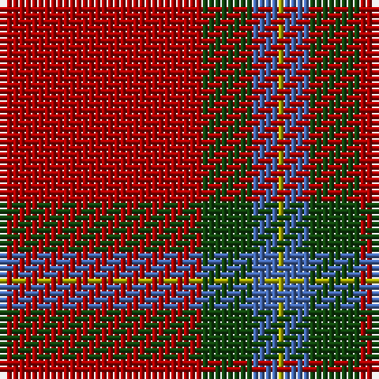

This page is one **sett** — a single exact thread-count. It belongs to the [tartan](/tartans/dr32dg8b4lg1/)
(the same proportion at any scale), whose colour order is pattern [RGBY](/stripes/rgby/).

Sourced from weddslist.  It is a [4 stripe tartan](/stripes/stripes4/).

Original link http://www.weddslist.com/cgi-bin/tartans/pg.pl?source=x

## Thread count
DR/32 DG8 B4 LG/1

## Palette
Each colour and the base-6 reference it is a variant of.

| Colour | Shade | Base |
|---|---|---|
| B | <code style="background-color:#4367AE;">#4367AE</code> `oklch(52.2% 0.120 262.7)` <small>#4367AE</small> | B <code style="background-color:#2A418A;">#2A418A</code> |
| DG | <code style="background-color:#11450D;">#11450D</code> `oklch(34.4% 0.101 142.1)` <small>#11450D</small> | G <code style="background-color:#006100;">#006100</code> |
| DR | <code style="background-color:#AA0000;">#AA0000</code> `oklch(46.3% 0.190 29.2)` <small>#AA0000</small> | R <code style="background-color:#CC0000;">#CC0000</code> |
| LG | <code style="background-color:#AAAA00;">#AAAA00</code> `oklch(71.4% 0.156 109.8)` <small>#AAAA00</small> | Y <code style="background-color:#F2BF00;">#F2BF00</code> |

# Sample pattern

## Nearest tartans

The nearest existing variants by ΔTartan distance, with this tartan at the top so the swatches line up against it.

ΔTartan

Tartan

Sett

—

<a href="/ttd/edit/#slug=r32dg8b4ly1">MacLaine of Lochbuie</a> <a class="nn-out" href="/setts/s4/r32dg8b4ly1/" title="open its dictionary page">↗</a>

0.00

<a href="/ttd/edit/#slug=r32dg8b4ly1~x2">MacLaine of Lochbuie</a> <a class="nn-out" href="/setts/s4/r32dg8b4ly1~x2/" title="open its dictionary page">↗</a>

0.79

<a href="/ttd/edit/#slug=r32dg8t4ly1~x2">MacLaine of Lochbuie (Coburn)</a> <a class="nn-out" href="/setts/s4/r32dg8t4ly1~x2/" title="open its dictionary page">↗</a>

0.88

<a href="/ttd/edit/#slug=r32g8t4ly1~x2">MacLaine of Lochbuie</a> <a class="nn-out" href="/setts/s4/r32g8t4ly1~x2/" title="open its dictionary page">↗</a>

1.46

<a href="/ttd/edit/#slug=r9y2r45y20lo3~x2">Hunt (Personal)</a> <a class="nn-out" href="/setts/s5/r9y2r45y20lo3~x2/" title="open its dictionary page">↗</a>

1.56

<a href="/ttd/edit/#slug=r24g5r3g9r3db1~x4">MacKintosh, Red</a> <a class="nn-out" href="/setts/s6/r24g5r3g9r3db1~x4/" title="open its dictionary page">↗</a>

1.57

<a href="/ttd/edit/#slug=r32dg8lb4ly1">MacLaine of Lochbuie</a> <a class="nn-out" href="/setts/s4/r32dg8lb4ly1/" title="open its dictionary page">↗</a>

1.58

<a href="/ttd/edit/#slug=r5db10r5dg5r25ly1~x4">AON</a> <a class="nn-out" href="/setts/s6/r5db10r5dg5r25ly1~x4/" title="open its dictionary page">↗</a>

1.61

<a href="/ttd/edit/#slug=r36dg18r4dg6k1lr2~x2">MacGregor</a> <a class="nn-out" href="/setts/s6/r36dg18r4dg6k1lr2~x2/" title="open its dictionary page">↗</a>

1.61

<a href="/ttd/edit/#slug=r36dg18r4dg6k1lr2">MacGregor</a> <a class="nn-out" href="/setts/s6/r36dg18r4dg6k1lr2/" title="open its dictionary page">↗</a>

1.62

<a href="/ttd/edit/#slug=r72k8r4g16r7o2~x2">MacAndrew Dress (Name)</a> <a class="nn-out" href="/setts/s6/r72k8r4g16r7o2~x2/" title="open its dictionary page">↗</a>

## Neighbour map

Every grey dot is one of 14299 variants placed by the first two principal components of the ΔTartan feature space (44% of its variance). Red is this tartan; blue dots are its nearest — click one to open its page.

<svg viewBox="0 0 640 380" role="img" style="max-width:100%;height:auto;border:1px solid #e0e0e0;border-radius:4px;display:block" xmlns="http://www.w3.org/2000/svg"><image href="/nn/cloud.v1.png" width="640" height="380"/><a href="/setts/s4/r32dg8b4ly1~x2/"><circle cx="529.3" cy="182.5" r="4" fill="#3465a4"><title>MacLaine of Lochbuie</title></circle></a><a href="/setts/s4/r32dg8t4ly1~x2/"><circle cx="519.9" cy="171.5" r="4" fill="#3465a4"><title>MacLaine of Lochbuie (Coburn)</title></circle></a><a href="/setts/s4/r32g8t4ly1~x2/"><circle cx="511.9" cy="169.4" r="4" fill="#3465a4"><title>MacLaine of Lochbuie</title></circle></a><a href="/setts/s5/r9y2r45y20lo3~x2/"><circle cx="516.5" cy="209.0" r="4" fill="#3465a4"><title>Hunt (Personal)</title></circle></a><a href="/setts/s6/r24g5r3g9r3db1~x4/"><circle cx="489.9" cy="183.7" r="4" fill="#3465a4"><title>MacKintosh, Red</title></circle></a><a href="/setts/s4/r32dg8lb4ly1/"><circle cx="490.6" cy="155.4" r="4" fill="#3465a4"><title>MacLaine of Lochbuie</title></circle></a><a href="/setts/s6/r5db10r5dg5r25ly1~x4/"><circle cx="453.9" cy="165.9" r="4" fill="#3465a4"><title>AON</title></circle></a><a href="/setts/s6/r36dg18r4dg6k1lr2~x2/"><circle cx="451.1" cy="156.3" r="4" fill="#3465a4"><title>MacGregor</title></circle></a><a href="/setts/s6/r36dg18r4dg6k1lr2/"><circle cx="451.1" cy="156.3" r="4" fill="#3465a4"><title>MacGregor</title></circle></a><a href="/setts/s6/r72k8r4g16r7o2~x2/"><circle cx="563.5" cy="132.8" r="4" fill="#3465a4"><title>MacAndrew Dress (Name)</title></circle></a><circle cx="529.3" cy="182.5" r="5" fill="#c00000"/></svg>

ID: /setts/s4/r32dg8b4ly1/
