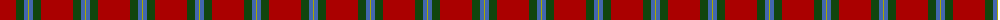

In pattern [RGBY](/patterns/rgby/).

This was sourced from weddslist.  It is a [4 stripes tartan](/stripes/stripes4/).

Original link http://www.weddslist.com/cgi-bin/tartans/pg.pl?source=x

## Thread count
DR/32 DG8 B4 LG/1

## Palette
Each colour and its ΔE from the base-6 reference it is a variant of.

| Colour | Shade | Base | ΔE (OKLab) |
|---|---|---|---|
| B | <code style="background-color:#4367AE;">#4367AE</code> `#4367AE` | B <code style="background-color:#2A418A;">#2A418A</code> | 0.12 |
| DG | <code style="background-color:#11450D;">#11450D</code> `#11450D` | G <code style="background-color:#006100;">#006100</code> | 0.09 |
| DR | <code style="background-color:#AA0000;">#AA0000</code> `#AA0000` | R <code style="background-color:#CC0000;">#CC0000</code> | 0.07 |
| LG | <code style="background-color:#AAAA00;">#AAAA00</code> `#AAAA00` | Y <code style="background-color:#F2BF00;">#F2BF00</code> | 0.13 |

# Sample pattern

## Nearest tartans

The nearest existing variants by ΔTartan distance.

1. [MacLaine of Lochbuie](/setts/s4/r64g16b8y2-b4367ae-g11450d-raa0000-yaaaa00/) — ΔT 0.00
1. [MacLaine of Lochbuie (Coburn)](/setts/s4/r64g16b8y2-b5c8ca8-g285800-rc80000-ye8c000/) — ΔT 0.78
1. [MacLaine of Lochbuie Clan Tartan Tartan Number: 1462. Earliest known date: 1810-15 A sample of this distinctive and ancient tartan exists in the Cockburn Collection in the Mitchell Library in Glasgow dating before 1810 when the collection was made. It was first published by Grant in 1886. The MacLaines of Lochbuie challenged the right of chiefship for the Clan MacLean. The matter was settled by 'tanistry' and Duart was recognised as chief, even though Eachin Reganach was in fact the elder brother of Lachlan, the first chief of the MacLeans of Duart. The MacLaines of Lochbuie were followers of the Lords of the Isles, and were granted lands on the Isle of Mull. Castle Moy at Loch Buie, now ruined, was the seat of the MacLaines for over 500 years. See products available Copyright © Blair Urquhart, Comrie, 2015](/setts/s4/r64g16b8y2-b5c8ca8-g006818-rc80000-ye8c000/) — ΔT 0.84
1. [MacLaine of Lochbuie](/setts/s4/r64g16b8y2-b5480b0-g008000-rc00000-yf0c000/) — ΔT 0.87
1. [Hunt (Personal)](/setts/s5/r18g4r90g40y6-g789484-r901c38-ybc8c00/) — ΔT 1.46
1. [MacLaine of Lochbuie](/setts/s4/r32g8w4y1-g004c00-rc80000-wd0d0d0-yffc800/) — ΔT 1.55
1. [MacKintosh, Red](/setts/s6/r96g20r12g36r12b4-b2c2c80-g006818-rc80000/) — ΔT 1.56
1. [AON](/setts/s6/r20b40r20g20r100y4-b202060-g285800-rc80000-ye8c000/) — ΔT 1.57
1. [MacAndrew Dress (Name)](/setts/s6/r144k16r8g32r14ra4-g006818-k101010-rc80000-ra888888/) — ΔT 1.61
1. [MacGregor](/setts/s6/r72g36r8g12k2y4-g11450d-k000000-raa0000-yaaaaaa/) — ΔT 1.61

## Neighbour map

Every grey dot is one of 15726 variants placed by the first two principal components of the ΔTartan feature space (44% of its variance). Red is this tartan; blue dots are its nearest — click one to open its page.

<svg viewBox="0 0 640 380" role="img" style="max-width:100%;height:auto;border:1px solid #e0e0e0;border-radius:4px;display:block" xmlns="http://www.w3.org/2000/svg"><image href="/nn/cloud.v1.png" width="640" height="380"/><a href="/setts/s4/r64g16b8y2-b4367ae-g11450d-raa0000-yaaaa00/"><circle cx="530.8" cy="180.8" r="4" fill="#3465a4"><title>MacLaine of Lochbuie</title></circle></a><a href="/setts/s4/r64g16b8y2-b5c8ca8-g285800-rc80000-ye8c000/"><circle cx="522.1" cy="171.3" r="4" fill="#3465a4"><title>MacLaine of Lochbuie (Coburn)</title></circle></a><a href="/setts/s4/r64g16b8y2-b5c8ca8-g006818-rc80000-ye8c000/"><circle cx="517.8" cy="170.0" r="4" fill="#3465a4"><title>MacLaine of Lochbuie Clan Tartan Tartan Number: 1462. Earliest known date: 1810-15 A sample of this distinctive and ancient tartan exists in the Cockburn Collection in the Mitchell Library in Glasgow dating before 1810 when the collection was made. It was first published by Grant in 1886. The MacLaines of Lochbuie challenged the right of chiefship for the Clan MacLean. The matter was settled by 'tanistry' and Duart was recognised as chief, even though Eachin Reganach was in fact the elder brother of Lachlan, the first chief of the MacLeans of Duart. The MacLaines of Lochbuie were followers of the Lords of the Isles, and were granted lands on the Isle of Mull. Castle Moy at Loch Buie, now ruined, was the seat of the MacLaines for over 500 years. See products available Copyright © Blair Urquhart, Comrie, 2015</title></circle></a><a href="/setts/s4/r64g16b8y2-b5480b0-g008000-rc00000-yf0c000/"><circle cx="513.9" cy="169.6" r="4" fill="#3465a4"><title>MacLaine of Lochbuie</title></circle></a><a href="/setts/s5/r18g4r90g40y6-g789484-r901c38-ybc8c00/"><circle cx="517.9" cy="206.7" r="4" fill="#3465a4"><title>Hunt (Personal)</title></circle></a><a href="/setts/s4/r32g8w4y1-g004c00-rc80000-wd0d0d0-yffc800/"><circle cx="493.0" cy="157.7" r="4" fill="#3465a4"><title>MacLaine of Lochbuie</title></circle></a><a href="/setts/s6/r96g20r12g36r12b4-b2c2c80-g006818-rc80000/"><circle cx="491.7" cy="183.5" r="4" fill="#3465a4"><title>MacKintosh, Red</title></circle></a><a href="/setts/s6/r20b40r20g20r100y4-b202060-g285800-rc80000-ye8c000/"><circle cx="455.6" cy="166.8" r="4" fill="#3465a4"><title>AON</title></circle></a><a href="/setts/s6/r144k16r8g32r14ra4-g006818-k101010-rc80000-ra888888/"><circle cx="565.4" cy="133.4" r="4" fill="#3465a4"><title>MacAndrew Dress (Name)</title></circle></a><a href="/setts/s6/r72g36r8g12k2y4-g11450d-k000000-raa0000-yaaaaaa/"><circle cx="450.7" cy="154.4" r="4" fill="#3465a4"><title>MacGregor</title></circle></a><circle cx="530.8" cy="180.8" r="5" fill="#c00000"/></svg>

ID: /setts/s4/r32g8b4y1-b4367ae-g11450d-raa0000-yaaaa00/
