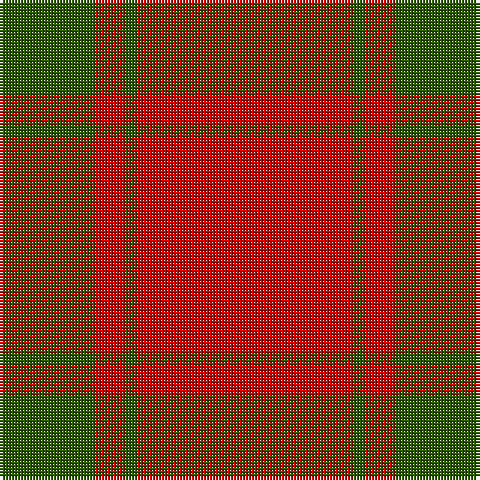

**Bands:** [GRGR](/stripes/grgr/) · **Stripes:** [DG R DG R](/stripes/stripes4/) DG R DG R

This was sourced from tartans-authority.  It is a [4 band tartan](/bands/bands4/).

Original link http://www.tartansauthority.com/tartan-ferret/display/904/

## Variants

Other setts woven to the same stripe pattern.

- [MacDonald Lord of the Isles](/setts/s4/r38dg2r5dg16/)
- [MacDonald Lord of the Isles](/setts/s4/r38dg2r5dg16~x2/)
- [MacGregor of Glenstrae #2](/setts/s4/r17dg9r2dg9~x2/)

## Thread count
G/32 R10 G4 R/72

## Palette
Each colour and its ΔE from the base-6 reference it is a variant of.

| Colour | Shade | Base | ΔE (OKLab) |
|---|---|---|---|
| G | <code style="background-color:#285800;">#285800</code> `#285800` | G <code style="background-color:#006100;">#006100</code> | 0.03 |
| R | <code style="background-color:#C80000;">#C80000</code> `#C80000` | R <code style="background-color:#CC0000;">#CC0000</code> | 0.01 |

# Sample pattern

## Nearest tartans

The nearest existing variants by ΔTartan distance.

1. [MacDonald of Sleat](/setts/s4/r36g2r5g16~x2/) — ΔT 0.35
1. [MacDonald Lord of the Isles](/setts/s4/r38dg2r5dg16/) — ΔT 0.53
1. [MacDonald Lord of the Isles](/setts/s4/r38dg2r5dg16~x2/) — ΔT 0.81
1. [Scottish Watch](/setts/s3/r104g39ly4/) — ΔT 1.36
1. [MacKintosh, Red](/setts/s6/r24g5r3g9r3db1~x4/) — ΔT 1.48
1. [MacQuarrie #5](/setts/s6/r16g1r1g1r4g12~x4/) — ΔT 1.60
1. [Cameron, Ancient](/setts/s7/r58ly3r6g16r12g16r6/) — ΔT 1.63
1. [MacQuarrie](/setts/s6/r16dg1r1dg1r4dg12~x2/) — ΔT 1.65
1. [Masai Shuka 21 (Artefact)](/setts/s4/r40db2r6db15~x2/) — ΔT 1.65
1. [Monica](/setts/s6/r3o10r3o4r20lb1~x4/) — ΔT 1.75

## Neighbour map

Every grey dot is one of 14313 variants placed by the first two principal components of the ΔTartan feature space (44% of its variance). Red is this tartan; blue dots are its nearest — click one to open its page.

<svg viewBox="0 0 640 380" role="img" style="max-width:100%;height:auto;border:1px solid #e0e0e0;border-radius:4px;display:block" xmlns="http://www.w3.org/2000/svg"><image href="/nn/cloud.v1.png" width="640" height="380"/><a href="/setts/s4/r36g2r5g16~x2/"><circle cx="522.8" cy="238.0" r="4" fill="#3465a4"><title>MacDonald of Sleat</title></circle></a><a href="/setts/s4/r38dg2r5dg16/"><circle cx="528.6" cy="232.0" r="4" fill="#3465a4"><title>MacDonald Lord of the Isles</title></circle></a><a href="/setts/s4/r38dg2r5dg16~x2/"><circle cx="556.7" cy="251.1" r="4" fill="#3465a4"><title>MacDonald Lord of the Isles</title></circle></a><a href="/setts/s3/r104g39ly4/"><circle cx="514.5" cy="221.6" r="4" fill="#3465a4"><title>Scottish Watch</title></circle></a><a href="/setts/s6/r24g5r3g9r3db1~x4/"><circle cx="490.4" cy="183.9" r="4" fill="#3465a4"><title>MacKintosh, Red</title></circle></a><a href="/setts/s6/r16g1r1g1r4g12~x4/"><circle cx="457.1" cy="215.3" r="4" fill="#3465a4"><title>MacQuarrie #5</title></circle></a><a href="/setts/s7/r58ly3r6g16r12g16r6/"><circle cx="496.5" cy="181.6" r="4" fill="#3465a4"><title>Cameron, Ancient</title></circle></a><a href="/setts/s6/r16dg1r1dg1r4dg12~x2/"><circle cx="452.3" cy="213.1" r="4" fill="#3465a4"><title>MacQuarrie</title></circle></a><a href="/setts/s4/r40db2r6db15~x2/"><circle cx="548.2" cy="225.8" r="4" fill="#3465a4"><title>Masai Shuka 21 (Artefact)</title></circle></a><a href="/setts/s6/r3o10r3o4r20lb1~x4/"><circle cx="462.4" cy="199.3" r="4" fill="#3465a4"><title>Monica</title></circle></a><circle cx="532.2" cy="241.6" r="5" fill="#c00000"/></svg>

ID: /setts/s4/r36dg2r5dg16~x2/
