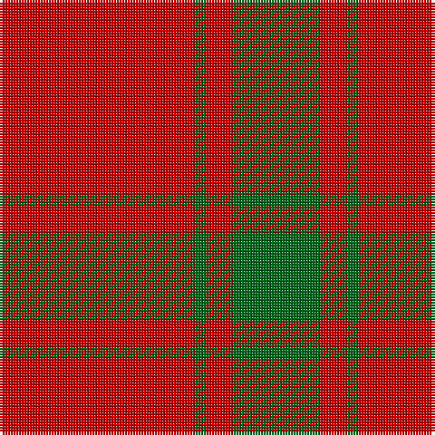

This page is one **sett** — a single exact thread-count. It belongs to the [tartan](/tartans/r36g2r5g16/)
(the same proportion at any scale), whose colour order is pattern [GRGR](/stripes/grgr/).

Sourced from register-of-tartans.  It is a [4 stripe tartan](/stripes/stripes4/).

Original link https://www.tartanregister.gov.uk/tartanDetails.aspx?ref=2367

3 attestations — the source records this cloth was collapsed from (oldest owns this page)

<ul>
<li>undated — MacDonald of Sleat (register-of-tartans, <a href="https://www.tartanregister.gov.uk/tartanDetails.aspx?ref=2367">record</a>)</li>
<li>undated — MacDonald of Sleat (weddslist, <a href="http://www.weddslist.com/cgi-bin/tartans/pg.pl?source=sts">record</a>)</li>
<li>undated — MacDonald of Sleat Clan Tartan Tartan Number: 904. Earliest known date: 1908 The MacDonald of Sleat tartan was manufactured in the 18th century and called MacDonald of Sleat, Lord of the Isles. The pattern was devised from an old MacDonald tartan that is shown in a painting at Armadale Castle, but it appears that the reconstruction differs somewhat from the original. Whether this was intended or simply a mistake is entirely open to conjecture but it would not be the first new design to have arisen from an error in the threadcount. The first recorded publication of the sett can be found in Adam's work of 1908. See products available Copyright © Blair Urquhart, Comrie, 2015 (house-of-tartan, <a href="http://www.house-of-tartan.scotland.net/house/TartanViewjs.asp?colr=Def&tnam=904">record</a>)</li>
</ul>

## Register references

External register numbers recorded for this tartan.

- Scottish Register of Tartans: [2367](https://www.tartanregister.gov.uk/tartanDetails.aspx?ref=2367)
- Scottish Tartans Authority (ITI): 904
- Scottish Tartans World Register: 904

## Thread count
R/72 G4 R10 G/32

## Palette
Each colour and the base-6 reference it is a variant of.

| Colour | Shade | Base |
|---|---|---|
| G | <code style="background-color:#006818;">#006818</code> `oklch(45.0% 0.142 145.0)` <small>#006818</small> | G <code style="background-color:#006100;">#006100</code> |
| R | <code style="background-color:#C80000;">#C80000</code> `oklch(52.3% 0.215 29.2)` <small>#C80000</small> | R <code style="background-color:#CC0000;">#CC0000</code> |

# Sample pattern

## Nearest tartans

The nearest existing variants by ΔTartan distance, with this tartan at the top so the swatches line up against it.

ΔTartan

Tartan

Sett

—

<a href="/ttd/edit/#slug=r36g2r5g16~x2">MacDonald of Sleat</a> <a class="nn-out" href="/setts/s4/r36g2r5g16~x2/" title="open its dictionary page">↗</a>

0.35

<a href="/ttd/edit/#slug=r36dg2r5dg16~x2">MacDonald of Sleat - 1810 (Clan)</a> <a class="nn-out" href="/setts/s4/r36dg2r5dg16~x2/" title="open its dictionary page">↗</a>

0.39

<a href="/ttd/edit/#slug=r38dg2r5dg16">MacDonald Lord of the Isles</a> <a class="nn-out" href="/setts/s4/r38dg2r5dg16/" title="open its dictionary page">↗</a>

1.02

<a href="/ttd/edit/#slug=r38dg2r5dg16~x2">MacDonald Lord of the Isles</a> <a class="nn-out" href="/setts/s4/r38dg2r5dg16~x2/" title="open its dictionary page">↗</a>

1.23

<a href="/ttd/edit/#slug=r104g39ly4">Scottish Watch</a> <a class="nn-out" href="/setts/s3/r104g39ly4/" title="open its dictionary page">↗</a>

1.39

<a href="/ttd/edit/#slug=r24g5r3g9r3db1~x4">MacKintosh, Red</a> <a class="nn-out" href="/setts/s6/r24g5r3g9r3db1~x4/" title="open its dictionary page">↗</a>

1.46

<a href="/ttd/edit/#slug=r16g1r1g1r4g12~x4">MacQuarrie #5</a> <a class="nn-out" href="/setts/s6/r16g1r1g1r4g12~x4/" title="open its dictionary page">↗</a>

1.50

<a href="/ttd/edit/#slug=r16dg1r1dg1r4dg12">MacQuarrie</a> <a class="nn-out" href="/setts/s6/r16dg1r1dg1r4dg12/" title="open its dictionary page">↗</a>

1.53

<a href="/ttd/edit/#slug=r58ly3r6g16r12g16r6">Cameron, Ancient</a> <a class="nn-out" href="/setts/s7/r58ly3r6g16r12g16r6/" title="open its dictionary page">↗</a>

1.55

<a href="/ttd/edit/#slug=r16dg1r1dg1r4dg12~x2">MacQuarrie 7</a> <a class="nn-out" href="/setts/s6/r16dg1r1dg1r4dg12~x2/" title="open its dictionary page">↗</a>

1.67

<a href="/ttd/edit/#slug=r40db2r6db15~x2">Masai Shuka 21 (Artefact)</a> <a class="nn-out" href="/setts/s4/r40db2r6db15~x2/" title="open its dictionary page">↗</a>

## Neighbour map

Every grey dot is one of 14299 variants placed by the first two principal components of the ΔTartan feature space (44% of its variance). Red is this tartan; blue dots are its nearest — click one to open its page.

<svg viewBox="0 0 640 380" role="img" style="max-width:100%;height:auto;border:1px solid #e0e0e0;border-radius:4px;display:block" xmlns="http://www.w3.org/2000/svg"><image href="/nn/cloud.v1.png" width="640" height="380"/><a href="/setts/s4/r36dg2r5dg16~x2/"><circle cx="531.7" cy="241.3" r="4" fill="#3465a4"><title>MacDonald of Sleat - 1810 (Clan)</title></circle></a><a href="/setts/s4/r38dg2r5dg16/"><circle cx="528.1" cy="231.6" r="4" fill="#3465a4"><title>MacDonald Lord of the Isles</title></circle></a><a href="/setts/s4/r38dg2r5dg16~x2/"><circle cx="556.3" cy="250.8" r="4" fill="#3465a4"><title>MacDonald Lord of the Isles</title></circle></a><a href="/setts/s3/r104g39ly4/"><circle cx="514.0" cy="221.3" r="4" fill="#3465a4"><title>Scottish Watch</title></circle></a><a href="/setts/s6/r24g5r3g9r3db1~x4/"><circle cx="489.9" cy="183.7" r="4" fill="#3465a4"><title>MacKintosh, Red</title></circle></a><a href="/setts/s6/r16g1r1g1r4g12~x4/"><circle cx="456.7" cy="215.1" r="4" fill="#3465a4"><title>MacQuarrie #5</title></circle></a><a href="/setts/s6/r16dg1r1dg1r4dg12/"><circle cx="451.9" cy="212.8" r="4" fill="#3465a4"><title>MacQuarrie</title></circle></a><a href="/setts/s7/r58ly3r6g16r12g16r6/"><circle cx="495.9" cy="181.3" r="4" fill="#3465a4"><title>Cameron, Ancient</title></circle></a><a href="/setts/s6/r16dg1r1dg1r4dg12~x2/"><circle cx="455.0" cy="215.4" r="4" fill="#3465a4"><title>MacQuarrie 7</title></circle></a><a href="/setts/s4/r40db2r6db15~x2/"><circle cx="547.7" cy="225.4" r="4" fill="#3465a4"><title>Masai Shuka 21 (Artefact)</title></circle></a><circle cx="522.3" cy="237.6" r="5" fill="#c00000"/></svg>

ID: /setts/s4/r36g2r5g16~x2/
