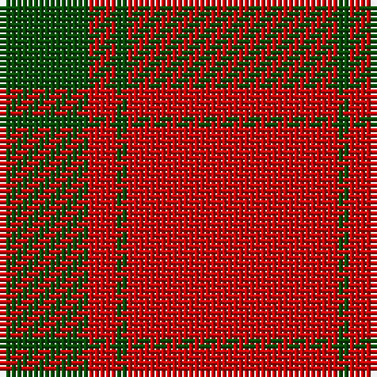

In pattern [GRGR](/stripes/grgr/).

This was sourced from weddslist.  It is a [4 stripe tartan](/stripes/stripes4/).

Original link http://www.weddslist.com/cgi-bin/tartans/pg.pl?source=rb

## Attestations

This cloth appears in 2 source records; the oldest owns this page.

- undated — MacDonald Lord of the Isles (weddslist, [record](http://www.weddslist.com/cgi-bin/tartans/pg.pl?source=rb))
- undated — MacDonald Lord of the Isles (weddslist, [record](http://www.weddslist.com/cgi-bin/tartans/pg.pl?source=x))

## Thread count
R/38 G2 R5 G/16

## Palette
Each colour and the base-6 reference it is a variant of.

| Colour | Shade | Base |
|---|---|---|
| G | <code style="background-color:#004C00;">#004C00</code> `oklch(36.1% 0.123 142.5)` <small>#004C00</small> | G <code style="background-color:#006100;">#006100</code> |
| R | <code style="background-color:#C80000;">#C80000</code> `oklch(52.3% 0.215 29.2)` <small>#C80000</small> | R <code style="background-color:#CC0000;">#CC0000</code> |

# Sample pattern

## Nearest tartans

The nearest existing variants by ΔTartan distance.

1. [MacDonald of Sleat](/setts/s4/r36g2r5g16~x2/) — ΔT 0.39
1. [MacDonald of Sleat - 1810 (Clan)](/setts/s4/r36dg2r5dg16~x2/) — ΔT 0.53
1. [MacDonald Lord of the Isles](/setts/s4/r38dg2r5dg16~x2/) — ΔT 1.10
1. [Scottish Watch](/setts/s3/r104g39ly4/) — ΔT 1.26
1. [Masai Shuka 12 (Artefact)](/setts/s4/r25k5r1~x4/) — ΔT 1.41
1. [MacKintosh, Red](/setts/s6/r24g5r3g9r3db1~x4/) — ΔT 1.42
1. [Masai Shuka 21 (Artefact)](/setts/s4/r40db2r6db15~x2/) — ΔT 1.46
1. [MacQuarrie](/setts/s6/r16dg1r1dg1r4dg12/) — ΔT 1.54
1. [Masai Shuka 07 (Artefact)](/setts/s5/r75k15r4k15r4~x2/) — ΔT 1.55
1. [Cameron, Ancient](/setts/s7/r58ly3r6g16r12g16r6/) — ΔT 1.56

## Neighbour map

Every grey dot is one of 14299 variants placed by the first two principal components of the ΔTartan feature space (44% of its variance). Red is this tartan; blue dots are its nearest — click one to open its page.

<svg viewBox="0 0 640 380" role="img" style="max-width:100%;height:auto;border:1px solid #e0e0e0;border-radius:4px;display:block" xmlns="http://www.w3.org/2000/svg"><image href="/nn/cloud.v1.png" width="640" height="380"/><a href="/setts/s4/r36g2r5g16~x2/"><circle cx="522.3" cy="237.6" r="4" fill="#3465a4"><title>MacDonald of Sleat</title></circle></a><a href="/setts/s4/r36dg2r5dg16~x2/"><circle cx="531.7" cy="241.3" r="4" fill="#3465a4"><title>MacDonald of Sleat - 1810 (Clan)</title></circle></a><a href="/setts/s4/r38dg2r5dg16~x2/"><circle cx="556.3" cy="250.8" r="4" fill="#3465a4"><title>MacDonald Lord of the Isles</title></circle></a><a href="/setts/s3/r104g39ly4/"><circle cx="514.0" cy="221.3" r="4" fill="#3465a4"><title>Scottish Watch</title></circle></a><a href="/setts/s4/r25k5r1~x4/"><circle cx="536.7" cy="200.9" r="4" fill="#3465a4"><title>Masai Shuka 12 (Artefact)</title></circle></a><a href="/setts/s6/r24g5r3g9r3db1~x4/"><circle cx="489.9" cy="183.7" r="4" fill="#3465a4"><title>MacKintosh, Red</title></circle></a><a href="/setts/s4/r40db2r6db15~x2/"><circle cx="547.7" cy="225.4" r="4" fill="#3465a4"><title>Masai Shuka 21 (Artefact)</title></circle></a><a href="/setts/s6/r16dg1r1dg1r4dg12/"><circle cx="451.9" cy="212.8" r="4" fill="#3465a4"><title>MacQuarrie</title></circle></a><a href="/setts/s5/r75k15r4k15r4~x2/"><circle cx="539.8" cy="193.4" r="4" fill="#3465a4"><title>Masai Shuka 07 (Artefact)</title></circle></a><a href="/setts/s7/r58ly3r6g16r12g16r6/"><circle cx="495.9" cy="181.3" r="4" fill="#3465a4"><title>Cameron, Ancient</title></circle></a><circle cx="528.1" cy="231.6" r="5" fill="#c00000"/></svg>

ID: /setts/s4/r38dg2r5dg16/
