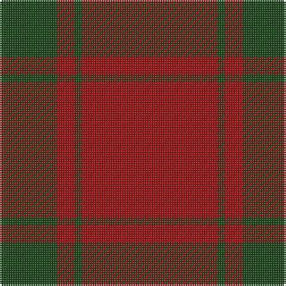

In pattern [GRGR](/stripes/grgr/).

This was sourced from weddslist.  It is a [4 stripe tartan](/stripes/stripes4/).

Original link http://www.weddslist.com/cgi-bin/tartans/pg.pl?source=tinsel

## Thread count
DR/76 DG4 DR10 DG/32

## Palette
Each colour and the base-6 reference it is a variant of.

| Colour | Shade | Base |
|---|---|---|
| DG | <code style="background-color:#11450D;">#11450D</code> `oklch(34.4% 0.101 142.1)` <small>#11450D</small> | G <code style="background-color:#006100;">#006100</code> |
| DR | <code style="background-color:#AA0000;">#AA0000</code> `oklch(46.3% 0.190 29.2)` <small>#AA0000</small> | R <code style="background-color:#CC0000;">#CC0000</code> |

# Sample pattern

## Nearest tartans

The nearest existing variants by ΔTartan distance.

1. [MacDonald of Sleat - 1810 (Clan)](/setts/s4/r36dg2r5dg16~x2/) — ΔT 0.81
1. [MacDonald of Sleat](/setts/s4/r36g2r5g16~x2/) — ΔT 1.02
1. [MacDonald Lord of the Isles](/setts/s4/r38dg2r5dg16/) — ΔT 1.10
1. [Scottish Watch (Corporate)](/setts/s3/r104dg39lo4~x2/) — ΔT 1.43
1. [Hunt (Personal)](/setts/s5/r9y2r45y20lo3~x2/) — ΔT 1.65
1. [MacKintosh, Red](/setts/s6/r24g5r3g9r3db1~x4/) — ΔT 1.74
1. [Scottish Watch](/setts/s3/r104g39ly4/) — ΔT 1.78
1. [Dunbar, John Telfer (Personal)](/setts/s7/o5k2o28k10o26k4o4~x2/) — ΔT 1.82
1. [MacQuarrie 7](/setts/s6/r16dg1r1dg1r4dg12~x2/) — ΔT 1.82
1. [Masai Shuka 21 (Artefact)](/setts/s4/r40db2r6db15~x2/) — ΔT 1.83

## Neighbour map

Every grey dot is one of 14299 variants placed by the first two principal components of the ΔTartan feature space (44% of its variance). Red is this tartan; blue dots are its nearest — click one to open its page.

<svg viewBox="0 0 640 380" role="img" style="max-width:100%;height:auto;border:1px solid #e0e0e0;border-radius:4px;display:block" xmlns="http://www.w3.org/2000/svg"><image href="/nn/cloud.v1.png" width="640" height="380"/><a href="/setts/s4/r36dg2r5dg16~x2/"><circle cx="531.7" cy="241.3" r="4" fill="#3465a4"><title>MacDonald of Sleat - 1810 (Clan)</title></circle></a><a href="/setts/s4/r36g2r5g16~x2/"><circle cx="522.3" cy="237.6" r="4" fill="#3465a4"><title>MacDonald of Sleat</title></circle></a><a href="/setts/s4/r38dg2r5dg16/"><circle cx="528.1" cy="231.6" r="4" fill="#3465a4"><title>MacDonald Lord of the Isles</title></circle></a><a href="/setts/s3/r104dg39lo4~x2/"><circle cx="562.3" cy="256.5" r="4" fill="#3465a4"><title>Scottish Watch (Corporate)</title></circle></a><a href="/setts/s5/r9y2r45y20lo3~x2/"><circle cx="516.5" cy="209.0" r="4" fill="#3465a4"><title>Hunt (Personal)</title></circle></a><a href="/setts/s6/r24g5r3g9r3db1~x4/"><circle cx="489.9" cy="183.7" r="4" fill="#3465a4"><title>MacKintosh, Red</title></circle></a><a href="/setts/s3/r104g39ly4/"><circle cx="514.0" cy="221.3" r="4" fill="#3465a4"><title>Scottish Watch</title></circle></a><a href="/setts/s7/o5k2o28k10o26k4o4~x2/"><circle cx="602.2" cy="250.8" r="4" fill="#3465a4"><title>Dunbar, John Telfer (Personal)</title></circle></a><a href="/setts/s6/r16dg1r1dg1r4dg12~x2/"><circle cx="455.0" cy="215.4" r="4" fill="#3465a4"><title>MacQuarrie 7</title></circle></a><a href="/setts/s4/r40db2r6db15~x2/"><circle cx="547.7" cy="225.4" r="4" fill="#3465a4"><title>Masai Shuka 21 (Artefact)</title></circle></a><circle cx="556.3" cy="250.8" r="5" fill="#c00000"/></svg>

ID: /setts/s4/r38dg2r5dg16~x2/
