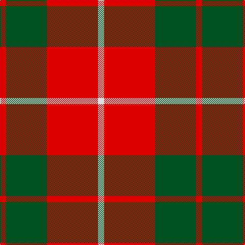

In pattern [RGRW](/stripes/rgrw/).

This was sourced from register-of-tartans.  It is a [4 stripe tartan](/stripes/stripes4/).

Original link https://www.tartanregister.gov.uk/tartanDetails.aspx?ref=2550

## Also known as

This cloth is also recorded under:

- MacKinnon #6

## Register references

External register numbers recorded for this tartan.

- Scottish Register of Tartans: [2550](https://www.tartanregister.gov.uk/tartanDetails.aspx?ref=2550)
- Scottish Tartans World Register: 1527

## Thread count
R/12 G80 R100 LN/12

## Palette
Each colour and the base-6 reference it is a variant of.

| Colour | Shade | Base |
|---|---|---|
| G | <code style="background-color:#005020;">#005020</code> `oklch(37.7% 0.105 149.6)` <small>#005020</small> | G <code style="background-color:#006100;">#006100</code> |
| LN | <code style="background-color:#E0E0E0;">#E0E0E0</code> `oklch(90.7% 0.000 89.9)` <small>#E0E0E0</small> | W <code style="background-color:#F7F7F7;">#F7F7F7</code> |
| R | <code style="background-color:#DC0000;">#DC0000</code> `oklch(56.2% 0.230 29.2)` <small>#DC0000</small> | R <code style="background-color:#CC0000;">#CC0000</code> |

# Sample pattern

## Nearest tartans

The nearest existing variants by ΔTartan distance, with this tartan at the top so the swatches line up against it.

ΔTartan

Tartan

Sett

—

<a href="/ttd/edit/#slug=r3dg20r25w3~x4">MacKinnon #6</a> <a class="nn-out" href="/setts/s4/r3dg20r25w3~x4/" title="open its dictionary page">↗</a>

0.69

<a href="/ttd/edit/#slug=dg16r5dg2r18k2~x2">MacDonald Lord of the Isles #2</a> <a class="nn-out" href="/setts/s5/dg16r5dg2r18k2~x2/" title="open its dictionary page">↗</a>

0.75

<a href="/setts/s4/r10dg4ly1~x8/">Lugo (2013)</a>

0.83

<a href="/ttd/edit/#slug=r3g20r25w3~x4">MacKinnon 11</a> <a class="nn-out" href="/setts/s4/r3g20r25w3~x4/" title="open its dictionary page">↗</a>

0.85

<a href="/ttd/edit/#slug=dg7r3dg1r9k1~x2">MacDonald of Sleat</a> <a class="nn-out" href="/setts/s5/dg7r3dg1r9k1~x2/" title="open its dictionary page">↗</a>

1.02

<a href="/ttd/edit/#slug=r1g7r9ly1~x4">Bryce</a> <a class="nn-out" href="/setts/s4/r1g7r9ly1~x4/" title="open its dictionary page">↗</a>

1.04

<a href="/ttd/edit/#slug=w11r40g13r5g12r5~x2">Makhtoum</a> <a class="nn-out" href="/setts/s6/w11r40g13r5g12r5~x2/" title="open its dictionary page">↗</a>

1.05

<a href="/ttd/edit/#slug=g16r5g2r18k2~x2">MacDonald, Lord of The Isles (Artef)</a> <a class="nn-out" href="/setts/s5/g16r5g2r18k2~x2/" title="open its dictionary page">↗</a>

1.17

<a href="/ttd/edit/#slug=t6do28lo20t3~x2">Prince of Orange</a> <a class="nn-out" href="/setts/s4/t6do28lo20t3~x2/" title="open its dictionary page">↗</a>

1.23

<a href="/ttd/edit/#slug=r1g3r1g3r8ly1~x8">Cameron</a> <a class="nn-out" href="/setts/s6/r1g3r1g3r8ly1~x8/" title="open its dictionary page">↗</a>

1.25

<a href="/ttd/edit/#slug=dg8r2dg9r16w1~x2">MacGregor of Balquhidder</a> <a class="nn-out" href="/setts/s5/dg8r2dg9r16w1~x2/" title="open its dictionary page">↗</a>

## Neighbour map

Every grey dot is one of 14299 variants placed by the first two principal components of the ΔTartan feature space (44% of its variance). Red is this tartan; blue dots are its nearest — click one to open its page.

<svg viewBox="0 0 640 380" role="img" style="max-width:100%;height:auto;border:1px solid #e0e0e0;border-radius:4px;display:block" xmlns="http://www.w3.org/2000/svg"><image href="/nn/cloud.v1.png" width="640" height="380"/><a href="/setts/s5/dg16r5dg2r18k2~x2/"><circle cx="343.2" cy="232.8" r="4" fill="#3465a4"><title>MacDonald Lord of the Isles #2</title></circle></a><a href="/setts/s4/r10dg4ly1~x8/"><circle cx="331.2" cy="248.6" r="4" fill="#3465a4"><title>Lugo (2013)</title></circle></a><a href="/setts/s4/r3g20r25w3~x4/"><circle cx="339.7" cy="246.1" r="4" fill="#3465a4"><title>MacKinnon 11</title></circle></a><a href="/setts/s5/dg7r3dg1r9k1~x2/"><circle cx="354.7" cy="237.0" r="4" fill="#3465a4"><title>MacDonald of Sleat</title></circle></a><a href="/setts/s4/r1g7r9ly1~x4/"><circle cx="355.9" cy="245.7" r="4" fill="#3465a4"><title>Bryce</title></circle></a><a href="/setts/s6/w11r40g13r5g12r5~x2/"><circle cx="328.7" cy="216.4" r="4" fill="#3465a4"><title>Makhtoum</title></circle></a><a href="/setts/s5/g16r5g2r18k2~x2/"><circle cx="352.4" cy="240.2" r="4" fill="#3465a4"><title>MacDonald, Lord of The Isles (Artef)</title></circle></a><a href="/setts/s4/t6do28lo20t3~x2/"><circle cx="283.0" cy="244.4" r="4" fill="#3465a4"><title>Prince of Orange</title></circle></a><a href="/setts/s6/r1g3r1g3r8ly1~x8/"><circle cx="370.7" cy="226.4" r="4" fill="#3465a4"><title>Cameron</title></circle></a><a href="/setts/s5/dg8r2dg9r16w1~x2/"><circle cx="346.6" cy="217.1" r="4" fill="#3465a4"><title>MacGregor of Balquhidder</title></circle></a><circle cx="335.1" cy="239.8" r="5" fill="#c00000"/></svg>

ID: /setts/s4/r3dg20r25w3~x4/
