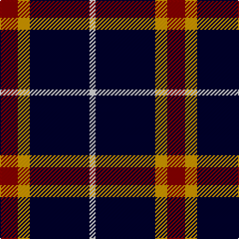

**Bands:** [RYKW](/stripes/rykw/) · **Stripes:** [R LO K W](/stripes/stripes4/) R LO K W

This was sourced from tartans-authority.  It is a [4 band tartan](/bands/bands4/).

Original link http://www.tartansauthority.com/tartan-ferret/display/5306/

## Thread count
DR/18 DY12 DB60 LN/6

## Palette
Each colour and its ΔE from the base-6 reference it is a variant of.

| Colour | Shade | Base | ΔE (OKLab) |
|---|---|---|---|
| DB | <code style="background-color:#00002C;">#00002C</code> `#00002C` | K <code style="background-color:#000000;">#000000</code> | 0.16 |
| DR | <code style="background-color:#880000;">#880000</code> `#880000` | R <code style="background-color:#CC0000;">#CC0000</code> | 0.15 |
| DY | <code style="background-color:#D09800;">#D09800</code> `#D09800` | Y <code style="background-color:#F2BF00;">#F2BF00</code> | 0.12 |
| LN | <code style="background-color:#E0E0E0;">#E0E0E0</code> `#E0E0E0` | W <code style="background-color:#F7F7F7;">#F7F7F7</code> | 0.07 |

# Sample pattern

## Nearest tartans

The nearest existing variants by ΔTartan distance.

1. [Perry, Alex (Personal)](/setts/s4/k62n24lo5w8~x2/) — ΔT 0.96
1. [Scottish Nuclear](/setts/s4/r4db32k15w2~x2/) — ΔT 1.12
1. [Callaway (Corporate)](/setts/s6/r1k10n2lb5k5r1~x4/) — ΔT 1.19
1. [Calgary Firefighters (Corporate)](/setts/s5/o4k48o16r12db3~x2/) — ΔT 1.44
1. [St. Eloi](/setts/s6/r3lo2k10w1~x6/) — ΔT 1.50
1. [Calgary Firefighters](/setts/s5/y4k48y16r12b3~x2/) — ΔT 1.51
1. [Wilson's No.205](/setts/s4/w1dg10dp4lt1~x2/) — ΔT 1.51
1. [Dunfermline Athletic (2008) (Corp)](/setts/s7/k11w1k1w1k4o8r1~x8/) — ΔT 1.52
1. [College of Radiographers](/setts/s5/k15y2k10db18w3~x2/) — ΔT 1.53
1. [Glen Coe Trade Tartan Tartan Number: 1243. Earliest known date: Modern Many new designs have been given district names to promote their Scottish connections. However, these names should not be confused with the District tartans which have earned their title through 'use and wont' and not a little history. See products available Copyright © Blair Urquhart, Comrie, 2015](/setts/s5/k37w9k3dg9w3~x2/) — ΔT 1.54

## Neighbour map

Every grey dot is one of 14299 variants placed by the first two principal components of the ΔTartan feature space (44% of its variance). Red is this tartan; blue dots are its nearest — click one to open its page.

<svg viewBox="0 0 640 380" role="img" style="max-width:100%;height:auto;border:1px solid #e0e0e0;border-radius:4px;display:block" xmlns="http://www.w3.org/2000/svg"><image href="/nn/cloud.v1.png" width="640" height="380"/><a href="/setts/s4/k62n24lo5w8~x2/"><circle cx="342.7" cy="212.0" r="4" fill="#3465a4"><title>Perry, Alex (Personal)</title></circle></a><a href="/setts/s4/r4db32k15w2~x2/"><circle cx="346.4" cy="208.8" r="4" fill="#3465a4"><title>Scottish Nuclear</title></circle></a><a href="/setts/s6/r1k10n2lb5k5r1~x4/"><circle cx="309.4" cy="208.8" r="4" fill="#3465a4"><title>Callaway (Corporate)</title></circle></a><a href="/setts/s5/o4k48o16r12db3~x2/"><circle cx="336.1" cy="188.8" r="4" fill="#3465a4"><title>Calgary Firefighters (Corporate)</title></circle></a><a href="/setts/s6/r3lo2k10w1~x6/"><circle cx="376.7" cy="215.7" r="4" fill="#3465a4"><title>St. Eloi</title></circle></a><a href="/setts/s5/y4k48y16r12b3~x2/"><circle cx="342.5" cy="192.8" r="4" fill="#3465a4"><title>Calgary Firefighters</title></circle></a><a href="/setts/s4/w1dg10dp4lt1~x2/"><circle cx="334.6" cy="224.9" r="4" fill="#3465a4"><title>Wilson's No.205</title></circle></a><a href="/setts/s7/k11w1k1w1k4o8r1~x8/"><circle cx="311.8" cy="182.6" r="4" fill="#3465a4"><title>Dunfermline Athletic (2008) (Corp)</title></circle></a><a href="/setts/s5/k15y2k10db18w3~x2/"><circle cx="250.7" cy="240.1" r="4" fill="#3465a4"><title>College of Radiographers</title></circle></a><a href="/setts/s5/k37w9k3dg9w3~x2/"><circle cx="373.3" cy="207.1" r="4" fill="#3465a4"><title>Glen Coe Trade Tartan Tartan Number: 1243. Earliest known date: Modern Many new designs have been given district names to promote their Scottish connections. However, these names should not be confused with the District tartans which have earned their title through 'use and wont' and not a little history. See products available Copyright © Blair Urquhart, Comrie, 2015</title></circle></a><circle cx="322.5" cy="218.4" r="5" fill="#c00000"/></svg>

ID: /setts/s4/r3lo2k10w1~x6/
