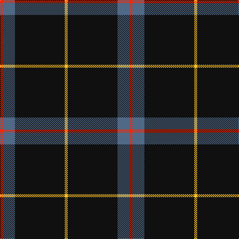

In pattern [RBKY](/stripes/rbky/).

This was sourced from register-of-tartans.  It is a [4 stripe tartan](/stripes/stripes4/).

Original link https://www.tartanregister.gov.uk/tartanDetails.aspx?ref=10749

## Also known as

This cloth is also recorded under:

- Rogues, The

## Attestations

This cloth appears in 2 source records; the oldest owns this page.

- 15/12/2012 — Rogues (United States), The (register-of-tartans, [record](https://www.tartanregister.gov.uk/tartanDetails.aspx?ref=10749))
- undated — Rogues (United States), The Corporate Tartan Tartan Number: 10749. Earliest known date: 15/12/2012 Designed by Steven Randall Wothke as the official tartan for his traditional piping and drumming band, The Rogues, formed in Texas in 1994. Colours: black is reminiscent of formal attire; red, yellow and blue were inspired by the first kilt Mr Wothke owned. See products available Copyright © Blair Urquhart, Comrie, 2015 (house-of-tartan, [record](http://www.house-of-tartan.scotland.net/house/TartanViewjs.asp?colr=Def&tnam=10749))

## Register references

External register numbers recorded for this tartan.

- Scottish Register of Tartans: [10749](https://www.tartanregister.gov.uk/tartanDetails.aspx?ref=10749)

## Thread count
R/6 B24 K100 Y/6

## Palette
Each colour and its ΔE from the base-6 reference it is a variant of.

| Colour | Shade | Base | ΔE (OKLab) |
|---|---|---|---|
| B | <code style="background-color:#506987;">#506987</code> `#506987` | B <code style="background-color:#2A418A;">#2A418A</code> | 0.13 |
| K | <code style="background-color:#101010;">#101010</code> `#101010` | K <code style="background-color:#000000;">#000000</code> | 0.17 |
| R | <code style="background-color:#FF2400;">#FF2400</code> `#FF2400` | R <code style="background-color:#CC0000;">#CC0000</code> | 0.11 |
| Y | <code style="background-color:#FFC125;">#FFC125</code> `#FFC125` | Y <code style="background-color:#F2BF00;">#F2BF00</code> | 0.02 |

# Sample pattern

## Nearest tartans

The nearest existing variants by ΔTartan distance.

1. [Rogues, The (Corporate)](/setts/s4/r3t12k50ly3~x2/) — ΔT 0.34
1. [C-Tec N.I. Ltd](/setts/s4/k62db15w6ly4~x2/) — ΔT 0.81
1. [Dobelman (Personal)](/setts/s4/r1k20lb5r1~x4/) — ΔT 1.10
1. [Westgate Fashion Tartan Tartan Number: 6019. Earliest known date: pre 2003 A fashion tartan See products available Copyright © Blair Urquhart, Comrie, 2015](/setts/s4/y14k80y14ly5~x2/) — ΔT 1.17
1. [Dhillon (Personal)](/setts/s4/k35lo3w3g3~x4/) — ΔT 1.18
1. [Perry (Calgary), Alex (Personal)](/setts/s4/k62dt24lo5w3~x2/) — ΔT 1.19
1. [Friends of Nordegg (Corporate)](/setts/s5/k50db6r6o6w3~x2/) — ΔT 1.19
1. [Perry Ancient (Personal)](/setts/s5/k75y26y3k4ly6~x2/) — ΔT 1.29
1. [Harley Davidson (Corporate)](/setts/s6/o4n6k4o8k49o2/) — ΔT 1.29
1. [Fily, Sylvain Roger](/setts/s5/r2g2k20w1db1~x6/) — ΔT 1.32

## Neighbour map

Every grey dot is one of 14299 variants placed by the first two principal components of the ΔTartan feature space (44% of its variance). Red is this tartan; blue dots are its nearest — click one to open its page.

<svg viewBox="0 0 640 380" role="img" style="max-width:100%;height:auto;border:1px solid #e0e0e0;border-radius:4px;display:block" xmlns="http://www.w3.org/2000/svg"><image href="/nn/cloud.v1.png" width="640" height="380"/><a href="/setts/s4/r3t12k50ly3~x2/"><circle cx="456.2" cy="196.1" r="4" fill="#3465a4"><title>Rogues, The (Corporate)</title></circle></a><a href="/setts/s4/k62db15w6ly4~x2/"><circle cx="424.6" cy="199.4" r="4" fill="#3465a4"><title>C-Tec N.I. Ltd</title></circle></a><a href="/setts/s4/r1k20lb5r1~x4/"><circle cx="479.4" cy="198.4" r="4" fill="#3465a4"><title>Dobelman (Personal)</title></circle></a><a href="/setts/s4/y14k80y14ly5~x2/"><circle cx="475.7" cy="229.6" r="4" fill="#3465a4"><title>Westgate Fashion Tartan Tartan Number: 6019. Earliest known date: pre 2003 A fashion tartan See products available Copyright © Blair Urquhart, Comrie, 2015</title></circle></a><a href="/setts/s4/k35lo3w3g3~x4/"><circle cx="490.0" cy="202.4" r="4" fill="#3465a4"><title>Dhillon (Personal)</title></circle></a><a href="/setts/s4/k62dt24lo5w3~x2/"><circle cx="421.6" cy="203.4" r="4" fill="#3465a4"><title>Perry (Calgary), Alex (Personal)</title></circle></a><a href="/setts/s5/k50db6r6o6w3~x2/"><circle cx="418.8" cy="164.7" r="4" fill="#3465a4"><title>Friends of Nordegg (Corporate)</title></circle></a><a href="/setts/s5/k75y26y3k4ly6~x2/"><circle cx="462.9" cy="182.4" r="4" fill="#3465a4"><title>Perry Ancient (Personal)</title></circle></a><a href="/setts/s6/o4n6k4o8k49o2/"><circle cx="489.6" cy="164.4" r="4" fill="#3465a4"><title>Harley Davidson (Corporate)</title></circle></a><a href="/setts/s5/r2g2k20w1db1~x6/"><circle cx="476.6" cy="149.8" r="4" fill="#3465a4"><title>Fily, Sylvain Roger</title></circle></a><circle cx="465.9" cy="200.3" r="5" fill="#c00000"/></svg>

ID: /setts/s4/r3n12k50ly3~x2/
