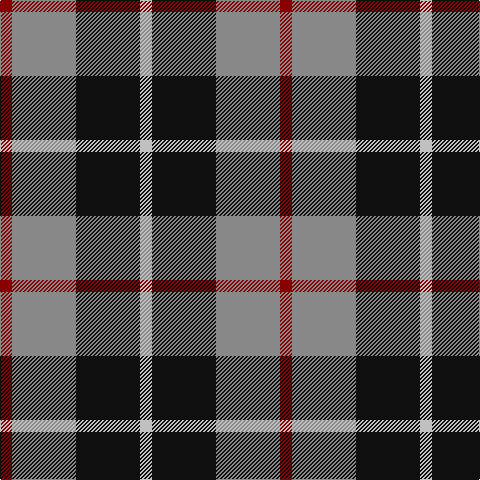

In pattern [RRKW](/stripes/rrkw/).

This was sourced from tartans-authority.  It is a [4 stripe tartan](/stripes/stripes4/).

Original link http://www.tartansauthority.com/tartan-ferret/display/3597/

## Also known as

This cloth is also recorded under:

- Thompson, Grey

## Attestations

This cloth appears in 2 source records; the oldest owns this page.

- pre 2002 — Thompson, Dress (Clan) (tartans-authority, [record](http://www.tartansauthority.com/tartan-ferret/display/3597/))
- undated — Thompson, Grey (register-of-tartans, [record](https://www.tartanregister.gov.uk/tartanDetails.aspx?ref=5157))

## Register references

External register numbers recorded for this tartan.

- Scottish Register of Tartans: [5157](https://www.tartanregister.gov.uk/tartanDetails.aspx?ref=5157)
- Scottish Tartans Authority (ITI): 3597

## Thread count
DR/12 Na64 K64 N/12

## Palette
Each colour and the base-6 reference it is a variant of.

| Colour | Shade | Base |
|---|---|---|
| DR | <code style="background-color:#880000;">#880000</code> `oklch(39.4% 0.162 29.2)` <small>#880000</small> | R <code style="background-color:#CC0000;">#CC0000</code> |
| K | <code style="background-color:#101010;">#101010</code> `oklch(17.3% 0.000 89.9)` <small>#101010</small> | K <code style="background-color:#000000;">#000000</code> |
| N | <code style="background-color:#C0C0C0;">#C0C0C0</code> `oklch(80.8% 0.000 89.9)` <small>#C0C0C0</small> | W <code style="background-color:#F7F7F7;">#F7F7F7</code> |
| Na | <code style="background-color:#888888;">#888888</code> `oklch(62.7% 0.000 89.9)` <small>#888888</small> | R <code style="background-color:#CC0000;">#CC0000</code> |

# Sample pattern

## Nearest tartans

The nearest existing variants by ΔTartan distance.

1. [Loganair](/setts/s4/r5o32k31w5~x2/) — ΔT 0.40
1. [Loganair Uniform Skirt Corporate Tartan Tartan Number: 1629. Earliest known date: c.1985 Half actual count for display. Used until 1988 See products available Copyright © Blair Urquhart, Comrie, 2015](/setts/s4/r5o32k31w5/) — ΔT 0.43
1. [Harbison (2015)](/setts/s4/g21db34r14w6~x2/) — ΔT 0.80
1. [New York State Police Pipe Band](/setts/s5/o5dp3o18k16ly3~x4/) — ΔT 0.96
1. [Loganair, Uniform Skirt](/setts/s4/r5y32k31w5~x2/) — ΔT 1.00
1. [Delroeux, John Michael (Personal)](/setts/s4/db3dg6ly1r3~x10/) — ΔT 1.03
1. [Oban Grey](/setts/s5/k4w3k4y9r1~x4/) — ΔT 1.07
1. [Harbison (2015)](/setts/s4/db21g34r14w6~x2/) — ΔT 1.09
1. [Salt Spring Island](/setts/s4/r1dg6db6w1~x4/) — ΔT 1.11
1. [Oban Grey District Tartan Tartan Number: 1237. Earliest known date: pre 2003 Not an official district but a name chosen by the weavers. See products available Copyright © Blair Urquhart, Comrie, 2015](/setts/s5/k4w3k4o9r1~x4/) — ΔT 1.12

## Neighbour map

Every grey dot is one of 14299 variants placed by the first two principal components of the ΔTartan feature space (44% of its variance). Red is this tartan; blue dots are its nearest — click one to open its page.

<svg viewBox="0 0 640 380" role="img" style="max-width:100%;height:auto;border:1px solid #e0e0e0;border-radius:4px;display:block" xmlns="http://www.w3.org/2000/svg"><image href="/nn/cloud.v1.png" width="640" height="380"/><a href="/setts/s4/r5o32k31w5~x2/"><circle cx="210.3" cy="241.0" r="4" fill="#3465a4"><title>Loganair</title></circle></a><a href="/setts/s4/r5o32k31w5/"><circle cx="209.3" cy="239.4" r="4" fill="#3465a4"><title>Loganair Uniform Skirt Corporate Tartan Tartan Number: 1629. Earliest known date: c.1985 Half actual count for display. Used until 1988 See products available Copyright © Blair Urquhart, Comrie, 2015</title></circle></a><a href="/setts/s4/g21db34r14w6~x2/"><circle cx="176.1" cy="265.6" r="4" fill="#3465a4"><title>Harbison (2015)</title></circle></a><a href="/setts/s5/o5dp3o18k16ly3~x4/"><circle cx="235.5" cy="233.9" r="4" fill="#3465a4"><title>New York State Police Pipe Band</title></circle></a><a href="/setts/s4/r5y32k31w5~x2/"><circle cx="197.4" cy="237.5" r="4" fill="#3465a4"><title>Loganair, Uniform Skirt</title></circle></a><a href="/setts/s4/db3dg6ly1r3~x10/"><circle cx="171.0" cy="256.6" r="4" fill="#3465a4"><title>Delroeux, John Michael (Personal)</title></circle></a><a href="/setts/s5/k4w3k4y9r1~x4/"><circle cx="187.5" cy="223.6" r="4" fill="#3465a4"><title>Oban Grey</title></circle></a><a href="/setts/s4/db21g34r14w6~x2/"><circle cx="178.6" cy="268.0" r="4" fill="#3465a4"><title>Harbison (2015)</title></circle></a><a href="/setts/s4/r1dg6db6w1~x4/"><circle cx="199.8" cy="254.4" r="4" fill="#3465a4"><title>Salt Spring Island</title></circle></a><a href="/setts/s5/k4w3k4o9r1~x4/"><circle cx="185.8" cy="222.5" r="4" fill="#3465a4"><title>Oban Grey District Tartan Tartan Number: 1237. Earliest known date: pre 2003 Not an official district but a name chosen by the weavers. See products available Copyright © Blair Urquhart, Comrie, 2015</title></circle></a><circle cx="192.7" cy="253.0" r="5" fill="#c00000"/></svg>

ID: /setts/s4/r3o16k16lb3~x4/
