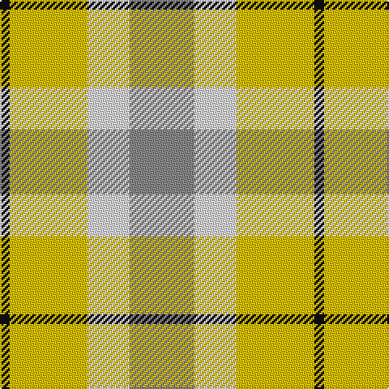

In pattern [KYWR](/patterns/kywr/).

This was sourced from tartans-authority.  It is a [4 stripes tartan](/stripes/stripes4/).

Original link http://www.tartansauthority.com/tartan-ferret/display/7871/

## Thread count
Ka/6 Y48 LN26 N/40

## Palette
Each colour and its ΔE from the base-6 reference it is a variant of.

| Colour | Shade | Base | ΔE (OKLab) |
|---|---|---|---|
| G | <code style="background-color:#006818;">#006818</code> `#006818` | G <code style="background-color:#006400;">#006400</code> | 0.02 |
| K | <code style="background-color:#000000;">#000000</code> `#000000` | K <code style="background-color:#000000;">#000000</code> | 0.00 |
| Ka | <code style="background-color:#101010;">#101010</code> `#101010` | K <code style="background-color:#000000;">#000000</code> | 0.17 |
| LN | <code style="background-color:#E0E0E0;">#E0E0E0</code> `#E0E0E0` | W <code style="background-color:#F4F4F0;">#F4F4F0</code> | 0.06 |
| N | <code style="background-color:#888888;">#888888</code> `#888888` | R <code style="background-color:#C80000;">#C80000</code> | 0.24 |
| Y | <code style="background-color:#E8C000;">#E8C000</code> `#E8C000` | Y <code style="background-color:#E8C000;">#E8C000</code> | 0.00 |

# Sample pattern

## Nearest tartans

The nearest existing variants by ΔTartan distance.

1. [Spirit of Riverside](/setts/s4/w40wa26y48k6-k101010-wd3d3d3-waffffff-yffd700/) — ΔT 1.18
1. [Trinity Bicycles (Corporate)](/setts/s5/g8w22g28wa60r8-g704400-rc80000-wb4c0c8-wac8c8bc/) — ΔT 1.53
1. [Wild Mustard Dreams](/setts/s5/y34ya34y34g52b10-b2c2c80-g006818-ydc943c-yafccc00/) — ΔT 1.60
1. [MacKinnon, dress](/setts/s4/g36r28w28ra4-g008000-r703000-rac00000-we0e0e0/) — ΔT 1.65
1. [Barbie's Plaid](/setts/s6/b4y8ba44y40g38y4-b606090-ba8080d0-g30a010-yffe000/) — ΔT 1.73
1. [Wilson's, No 203](/setts/s4/b8r16g20y4-b5480b0-g008000-rc00000-yf0c000/) — ΔT 1.77
1. [Dunoon](/setts/s4/w12g78y78w12-g008000-we0e0e0-yff8500/) — ΔT 1.88
1. [Samye #2](/setts/s5/y56r22g22b22w4-b2c4084-g309c18-rdc0000-we0e0e0-ye8c000/) — ΔT 1.89
1. [Farooq in Livingston (Personal)](/setts/s4/b40g40w20r5-b465665-g6e7766-r874c52-wffffff/) — ΔT 1.92
1. [Wild Mustard Dreams](/setts/s5/y34ya34r34g52b10-b0000ff-g408060-rb84c00-yd87c00-yaffe600/) — ΔT 1.92

## Neighbour map

Every grey dot is one of 15726 variants placed by the first two principal components of the ΔTartan feature space (44% of its variance). Red is this tartan; blue dots are its nearest — click one to open its page.

<svg viewBox="0 0 640 380" role="img" style="max-width:100%;height:auto;border:1px solid #e0e0e0;border-radius:4px;display:block" xmlns="http://www.w3.org/2000/svg"><image href="/nn/cloud.v1.png" width="640" height="380"/><a href="/setts/s4/w40wa26y48k6-k101010-wd3d3d3-waffffff-yffd700/"><circle cx="184.4" cy="247.2" r="4" fill="#3465a4"><title>Spirit of Riverside</title></circle></a><a href="/setts/s5/g8w22g28wa60r8-g704400-rc80000-wb4c0c8-wac8c8bc/"><circle cx="234.5" cy="221.1" r="4" fill="#3465a4"><title>Trinity Bicycles (Corporate)</title></circle></a><a href="/setts/s5/y34ya34y34g52b10-b2c2c80-g006818-ydc943c-yafccc00/"><circle cx="146.9" cy="274.1" r="4" fill="#3465a4"><title>Wild Mustard Dreams</title></circle></a><a href="/setts/s4/g36r28w28ra4-g008000-r703000-rac00000-we0e0e0/"><circle cx="149.2" cy="248.2" r="4" fill="#3465a4"><title>MacKinnon, dress</title></circle></a><a href="/setts/s6/b4y8ba44y40g38y4-b606090-ba8080d0-g30a010-yffe000/"><circle cx="184.2" cy="195.2" r="4" fill="#3465a4"><title>Barbie's Plaid</title></circle></a><a href="/setts/s4/b8r16g20y4-b5480b0-g008000-rc00000-yf0c000/"><circle cx="181.4" cy="278.1" r="4" fill="#3465a4"><title>Wilson's, No 203</title></circle></a><a href="/setts/s4/w12g78y78w12-g008000-we0e0e0-yff8500/"><circle cx="251.8" cy="256.0" r="4" fill="#3465a4"><title>Dunoon</title></circle></a><a href="/setts/s5/y56r22g22b22w4-b2c4084-g309c18-rdc0000-we0e0e0-ye8c000/"><circle cx="183.0" cy="182.0" r="4" fill="#3465a4"><title>Samye #2</title></circle></a><a href="/setts/s4/b40g40w20r5-b465665-g6e7766-r874c52-wffffff/"><circle cx="179.3" cy="255.1" r="4" fill="#3465a4"><title>Farooq in Livingston (Personal)</title></circle></a><a href="/setts/s5/y34ya34r34g52b10-b0000ff-g408060-rb84c00-yd87c00-yaffe600/"><circle cx="66.4" cy="254.0" r="4" fill="#3465a4"><title>Wild Mustard Dreams</title></circle></a><circle cx="183.7" cy="250.4" r="5" fill="#c00000"/></svg>

ID: /setts/s4/r40w26y48k6-k101010-r888888-we0e0e0-ye8c000/
