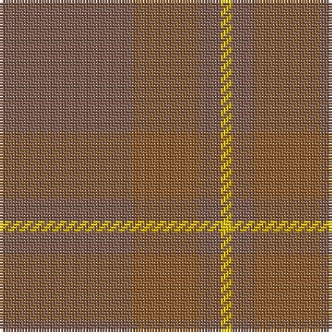

In pattern [RRRY](/patterns/rrry/).

This was sourced from weddslist.  It is a [4 stripes tartan](/stripes/stripes4/).

Original link http://www.weddslist.com/cgi-bin/tartans/pg.pl?source=sts

## Thread count
LTa/48 LT24 LTa8 Y/4

## Palette
Each colour and its ΔE from the base-6 reference it is a variant of.

| Colour | Shade | Base | ΔE (OKLab) |
|---|---|---|---|
| LT | <code style="background-color:#906030;">#906030</code> `#906030` | R <code style="background-color:#C80000;">#C80000</code> | 0.15 |
| LTa | <code style="background-color:#806050;">#806050</code> `#806050` | R <code style="background-color:#C80000;">#C80000</code> | 0.17 |
| Y | <code style="background-color:#F0C000;">#F0C000</code> `#F0C000` | Y <code style="background-color:#E8C000;">#E8C000</code> | 0.01 |

# Sample pattern

## Nearest tartans

The nearest existing variants by ΔTartan distance.

1. [London Regiment (Military)](/setts/s6/g68b54r6b54g68w6-b687488-g747c60-rc80000-wfcfcfc/) — ΔT 2.65
1. [Harmony, 12](/setts/s6/g12r4g58r58g4r12-g808080-r806050/) — ΔT 2.70
1. [Weathered Cyclist (Corporate)](/setts/s7/r64w4r18y4r24ya42ra2-ra07c58-rac80000-wfcfcfc-yfccc00-yaa08858/) — ΔT 2.70
1. [McKerrell of Hillhouse Dress](/setts/s6/b96r56w8r56b96y6-b5c8ca8-r888888-we0e0e0-ye8c000/) — ΔT 2.75
1. [Bute Heather, Ancient Wth'd (Fashion](/setts/s11/y10b4g16b2g16b8g8b12g36ya2y10-b5c5c5c-g707070-ya08858-yaa0a0a0/) — ΔT 2.87
1. [Outlander #3](/setts/s4/g112b56y48b16-b5c5c5c-g808080-ya08858/) — ΔT 3.01
1. [Bryce](/setts/s4/r10b70r92y10-b684038-r880000-ya88000/) — ΔT 3.07
1. [Cairns, David (Personal)](/setts/s5/b88ba8b32ba64r8-b393939-ba5b5b5b-ra40b00/) — ΔT 3.09
1. [McGuigan, Julia (St Monans, Fife) (Personal)](/setts/s4/g18ga104gb30y8-g70714d-ga5a601e-gb4e3d20-ybfab40/) — ΔT 3.10
1. [Young in Australia (Name)](/setts/s4/y162g12ya16g16-g00884c-ya08858-yabc8c00/) — ΔT 3.19

## Neighbour map

Every grey dot is one of 15726 variants placed by the first two principal components of the ΔTartan feature space (44% of its variance). Red is this tartan; blue dots are its nearest — click one to open its page.

<svg viewBox="0 0 640 380" role="img" style="max-width:100%;height:auto;border:1px solid #e0e0e0;border-radius:4px;display:block" xmlns="http://www.w3.org/2000/svg"><image href="/nn/cloud.v1.png" width="640" height="380"/><a href="/setts/s6/g68b54r6b54g68w6-b687488-g747c60-rc80000-wfcfcfc/"><circle cx="466.6" cy="311.9" r="4" fill="#3465a4"><title>London Regiment (Military)</title></circle></a><a href="/setts/s6/g12r4g58r58g4r12-g808080-r806050/"><circle cx="626.0" cy="337.9" r="4" fill="#3465a4"><title>Harmony, 12</title></circle></a><a href="/setts/s7/r64w4r18y4r24ya42ra2-ra07c58-rac80000-wfcfcfc-yfccc00-yaa08858/"><circle cx="607.9" cy="231.6" r="4" fill="#3465a4"><title>Weathered Cyclist (Corporate)</title></circle></a><a href="/setts/s6/b96r56w8r56b96y6-b5c8ca8-r888888-we0e0e0-ye8c000/"><circle cx="548.3" cy="309.6" r="4" fill="#3465a4"><title>McKerrell of Hillhouse Dress</title></circle></a><a href="/setts/s11/y10b4g16b2g16b8g8b12g36ya2y10-b5c5c5c-g707070-ya08858-yaa0a0a0/"><circle cx="556.8" cy="272.2" r="4" fill="#3465a4"><title>Bute Heather, Ancient Wth'd (Fashion</title></circle></a><a href="/setts/s4/g112b56y48b16-b5c5c5c-g808080-ya08858/"><circle cx="436.3" cy="362.3" r="4" fill="#3465a4"><title>Outlander #3</title></circle></a><a href="/setts/s4/r10b70r92y10-b684038-r880000-ya88000/"><circle cx="530.5" cy="324.5" r="4" fill="#3465a4"><title>Bryce</title></circle></a><a href="/setts/s5/b88ba8b32ba64r8-b393939-ba5b5b5b-ra40b00/"><circle cx="544.0" cy="324.2" r="4" fill="#3465a4"><title>Cairns, David (Personal)</title></circle></a><a href="/setts/s4/g18ga104gb30y8-g70714d-ga5a601e-gb4e3d20-ybfab40/"><circle cx="536.8" cy="289.9" r="4" fill="#3465a4"><title>McGuigan, Julia (St Monans, Fife) (Personal)</title></circle></a><a href="/setts/s4/y162g12ya16g16-g00884c-ya08858-yabc8c00/"><circle cx="626.0" cy="298.5" r="4" fill="#3465a4"><title>Young in Australia (Name)</title></circle></a><circle cx="620.4" cy="337.3" r="5" fill="#c00000"/></svg>

ID: /setts/s4/r48ra24r8y4-r806050-ra906030-yf0c000/
