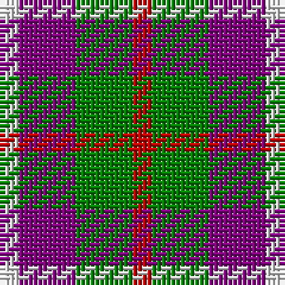

In pattern [RGBW](/patterns/rgbw/).

This was sourced from weddslist.  It is a [4 stripes tartan](/stripes/stripes4/).

Original link http://www.weddslist.com/cgi-bin/tartans/pg.pl?source=sts

## Thread count
LN/4 P12 G12 R/4

## Palette
Each colour and its ΔE from the base-6 reference it is a variant of.

| Colour | Shade | Base | ΔE (OKLab) |
|---|---|---|---|
| G | <code style="background-color:#008000;">#008000</code> `#008000` | G <code style="background-color:#006400;">#006400</code> | 0.09 |
| LN | <code style="background-color:#E0E0E0;">#E0E0E0</code> `#E0E0E0` | W <code style="background-color:#F4F4F0;">#F4F4F0</code> | 0.06 |
| P | <code style="background-color:#800080;">#800080</code> `#800080` | B <code style="background-color:#2C4084;">#2C4084</code> | 0.17 |
| R | <code style="background-color:#C00000;">#C00000</code> `#C00000` | R <code style="background-color:#C80000;">#C80000</code> | 0.02 |

# Sample pattern

## Nearest tartans

The nearest existing variants by ΔTartan distance.

1. [Haggis Hostels](/setts/s4/r80b40w40ba32-b5f749c-ba14283c-r960028-we8ccb8/) — ΔT 1.12
1. [Creek Indian Nation](/setts/s5/b24g48y12b12r24-b2c2c80-g006818-rc80000-ye8c000/) — ΔT 1.28
1. [SAL Grindrande Stiernan (Corporate)](/setts/s4/r60g20k60w20-g006818-k101010-rc80000-wfcfcfc/) — ΔT 1.30
1. [Wilson's, No 214](/setts/s5/g16r12b4k4b12-b5480b0-g008000-k000000-rc00000/) — ΔT 1.30
1. [Wilson's, No 95](/setts/s5/b4ba12r4g12b4-b5480b0-ba800080-g008000-rc00000/) — ΔT 1.30
1. [Thomas Newcomen's Combustion Engine](/setts/s4/k28r20w12b8-b202060-k101010-rc80000-wfcfcfc/) — ΔT 1.33
1. [Thomas Newcomen's Combustion Engine](/setts/s4/k28r20w12b8-b0000cd-k101010-rff0000-wffffff/) — ΔT 1.33
1. [Inspiration](/setts/s5/r10b24y22ba42ya10-b5f749c-ba14283c-rc8002c-yc4bc68-yae0a126/) — ΔT 1.34
1. [Inspiration](/setts/s5/r10b24y22ba42ya10-b202060-ba5c5c5c-rc80000-yfccc00-yae8c000/) — ΔT 1.35
1. [Chivas Regal](/setts/s5/b12k12b12r28y6-b003c64-k101010-rb03000-ye8c000/) — ΔT 1.35

## Neighbour map

Every grey dot is one of 15726 variants placed by the first two principal components of the ΔTartan feature space (44% of its variance). Red is this tartan; blue dots are its nearest — click one to open its page.

<svg viewBox="0 0 640 380" role="img" style="max-width:100%;height:auto;border:1px solid #e0e0e0;border-radius:4px;display:block" xmlns="http://www.w3.org/2000/svg"><image href="/nn/cloud.v1.png" width="640" height="380"/><a href="/setts/s4/r80b40w40ba32-b5f749c-ba14283c-r960028-we8ccb8/"><circle cx="114.7" cy="306.5" r="4" fill="#3465a4"><title>Haggis Hostels</title></circle></a><a href="/setts/s5/b24g48y12b12r24-b2c2c80-g006818-rc80000-ye8c000/"><circle cx="143.7" cy="273.0" r="4" fill="#3465a4"><title>Creek Indian Nation</title></circle></a><a href="/setts/s4/r60g20k60w20-g006818-k101010-rc80000-wfcfcfc/"><circle cx="110.8" cy="280.9" r="4" fill="#3465a4"><title>SAL Grindrande Stiernan (Corporate)</title></circle></a><a href="/setts/s5/g16r12b4k4b12-b5480b0-g008000-k000000-rc00000/"><circle cx="107.9" cy="276.0" r="4" fill="#3465a4"><title>Wilson's, No 214</title></circle></a><a href="/setts/s5/b4ba12r4g12b4-b5480b0-ba800080-g008000-rc00000/"><circle cx="123.1" cy="286.5" r="4" fill="#3465a4"><title>Wilson's, No 95</title></circle></a><a href="/setts/s4/k28r20w12b8-b202060-k101010-rc80000-wfcfcfc/"><circle cx="111.5" cy="280.1" r="4" fill="#3465a4"><title>Thomas Newcomen's Combustion Engine</title></circle></a><a href="/setts/s4/k28r20w12b8-b0000cd-k101010-rff0000-wffffff/"><circle cx="105.8" cy="275.3" r="4" fill="#3465a4"><title>Thomas Newcomen's Combustion Engine</title></circle></a><a href="/setts/s5/r10b24y22ba42ya10-b5f749c-ba14283c-rc8002c-yc4bc68-yae0a126/"><circle cx="96.7" cy="246.9" r="4" fill="#3465a4"><title>Inspiration</title></circle></a><a href="/setts/s5/r10b24y22ba42ya10-b202060-ba5c5c5c-rc80000-yfccc00-yae8c000/"><circle cx="94.4" cy="241.4" r="4" fill="#3465a4"><title>Inspiration</title></circle></a><a href="/setts/s5/b12k12b12r28y6-b003c64-k101010-rb03000-ye8c000/"><circle cx="160.7" cy="268.5" r="4" fill="#3465a4"><title>Chivas Regal</title></circle></a><circle cx="120.1" cy="286.6" r="5" fill="#c00000"/></svg>

ID: /setts/s4/r4g12b12w4-b800080-g008000-rc00000-we0e0e0/
