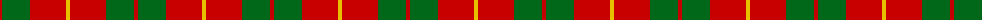
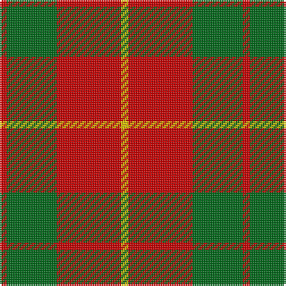

In pattern [RGRY](/patterns/rgry/).

This was sourced from house-of-tartan.  It is a [4 stripes tartan](/stripes/stripes4/).

Original link http://www.house-of-tartan.scotland.net/house/TartanViewjs.asp?colr=Def&tnam=1537

## Thread count
R/4 G28 R36 Y/4

## Palette
Each colour and its ΔE from the base-6 reference it is a variant of.

| Colour | Shade | Base | ΔE (OKLab) |
|---|---|---|---|
| G | <code style="background-color:#006818;">#006818</code> `#006818` | G <code style="background-color:#006100;">#006100</code> | 0.02 |
| R | <code style="background-color:#C80000;">#C80000</code> `#C80000` | R <code style="background-color:#CC0000;">#CC0000</code> | 0.01 |
| Y | <code style="background-color:#E8C000;">#E8C000</code> `#E8C000` | Y <code style="background-color:#F2BF00;">#F2BF00</code> | 0.02 |

# Sample pattern

## Nearest tartans

The nearest existing variants by ΔTartan distance.

1. [Bryce](/setts/s4/r4g28r36y4-g008000-rc00000-yf0c000/) — ΔT 0.36
1. [MacKinnon 11](/setts/s4/r12g80r100w12-g008000-rc00000-we0e0e0/) — ΔT 0.50
1. [MacDonald, Lord of The Isles (Artef)](/setts/s5/g32r10g4r36k4-g006818-k101010-rc80000/) — ΔT 0.62
1. [MacKinnon #6](/setts/s4/r12g80r100w12-g005020-rdc0000-we0e0e0/) — ΔT 0.82
1. [MacDonald Lord of the Isles #2](/setts/s5/g32r10g4r36k4-g005020-k101010-rdc0000/) — ΔT 0.83
1. [MacDonald, Lord of the Isles](/setts/s5/g32r10g4r36k4-g008000-k000000-rc00000/) — ΔT 0.85
1. [Cameron](/setts/s6/r8g24r8g24r64y8-g006818-rc80000-ye8c000/) — ΔT 0.96
1. [MacDonald of Sleat](/setts/s5/g14r6g2r18k2-g004c00-k000000-rc80000/) — ΔT 0.97
1. [Lugo (2013)](/setts/s4/r80g32y8g32-g003820-rb03000-ye0a126/) — ΔT 1.05
1. [Lugo (2013)](/setts/s4/r80g32y8g32-g003820-rc80000-ye8c000/) — ΔT 1.07

## Neighbour map

Every grey dot is one of 15726 variants placed by the first two principal components of the ΔTartan feature space (44% of its variance). Red is this tartan; blue dots are its nearest — click one to open its page.

<svg viewBox="0 0 640 380" role="img" style="max-width:100%;height:auto;border:1px solid #e0e0e0;border-radius:4px;display:block" xmlns="http://www.w3.org/2000/svg"><image href="/nn/cloud.v1.png" width="640" height="380"/><a href="/setts/s4/r4g28r36y4-g008000-rc00000-yf0c000/"><circle cx="358.1" cy="246.8" r="4" fill="#3465a4"><title>Bryce</title></circle></a><a href="/setts/s4/r12g80r100w12-g008000-rc00000-we0e0e0/"><circle cx="341.8" cy="247.6" r="4" fill="#3465a4"><title>MacKinnon 11</title></circle></a><a href="/setts/s5/g32r10g4r36k4-g006818-k101010-rc80000/"><circle cx="353.9" cy="240.3" r="4" fill="#3465a4"><title>MacDonald, Lord of The Isles (Artef)</title></circle></a><a href="/setts/s4/r12g80r100w12-g005020-rdc0000-we0e0e0/"><circle cx="337.4" cy="242.3" r="4" fill="#3465a4"><title>MacKinnon #6</title></circle></a><a href="/setts/s5/g32r10g4r36k4-g005020-k101010-rdc0000/"><circle cx="344.8" cy="234.0" r="4" fill="#3465a4"><title>MacDonald Lord of the Isles #2</title></circle></a><a href="/setts/s5/g32r10g4r36k4-g008000-k000000-rc00000/"><circle cx="335.1" cy="233.6" r="4" fill="#3465a4"><title>MacDonald, Lord of the Isles</title></circle></a><a href="/setts/s6/r8g24r8g24r64y8-g006818-rc80000-ye8c000/"><circle cx="372.8" cy="227.3" r="4" fill="#3465a4"><title>Cameron</title></circle></a><a href="/setts/s5/g14r6g2r18k2-g004c00-k000000-rc80000/"><circle cx="356.6" cy="238.3" r="4" fill="#3465a4"><title>MacDonald of Sleat</title></circle></a><a href="/setts/s4/r80g32y8g32-g003820-rb03000-ye0a126/"><circle cx="351.0" cy="262.8" r="4" fill="#3465a4"><title>Lugo (2013)</title></circle></a><a href="/setts/s4/r80g32y8g32-g003820-rc80000-ye8c000/"><circle cx="333.2" cy="250.1" r="4" fill="#3465a4"><title>Lugo (2013)</title></circle></a><circle cx="362.3" cy="247.7" r="5" fill="#c00000"/></svg>

ID: /setts/s4/r4g28r36y4-g006818-rc80000-ye8c000/
