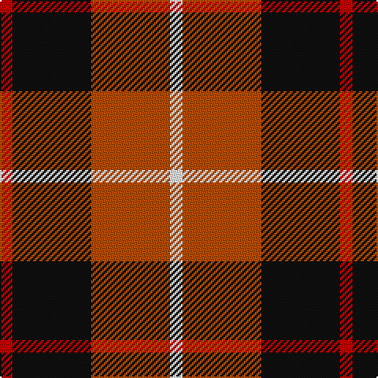

In pattern [RKRW](/stripes/rkrw/).

This was sourced from register-of-tartans.  It is a [4 stripe tartan](/stripes/stripes4/).

Original link https://www.tartanregister.gov.uk/tartanDetails.aspx?ref=11218

## Register references

External register numbers recorded for this tartan.

- Scottish Register of Tartans: [11218](https://www.tartanregister.gov.uk/tartanDetails.aspx?ref=11218)

## Thread count
R/8 K50 DO50 W/8

## Palette
Each colour and the base-6 reference it is a variant of.

| Colour | Shade | Base |
|---|---|---|
| DO | <code style="background-color:#B84C00;">#B84C00</code> `oklch(55.1% 0.156 45.5)` <small>#B84C00</small> | R <code style="background-color:#CC0000;">#CC0000</code> |
| K | <code style="background-color:#101010;">#101010</code> `oklch(17.3% 0.000 89.9)` <small>#101010</small> | K <code style="background-color:#000000;">#000000</code> |
| R | <code style="background-color:#C80000;">#C80000</code> `oklch(52.3% 0.215 29.2)` <small>#C80000</small> | R <code style="background-color:#CC0000;">#CC0000</code> |
| W | <code style="background-color:#FFFFFF;">#FFFFFF</code> `oklch(100.0% 0.000 89.9)` <small>#FFFFFF</small> | W <code style="background-color:#F7F7F7;">#F7F7F7</code> |

# Sample pattern

## Nearest tartans

The nearest existing variants by ΔTartan distance.

1. [Connel (Clan)](/setts/s4/w1r8k8ly1~x4/) — ΔT 0.70
1. [Skinner (Name)](/setts/s4/db1r8k8lo1~x4/) — ΔT 0.96
1. [Aberdeen University](/setts/s5/ly2r15k7db8ly2~x4/) — ΔT 1.06
1. [SAL Cubiska Stenen](/setts/s5/r15g3w2k10w5~x2/) — ΔT 1.17
1. [Connel](/setts/s4/w1r8k8ly1~x2/) — ΔT 1.17
1. [Wcwm 759-2](/setts/s6/lb5r34k22r4o24r4~x2/) — ΔT 1.18
1. [British Hills](/setts/s5/r2dg17r8db8ly2~x4/) — ΔT 1.27
1. [Aberdeen University (1992)](/setts/s5/ly4r27k12db15ly4~x2/) — ΔT 1.32
1. [Douglas of Roxburgh](/setts/s5/k6db3dg20r20ly3~x2/) — ΔT 1.34
1. [Oklahoma State University (Corporate](/setts/s4/r80k52w7o12/) — ΔT 1.35

## Neighbour map

Every grey dot is one of 14299 variants placed by the first two principal components of the ΔTartan feature space (44% of its variance). Red is this tartan; blue dots are its nearest — click one to open its page.

<svg viewBox="0 0 640 380" role="img" style="max-width:100%;height:auto;border:1px solid #e0e0e0;border-radius:4px;display:block" xmlns="http://www.w3.org/2000/svg"><image href="/nn/cloud.v1.png" width="640" height="380"/><a href="/setts/s4/w1r8k8ly1~x4/"><circle cx="239.7" cy="217.6" r="4" fill="#3465a4"><title>Connel (Clan)</title></circle></a><a href="/setts/s4/db1r8k8lo1~x4/"><circle cx="258.6" cy="228.6" r="4" fill="#3465a4"><title>Skinner (Name)</title></circle></a><a href="/setts/s5/ly2r15k7db8ly2~x4/"><circle cx="185.9" cy="213.6" r="4" fill="#3465a4"><title>Aberdeen University</title></circle></a><a href="/setts/s5/r15g3w2k10w5~x2/"><circle cx="166.1" cy="205.8" r="4" fill="#3465a4"><title>SAL Cubiska Stenen</title></circle></a><a href="/setts/s4/w1r8k8ly1~x2/"><circle cx="231.3" cy="217.9" r="4" fill="#3465a4"><title>Connel</title></circle></a><a href="/setts/s6/lb5r34k22r4o24r4~x2/"><circle cx="206.4" cy="202.6" r="4" fill="#3465a4"><title>Wcwm 759-2</title></circle></a><a href="/setts/s5/r2dg17r8db8ly2~x4/"><circle cx="220.6" cy="221.1" r="4" fill="#3465a4"><title>British Hills</title></circle></a><a href="/setts/s5/ly4r27k12db15ly4~x2/"><circle cx="188.0" cy="222.2" r="4" fill="#3465a4"><title>Aberdeen University (1992)</title></circle></a><a href="/setts/s5/k6db3dg20r20ly3~x2/"><circle cx="164.6" cy="209.5" r="4" fill="#3465a4"><title>Douglas of Roxburgh</title></circle></a><a href="/setts/s4/r80k52w7o12/"><circle cx="289.6" cy="205.7" r="4" fill="#3465a4"><title>Oklahoma State University (Corporate</title></circle></a><circle cx="214.6" cy="234.9" r="5" fill="#c00000"/></svg>

ID: /setts/s4/r4k25o25w4~x2/
