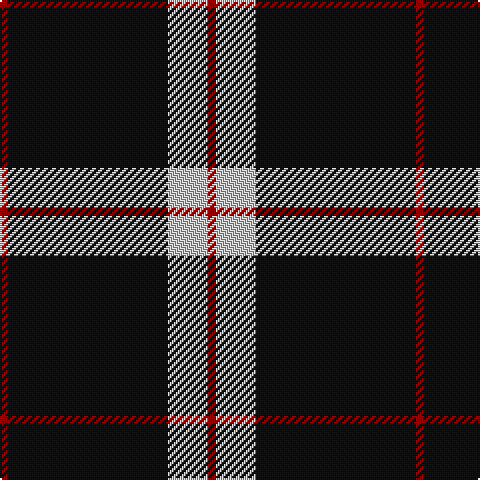

In pattern [RKWR](/patterns/rkwr/).

This was sourced from tartans-authority.  It is a [4 stripes tartan](/stripes/stripes4/).

Original link http://www.tartansauthority.com/tartan-ferret/display/3241/

## Attestations

This cloth appears in 2 source records; the oldest owns this page.

- 2002 — Dobelman (Personal) (tartans-authority, [record](http://www.tartansauthority.com/tartan-ferret/display/3241/))
- undated — Dobelman (Personal) (register-of-tartans, [record](https://www.tartanregister.gov.uk/tartanDetails.aspx?ref=5385))

## Thread count
DR/4 K80 N20 DR/4

## Palette
Each colour and its ΔE from the base-6 reference it is a variant of.

| Colour | Shade | Base | ΔE (OKLab) |
|---|---|---|---|
| DR | <code style="background-color:#880000;">#880000</code> `#880000` | R <code style="background-color:#CC0000;">#CC0000</code> | 0.15 |
| K | <code style="background-color:#101010;">#101010</code> `#101010` | K <code style="background-color:#000000;">#000000</code> | 0.17 |
| N | <code style="background-color:#C0C0C0;">#C0C0C0</code> `#C0C0C0` | W <code style="background-color:#F7F7F7;">#F7F7F7</code> | 0.17 |

# Sample pattern

## Nearest tartans

The nearest existing variants by ΔTartan distance.

1. [Perry Ancient (Personal)](/setts/s5/k150g52g6k8y12-g808080-k101010-ye8c000/) — ΔT 0.89
1. [Rogues, The (Corporate)](/setts/s4/r6b24k100y6-b5c8ca8-k101010-rc80000-yfccc00/) — ΔT 0.97
1. [Rogues (United States), The](/setts/s4/r6b24k100y6-b506987-k101010-rff2400-yffc125/) — ΔT 1.09
1. [C-Tec N.I. Ltd](/setts/s4/k124b30w12y8-b000080-k1c1714-wf8f8f8-yfccc00/) — ΔT 1.19
1. [Gwynn (Name)](/setts/s5/y18k8y8k90r8-k101010-rc80000-ye8c000/) — ΔT 1.23
1. [Westgate Fashion Tartan Tartan Number: 6019. Earliest known date: pre 2003 A fashion tartan See products available Copyright © Blair Urquhart, Comrie, 2015](/setts/s4/g28k160g28y10-g5c6428-k101010-ye8c000/) — ΔT 1.34
1. [Welsh National #3](/setts/s5/y14k8y8k78r8-k101010-rdc0000-ye8c000/) — ΔT 1.39
1. [Sunderland of Scotland (Fashion)](/setts/s7/r4k84r20k12r20k36ra4-k101010-r888888-rac80000/) — ΔT 1.39
1. [Union Fire Club Pipes & Drums (Corp.](/setts/s5/k120r40y4k32w12-k101010-rc80000-we0e0e0-ye8c000/) — ΔT 1.40
1. [Believe - Colette](/setts/s7/b6k62w12k14b6k24w4-b646464-k101010-wffffff/) — ΔT 1.40

## Neighbour map

Every grey dot is one of 15726 variants placed by the first two principal components of the ΔTartan feature space (44% of its variance). Red is this tartan; blue dots are its nearest — click one to open its page.

<svg viewBox="0 0 640 380" role="img" style="max-width:100%;height:auto;border:1px solid #e0e0e0;border-radius:4px;display:block" xmlns="http://www.w3.org/2000/svg"><image href="/nn/cloud.v1.png" width="640" height="380"/><a href="/setts/s5/k150g52g6k8y12-g808080-k101010-ye8c000/"><circle cx="461.6" cy="182.1" r="4" fill="#3465a4"><title>Perry Ancient (Personal)</title></circle></a><a href="/setts/s4/r6b24k100y6-b5c8ca8-k101010-rc80000-yfccc00/"><circle cx="455.3" cy="196.0" r="4" fill="#3465a4"><title>Rogues, The (Corporate)</title></circle></a><a href="/setts/s4/r6b24k100y6-b506987-k101010-rff2400-yffc125/"><circle cx="465.1" cy="199.6" r="4" fill="#3465a4"><title>Rogues (United States), The</title></circle></a><a href="/setts/s4/k124b30w12y8-b000080-k1c1714-wf8f8f8-yfccc00/"><circle cx="423.4" cy="199.4" r="4" fill="#3465a4"><title>C-Tec N.I. Ltd</title></circle></a><a href="/setts/s5/y18k8y8k90r8-k101010-rc80000-ye8c000/"><circle cx="453.5" cy="203.0" r="4" fill="#3465a4"><title>Gwynn (Name)</title></circle></a><a href="/setts/s4/g28k160g28y10-g5c6428-k101010-ye8c000/"><circle cx="475.3" cy="228.0" r="4" fill="#3465a4"><title>Westgate Fashion Tartan Tartan Number: 6019. Earliest known date: pre 2003 A fashion tartan See products available Copyright © Blair Urquhart, Comrie, 2015</title></circle></a><a href="/setts/s5/y14k8y8k78r8-k101010-rdc0000-ye8c000/"><circle cx="445.4" cy="209.2" r="4" fill="#3465a4"><title>Welsh National #3</title></circle></a><a href="/setts/s7/r4k84r20k12r20k36ra4-k101010-r888888-rac80000/"><circle cx="479.3" cy="193.3" r="4" fill="#3465a4"><title>Sunderland of Scotland (Fashion)</title></circle></a><a href="/setts/s5/k120r40y4k32w12-k101010-rc80000-we0e0e0-ye8c000/"><circle cx="462.5" cy="170.0" r="4" fill="#3465a4"><title>Union Fire Club Pipes &amp; Drums (Corp.</title></circle></a><a href="/setts/s7/b6k62w12k14b6k24w4-b646464-k101010-wffffff/"><circle cx="472.0" cy="192.9" r="4" fill="#3465a4"><title>Believe - Colette</title></circle></a><circle cx="479.2" cy="199.2" r="5" fill="#c00000"/></svg>

ID: /setts/s4/r4k80w20r4-k101010-r880000-wc0c0c0/
