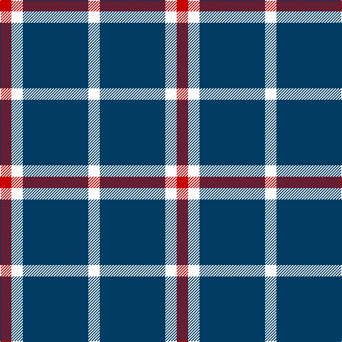

In pattern [RWBW](/patterns/rwbw/).

This was sourced from tartans-authority.  It is a [4 stripes tartan](/stripes/stripes4/).

Original link http://www.tartansauthority.com/tartan-ferret/display/10348/

## Thread count
R/16 W16 DB92 W/16

## Palette
Each colour and its ΔE from the base-6 reference it is a variant of.

| Colour | Shade | Base | ΔE (OKLab) |
|---|---|---|---|
| DB | <code style="background-color:#003C64;">#003C64</code> `#003C64` | B <code style="background-color:#2A418A;">#2A418A</code> | 0.08 |
| R | <code style="background-color:#C80000;">#C80000</code> `#C80000` | R <code style="background-color:#CC0000;">#CC0000</code> | 0.01 |
| W | <code style="background-color:#FCFCFC;">#FCFCFC</code> `#FCFCFC` | W <code style="background-color:#F7F7F7;">#F7F7F7</code> | 0.01 |

# Sample pattern

## Nearest tartans

The nearest existing variants by ΔTartan distance.

1. [Auchmaliddie Samkoma](/setts/s4/r4w4b23w4x4~b433a5a-rb62531-wf9f5ef/) — ΔT 0.94
1. [Turnbull Dress, Bruce (Personal)](/setts/s5/b10g4w27b40r4x2~b1c1c50-g00801c-rc80000-we0e0e0/) — ΔT 1.52
1. [Juchter (Personal)](/setts/s4/g20w5r3w5x2~g003820-rc80000-we0e0e0/) — ΔT 1.58
1. [Lords of Skye (Fashion?)](/setts/s4/k46g7k8w20x2~g604000-k101010-wfcfcfc/) — ΔT 1.58
1. [UEFA (Glasgow)](/setts/s6/r12b4y5b30y5b4x4~b3850c8-rc80000-ye8c000/) — ΔT 1.63
1. [Barbie's Moss Plaid (Blue & White)](/setts/s6/b3w3b20w20b20w3x2~b003c64-wfcfcfc/) — ΔT 1.66
1. [Glen Moy Trade Tartan Tartan Number: 635. Earliest known date: pre 1992 Its mainly Sheep farming in Glen Moy. Off the beaten track, its a very quiet area of the Angus glens close to Cortachy castle and great for walking if you like it to yourself! Its also close to Glen Clova which is the busiest glen around here with some fantastic mountains for walking and taking photos. See products available Copyright © Blair Urquhart, Comrie, 2015](/setts/s5/b37w9b3r9w3x2~b202060-rc80000-we0e0e0/) — ΔT 1.66
1. [Lords of Skye](/setts/s4/k46g7k8w20x2~g503c14-k101010-we0e0e0/) — ΔT 1.66
1. [Lords of Skye Trade Tartan Tartan Number: 1218. Earliest known date: 1983 Nothing See products available Copyright © Blair Urquhart, Comrie, 2015](/setts/s4/k46g7k8w20x2~g604000-k101010-we0e0e0/) — ΔT 1.67
1. [Cairn (Marton Mills)](/setts/s5/k2w1k8w8k1x8~k101010-we0e0e0/) — ΔT 1.71

## Neighbour map

Every grey dot is one of 15726 variants placed by the first two principal components of the ΔTartan feature space (44% of its variance). Red is this tartan; blue dots are its nearest — click one to open its page.

<svg viewBox="0 0 640 380" role="img" style="max-width:100%;height:auto;border:1px solid #e0e0e0;border-radius:4px;display:block" xmlns="http://www.w3.org/2000/svg"><image href="/nn/cloud.v1.png" width="640" height="380"/><a href="/setts/s4/r4w4b23w4x4~b433a5a-rb62531-wf9f5ef/"><circle cx="348.7" cy="244.5" r="4" fill="#3465a4"><title>Auchmaliddie Samkoma</title></circle></a><a href="/setts/s5/b10g4w27b40r4x2~b1c1c50-g00801c-rc80000-we0e0e0/"><circle cx="285.8" cy="206.2" r="4" fill="#3465a4"><title>Turnbull Dress, Bruce (Personal)</title></circle></a><a href="/setts/s4/g20w5r3w5x2~g003820-rc80000-we0e0e0/"><circle cx="304.2" cy="249.5" r="4" fill="#3465a4"><title>Juchter (Personal)</title></circle></a><a href="/setts/s4/k46g7k8w20x2~g604000-k101010-wfcfcfc/"><circle cx="333.6" cy="258.1" r="4" fill="#3465a4"><title>Lords of Skye (Fashion?)</title></circle></a><a href="/setts/s6/r12b4y5b30y5b4x4~b3850c8-rc80000-ye8c000/"><circle cx="345.0" cy="222.5" r="4" fill="#3465a4"><title>UEFA (Glasgow)</title></circle></a><a href="/setts/s6/b3w3b20w20b20w3x2~b003c64-wfcfcfc/"><circle cx="322.6" cy="253.8" r="4" fill="#3465a4"><title>Barbie's Moss Plaid (Blue &amp; White)</title></circle></a><a href="/setts/s5/b37w9b3r9w3x2~b202060-rc80000-we0e0e0/"><circle cx="375.8" cy="205.4" r="4" fill="#3465a4"><title>Glen Moy Trade Tartan Tartan Number: 635. Earliest known date: pre 1992 Its mainly Sheep farming in Glen Moy. Off the beaten track, its a very quiet area of the Angus glens close to Cortachy castle and great for walking if you like it to yourself! Its also close to Glen Clova which is the busiest glen around here with some fantastic mountains for walking and taking photos. See products available Copyright © Blair Urquhart, Comrie, 2015</title></circle></a><a href="/setts/s4/k46g7k8w20x2~g503c14-k101010-we0e0e0/"><circle cx="339.0" cy="261.3" r="4" fill="#3465a4"><title>Lords of Skye</title></circle></a><a href="/setts/s4/k46g7k8w20x2~g604000-k101010-we0e0e0/"><circle cx="339.0" cy="261.0" r="4" fill="#3465a4"><title>Lords of Skye Trade Tartan Tartan Number: 1218. Earliest known date: 1983 Nothing See products available Copyright © Blair Urquhart, Comrie, 2015</title></circle></a><a href="/setts/s5/k2w1k8w8k1x8~k101010-we0e0e0/"><circle cx="310.2" cy="245.9" r="4" fill="#3465a4"><title>Cairn (Marton Mills)</title></circle></a><circle cx="335.6" cy="246.8" r="5" fill="#c00000"/></svg>

ID: /setts/s4/r4w4b23w4x4~b003c64-rc80000-wfcfcfc/
