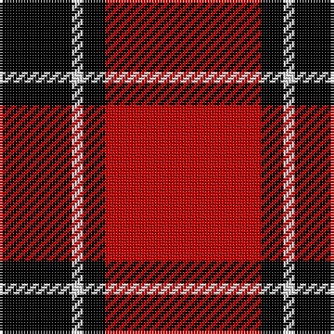

In pattern [KWKR](/patterns/kwkr/).

This was sourced from weddslist.  It is a [4 stripes tartan](/stripes/stripes4/).

Original link http://www.weddslist.com/cgi-bin/tartans/pg.pl?source=sts

## Thread count
K/26 LN4 K8 R/56

## Palette
Each colour and its ΔE from the base-6 reference it is a variant of.

| Colour | Shade | Base | ΔE (OKLab) |
|---|---|---|---|
| K | <code style="background-color:#000000;">#000000</code> `#000000` | K <code style="background-color:#000000;">#000000</code> | 0.00 |
| LN | <code style="background-color:#E0E0E0;">#E0E0E0</code> `#E0E0E0` | W <code style="background-color:#F4F4F0;">#F4F4F0</code> | 0.06 |
| R | <code style="background-color:#C00000;">#C00000</code> `#C00000` | R <code style="background-color:#C80000;">#C80000</code> | 0.02 |

# Sample pattern

## Nearest tartans

The nearest existing variants by ΔTartan distance.

1. [Dunbar (Wilson's) District Tartan Tartan Number: 1236. Earliest known date: 1840 Restricted See products available Copyright © Blair Urquhart, Comrie, 2015](/setts/s4/r56k8w4k26-k101010-rc80000-we0e0e0/) — ΔT 0.90
1. [MacIver](/setts/s5/k32r4k4r24w2-k101010-rdc0000-we0e0e0/) — ΔT 0.98
1. [MacGregor, Black (Personal)](/setts/s5/r82k38r14k18w6-k101010-rc80000-wfcfcfc/) — ΔT 1.01
1. [Loevenstein Castle 1 (Artefact)](/setts/s5/r40k6r8w4k14-k000000-r880000-wfcfcfc/) — ΔT 1.08
1. [Campbell of Armaddie](/setts/s5/r8k2r24k24r4-k000000-rc80000/) — ΔT 1.11
1. [Hopkins (Name)](/setts/s5/r72k36r8k14w4-k101010-rc80000-we0e0e0/) — ΔT 1.11
1. [Dunbar (District)](/setts/s4/r56k8w4k26-k101010-rcc4438-we0e0e0/) — ΔT 1.12
1. [Loevenstein Castle](/setts/s5/r40k6r8w4k14-k000000-r8c0000-wc8c8c8/) — ΔT 1.15
1. [Masai Shuka 15 (Artefact)](/setts/s5/r40k4r4k30w2-k101010-rc80000-we0e0e0/) — ΔT 1.19
1. [MacKeane](/setts/s5/r8k16r24k2y2-k101010-rc80000-ye8c000/) — ΔT 1.20

## Neighbour map

Every grey dot is one of 15726 variants placed by the first two principal components of the ΔTartan feature space (44% of its variance). Red is this tartan; blue dots are its nearest — click one to open its page.

<svg viewBox="0 0 640 380" role="img" style="max-width:100%;height:auto;border:1px solid #e0e0e0;border-radius:4px;display:block" xmlns="http://www.w3.org/2000/svg"><image href="/nn/cloud.v1.png" width="640" height="380"/><a href="/setts/s4/r56k8w4k26-k101010-rc80000-we0e0e0/"><circle cx="385.5" cy="213.7" r="4" fill="#3465a4"><title>Dunbar (Wilson's) District Tartan Tartan Number: 1236. Earliest known date: 1840 Restricted See products available Copyright © Blair Urquhart, Comrie, 2015</title></circle></a><a href="/setts/s5/k32r4k4r24w2-k101010-rdc0000-we0e0e0/"><circle cx="361.0" cy="197.5" r="4" fill="#3465a4"><title>MacIver</title></circle></a><a href="/setts/s5/r82k38r14k18w6-k101010-rc80000-wfcfcfc/"><circle cx="384.8" cy="205.0" r="4" fill="#3465a4"><title>MacGregor, Black (Personal)</title></circle></a><a href="/setts/s5/r40k6r8w4k14-k000000-r880000-wfcfcfc/"><circle cx="399.6" cy="217.6" r="4" fill="#3465a4"><title>Loevenstein Castle 1 (Artefact)</title></circle></a><a href="/setts/s5/r8k2r24k24r4-k000000-rc80000/"><circle cx="376.1" cy="233.6" r="4" fill="#3465a4"><title>Campbell of Armaddie</title></circle></a><a href="/setts/s5/r72k36r8k14w4-k101010-rc80000-we0e0e0/"><circle cx="401.2" cy="192.1" r="4" fill="#3465a4"><title>Hopkins (Name)</title></circle></a><a href="/setts/s4/r56k8w4k26-k101010-rcc4438-we0e0e0/"><circle cx="377.0" cy="212.8" r="4" fill="#3465a4"><title>Dunbar (District)</title></circle></a><a href="/setts/s5/r40k6r8w4k14-k000000-r8c0000-wc8c8c8/"><circle cx="406.3" cy="220.0" r="4" fill="#3465a4"><title>Loevenstein Castle</title></circle></a><a href="/setts/s5/r40k4r4k30w2-k101010-rc80000-we0e0e0/"><circle cx="387.3" cy="186.1" r="4" fill="#3465a4"><title>Masai Shuka 15 (Artefact)</title></circle></a><a href="/setts/s5/r8k16r24k2y2-k101010-rc80000-ye8c000/"><circle cx="387.3" cy="215.9" r="4" fill="#3465a4"><title>MacKeane</title></circle></a><circle cx="368.4" cy="210.5" r="5" fill="#c00000"/></svg>

ID: /setts/s4/r56k8w4k26-k000000-rc00000-we0e0e0/
