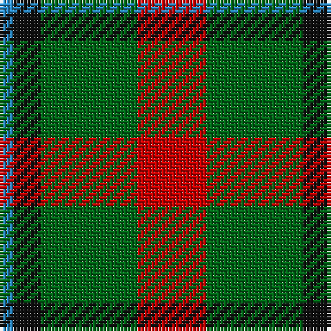

This page is one **sett** — a single exact thread-count. It belongs to the [tartan](/tartans/r5g7k2b1/)
(the same proportion at any scale), whose colour order is pattern [BKGR](/stripes/bkgr/).

Sourced from register-of-tartans.  It is a [4 stripe tartan](/stripes/stripes4/).

Original link https://www.tartanregister.gov.uk/tartanDetails.aspx?ref=4727

## Register references

External register numbers recorded for this tartan.

- Scottish Register of Tartans: [4727](https://www.tartanregister.gov.uk/tartanDetails.aspx?ref=4727)
- Scottish Tartans Authority (ITI): 1939
- Scottish Tartans World Register: 1939

## Thread count
R/20 G28 K8 B/4

## Palette
Each colour and the base-6 reference it is a variant of.

| Colour | Shade | Base |
|---|---|---|
| B | <code style="background-color:#2888C4;">#2888C4</code> `oklch(60.1% 0.125 241.5)` <small>#2888C4</small> | B <code style="background-color:#2A418A;">#2A418A</code> |
| DG | <code style="background-color:#003820;">#003820</code> `oklch(30.0% 0.070 158.3)` <small>#003820</small> | G <code style="background-color:#006100;">#006100</code> |
| G | <code style="background-color:#006818;">#006818</code> `oklch(45.0% 0.142 145.0)` <small>#006818</small> | G <code style="background-color:#006100;">#006100</code> |
| K | <code style="background-color:#101010;">#101010</code> `oklch(17.3% 0.000 89.9)` <small>#101010</small> | K <code style="background-color:#000000;">#000000</code> |
| R | <code style="background-color:#C80000;">#C80000</code> `oklch(52.3% 0.215 29.2)` <small>#C80000</small> | R <code style="background-color:#CC0000;">#CC0000</code> |

# Sample pattern

## Nearest tartans

The nearest existing variants by ΔTartan distance, with this tartan at the top so the swatches line up against it.

ΔTartan

Tartan

Sett

—

<a href="/ttd/edit/#slug=r5g7k2t1~x4">Wilson's No.195</a> <a class="nn-out" href="/setts/s4/r5g7k2t1~x4/" title="open its dictionary page">↗</a>

0.70

<a href="/ttd/edit/#slug=g30ly3db8r25~x2">Dohmen (Personal)</a> <a class="nn-out" href="/setts/s4/g30ly3db8r25~x2/" title="open its dictionary page">↗</a>

0.81

<a href="/ttd/edit/#slug=db3g6ly1r3~x10">Delroeux (Personal)</a> <a class="nn-out" href="/setts/s4/db3g6ly1r3~x10/" title="open its dictionary page">↗</a>

1.06

<a href="/ttd/edit/#slug=g15r3p11t2~x2">MacNab 7</a> <a class="nn-out" href="/setts/s4/g15r3p11t2~x2/" title="open its dictionary page">↗</a>

1.11

<a href="/ttd/edit/#slug=t2r4g5ly1~x4">Wilson's No.203</a> <a class="nn-out" href="/setts/s4/t2r4g5ly1~x4/" title="open its dictionary page">↗</a>

1.18

<a href="/ttd/edit/#slug=r2dg17r8db8ly2~x4">British Hills</a> <a class="nn-out" href="/setts/s5/r2dg17r8db8ly2~x4/" title="open its dictionary page">↗</a>

1.21

<a href="/ttd/edit/#slug=g6k1r1t2r2~x4">Wilson's, No 193</a> <a class="nn-out" href="/setts/s5/g6k1r1t2r2~x4/" title="open its dictionary page">↗</a>

1.25

<a href="/ttd/edit/#slug=n11k4r4lo4n1~x4">Ikelman #2 (Personal)</a> <a class="nn-out" href="/setts/s5/n11k4r4lo4n1~x4/" title="open its dictionary page">↗</a>

1.36

<a href="/ttd/edit/#slug=r10dy60dt13lb24dt24dy8">Bronte House Check (Fashion)</a> <a class="nn-out" href="/setts/s6/r10dy60dt13lb24dt24dy8/" title="open its dictionary page">↗</a>

1.37

<a href="/ttd/edit/#slug=db21g34r14w6~x2">Harbison (2015)</a> <a class="nn-out" href="/setts/s4/db21g34r14w6~x2/" title="open its dictionary page">↗</a>

1.37

<a href="/ttd/edit/#slug=k2o20k8dg18o3w2~x2">Celtic Combat</a> <a class="nn-out" href="/setts/s6/k2o20k8dg18o3w2~x2/" title="open its dictionary page">↗</a>

## Neighbour map

Every grey dot is one of 14299 variants placed by the first two principal components of the ΔTartan feature space (44% of its variance). Red is this tartan; blue dots are its nearest — click one to open its page.

<svg viewBox="0 0 640 380" role="img" style="max-width:100%;height:auto;border:1px solid #e0e0e0;border-radius:4px;display:block" xmlns="http://www.w3.org/2000/svg"><image href="/nn/cloud.v1.png" width="640" height="380"/><a href="/setts/s4/g30ly3db8r25~x2/"><circle cx="262.9" cy="246.5" r="4" fill="#3465a4"><title>Dohmen (Personal)</title></circle></a><a href="/setts/s4/db3g6ly1r3~x10/"><circle cx="194.8" cy="269.2" r="4" fill="#3465a4"><title>Delroeux (Personal)</title></circle></a><a href="/setts/s4/g15r3p11t2~x2/"><circle cx="252.2" cy="248.6" r="4" fill="#3465a4"><title>MacNab 7</title></circle></a><a href="/setts/s4/t2r4g5ly1~x4/"><circle cx="177.5" cy="277.0" r="4" fill="#3465a4"><title>Wilson's No.203</title></circle></a><a href="/setts/s5/r2dg17r8db8ly2~x4/"><circle cx="220.6" cy="221.1" r="4" fill="#3465a4"><title>British Hills</title></circle></a><a href="/setts/s5/g6k1r1t2r2~x4/"><circle cx="225.1" cy="236.6" r="4" fill="#3465a4"><title>Wilson's, No 193</title></circle></a><a href="/setts/s5/n11k4r4lo4n1~x4/"><circle cx="266.5" cy="231.7" r="4" fill="#3465a4"><title>Ikelman #2 (Personal)</title></circle></a><a href="/setts/s6/r10dy60dt13lb24dt24dy8/"><circle cx="232.2" cy="220.2" r="4" fill="#3465a4"><title>Bronte House Check (Fashion)</title></circle></a><a href="/setts/s4/db21g34r14w6~x2/"><circle cx="178.6" cy="268.0" r="4" fill="#3465a4"><title>Harbison (2015)</title></circle></a><a href="/setts/s6/k2o20k8dg18o3w2~x2/"><circle cx="237.3" cy="204.2" r="4" fill="#3465a4"><title>Celtic Combat</title></circle></a><circle cx="232.8" cy="258.8" r="5" fill="#c00000"/></svg>

ID: /setts/s4/r5g7k2t1~x4/
