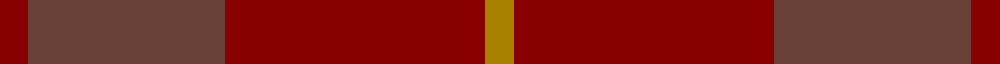

In pattern [RBRR](/stripes/rbrr/).

This was sourced from register-of-tartans.  It is a [4 stripe tartan](/stripes/stripes4/).

Original link https://www.tartanregister.gov.uk/tartanDetails.aspx?ref=408

## Attestations

This cloth appears in 2 source records; the oldest owns this page.

- 01/01/1953 — Bryce (register-of-tartans, [record](https://www.tartanregister.gov.uk/tartanDetails.aspx?ref=408))
- 1953 — Bryce (Clan) (tartans-authority, [record](http://www.tartansauthority.com/tartan-ferret/display/1537/))

## Register references

External register numbers recorded for this tartan.

- Scottish Register of Tartans: [408](https://www.tartanregister.gov.uk/tartanDetails.aspx?ref=408)
- Scottish Tartans Authority (ITI): 1537
- Scottish Tartans World Register: 1537

## Thread count
DR/10 N70 DR92 DY/10

## Palette
Each colour and the base-6 reference it is a variant of.

| Colour | Shade | Base |
|---|---|---|
| DR | <code style="background-color:#880000;">#880000</code> `oklch(39.4% 0.162 29.2)` <small>#880000</small> | R <code style="background-color:#CC0000;">#CC0000</code> |
| DY | <code style="background-color:#A88000;">#A88000</code> `oklch(62.2% 0.127 86.5)` <small>#A88000</small> | R <code style="background-color:#CC0000;">#CC0000</code> |
| N | <code style="background-color:#684038;">#684038</code> `oklch(41.6% 0.058 31.9)` <small>#684038</small> | B <code style="background-color:#2A418A;">#2A418A</code> |

# Sample pattern

## Nearest tartans

The nearest existing variants by ΔTartan distance, with this tartan at the top so the swatches line up against it.

ΔTartan

Tartan

Sett

—

<a href="/ttd/edit/#slug=r5n35r46o5~x2">Bryce</a> <a class="nn-out" href="/setts/s4/r5n35r46o5~x2/" title="open its dictionary page">↗</a>

1.48

<a href="/ttd/edit/#slug=r23o4r23o32r4~x2">Hamilton, Red (Fashion?)</a> <a class="nn-out" href="/setts/s5/r23o4r23o32r4~x2/" title="open its dictionary page">↗</a>

1.74

<a href="/ttd/edit/#slug=g1dr10r10g1~x6">Stirling of Keir (Clan)</a> <a class="nn-out" href="/setts/s4/g1dr10r10g1~x6/" title="open its dictionary page">↗</a>

2.46

<a href="/ttd/edit/#slug=do11n1do4n8r1~x8">Cairns, David (Personal)</a> <a class="nn-out" href="/setts/s5/do11n1do4n8r1~x8/" title="open its dictionary page">↗</a>

2.66

<a href="/ttd/edit/#slug=n13do15n2~x4">Outlander #5</a> <a class="nn-out" href="/setts/s3/n13do15n2~x4/" title="open its dictionary page">↗</a>

2.66

<a href="/ttd/edit/#slug=r32lo4r32o23r4o23r4o23~x2">Hamilton, Red</a> <a class="nn-out" href="/setts/s8/r32lo4r32o23r4o23r4o23~x2/" title="open its dictionary page">↗</a>

2.74

<a href="/ttd/edit/#slug=n7o1n6o8o1~x8">Callum (Buchan)</a> <a class="nn-out" href="/setts/s5/n7o1n6o8o1~x8/" title="open its dictionary page">↗</a>

2.75

<a href="/ttd/edit/#slug=dg3dy30dg40r3~x2">Sanix Muted</a> <a class="nn-out" href="/setts/s4/dg3dy30dg40r3~x2/" title="open its dictionary page">↗</a>

2.75

<a href="/ttd/edit/#slug=do1dy6do6dy1n6dy1~x8">Brown Heather (Fashion)</a> <a class="nn-out" href="/setts/s6/do1dy6do6dy1n6dy1~x8/" title="open its dictionary page">↗</a>

2.78

<a href="/ttd/edit/#slug=dr9do4dr4do4dr24dy19do19dy4~x2">Chindecella Ruadh (Kemete Heil)</a> <a class="nn-out" href="/setts/s8/dr9do4dr4do4dr24dy19do19dy4~x2/" title="open its dictionary page">↗</a>

2.89

<a href="/ttd/edit/#slug=y22dp1y22r4~x4">McWilliams (2014)</a> <a class="nn-out" href="/setts/s4/y22dp1y22r4~x4/" title="open its dictionary page">↗</a>

## Neighbour map

Every grey dot is one of 14299 variants placed by the first two principal components of the ΔTartan feature space (44% of its variance). Red is this tartan; blue dots are its nearest — click one to open its page.

<svg viewBox="0 0 640 380" role="img" style="max-width:100%;height:auto;border:1px solid #e0e0e0;border-radius:4px;display:block" xmlns="http://www.w3.org/2000/svg"><image href="/nn/cloud.v1.png" width="640" height="380"/><a href="/setts/s5/r23o4r23o32r4~x2/"><circle cx="483.2" cy="328.5" r="4" fill="#3465a4"><title>Hamilton, Red (Fashion?)</title></circle></a><a href="/setts/s4/g1dr10r10g1~x6/"><circle cx="453.1" cy="314.3" r="4" fill="#3465a4"><title>Stirling of Keir (Clan)</title></circle></a><a href="/setts/s5/do11n1do4n8r1~x8/"><circle cx="545.1" cy="340.1" r="4" fill="#3465a4"><title>Cairns, David (Personal)</title></circle></a><a href="/setts/s3/n13do15n2~x4/"><circle cx="522.3" cy="366.0" r="4" fill="#3465a4"><title>Outlander #5</title></circle></a><a href="/setts/s8/r32lo4r32o23r4o23r4o23~x2/"><circle cx="439.9" cy="297.2" r="4" fill="#3465a4"><title>Hamilton, Red</title></circle></a><a href="/setts/s5/n7o1n6o8o1~x8/"><circle cx="375.2" cy="338.0" r="4" fill="#3465a4"><title>Callum (Buchan)</title></circle></a><a href="/setts/s4/dg3dy30dg40r3~x2/"><circle cx="536.7" cy="335.3" r="4" fill="#3465a4"><title>Sanix Muted</title></circle></a><a href="/setts/s6/do1dy6do6dy1n6dy1~x8/"><circle cx="365.3" cy="340.5" r="4" fill="#3465a4"><title>Brown Heather (Fashion)</title></circle></a><a href="/setts/s8/dr9do4dr4do4dr24dy19do19dy4~x2/"><circle cx="388.6" cy="334.7" r="4" fill="#3465a4"><title>Chindecella Ruadh (Kemete Heil)</title></circle></a><a href="/setts/s4/y22dp1y22r4~x4/"><circle cx="468.9" cy="293.4" r="4" fill="#3465a4"><title>McWilliams (2014)</title></circle></a><circle cx="529.3" cy="337.7" r="5" fill="#c00000"/></svg>

ID: /setts/s4/r5n35r46o5~x2/
