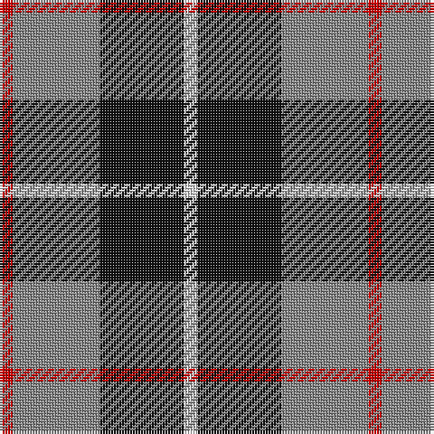

In pattern [RRKW](/stripes/rrkw/).

This was sourced from house-of-tartan.  It is a [4 stripe tartan](/stripes/stripes4/).

Original link http://www.house-of-tartan.scotland.net/house/TartanViewjs.asp?colr=Def&tnam=1629

## Also known as

This cloth is also recorded under:

- Loganair, Uniform Skirt

## Thread count
R/5 N32 K31 LN/5

## Palette
Each colour and the base-6 reference it is a variant of.

| Colour | Shade | Base |
|---|---|---|
| K | <code style="background-color:#101010;">#101010</code> `oklch(17.3% 0.000 89.9)` <small>#101010</small> | K <code style="background-color:#000000;">#000000</code> |
| LN | <code style="background-color:#E0E0E0;">#E0E0E0</code> `oklch(90.7% 0.000 89.9)` <small>#E0E0E0</small> | W <code style="background-color:#F7F7F7;">#F7F7F7</code> |
| N | <code style="background-color:#888888;">#888888</code> `oklch(62.7% 0.000 89.9)` <small>#888888</small> | R <code style="background-color:#CC0000;">#CC0000</code> |
| R | <code style="background-color:#C80000;">#C80000</code> `oklch(52.3% 0.215 29.2)` <small>#C80000</small> | R <code style="background-color:#CC0000;">#CC0000</code> |

# Sample pattern

## Nearest tartans

The nearest existing variants by ΔTartan distance, with this tartan at the top so the swatches line up against it.

ΔTartan

Tartan

Sett

—

<a href="/ttd/edit/#slug=r5o32k31w5">Loganair Uniform Skirt Corporate Tartan Tartan Number: 1629. Earliest known date: c.1985 Half actual count for display. Used until 1988 See products available Copyright © Blair Urquhart, Comrie, 2015</a> <a class="nn-out" href="/setts/s4/r5o32k31w5/" title="open its dictionary page">↗</a>

0.11

<a href="/ttd/edit/#slug=r5o32k31w5~x2">Loganair</a> <a class="nn-out" href="/setts/s4/r5o32k31w5~x2/" title="open its dictionary page">↗</a>

0.43

<a href="/ttd/edit/#slug=r3o16k16lb3~x4">Thompson, Dress (Clan)</a> <a class="nn-out" href="/setts/s4/r3o16k16lb3~x4/" title="open its dictionary page">↗</a>

0.78

<a href="/ttd/edit/#slug=o5dp3o18k16ly3~x4">New York State Police Pipe Band</a> <a class="nn-out" href="/setts/s5/o5dp3o18k16ly3~x4/" title="open its dictionary page">↗</a>

0.90

<a href="/ttd/edit/#slug=k4w3k4y9r1~x4">Oban Grey</a> <a class="nn-out" href="/setts/s5/k4w3k4y9r1~x4/" title="open its dictionary page">↗</a>

0.91

<a href="/ttd/edit/#slug=r5y32k31w5~x2">Loganair, Uniform Skirt</a> <a class="nn-out" href="/setts/s4/r5y32k31w5~x2/" title="open its dictionary page">↗</a>

0.94

<a href="/ttd/edit/#slug=k4w3k4o9r1~x4">Oban Grey District Tartan Tartan Number: 1237. Earliest known date: pre 2003 Not an official district but a name chosen by the weavers. See products available Copyright © Blair Urquhart, Comrie, 2015</a> <a class="nn-out" href="/setts/s5/k4w3k4o9r1~x4/" title="open its dictionary page">↗</a>

1.03

<a href="/ttd/edit/#slug=g21db34r14w6~x2">Harbison (2015)</a> <a class="nn-out" href="/setts/s4/g21db34r14w6~x2/" title="open its dictionary page">↗</a>

1.07

<a href="/ttd/edit/#slug=k4lb4k4o15r2~x4">Oban Grey (Fashion)</a> <a class="nn-out" href="/setts/s5/k4lb4k4o15r2~x4/" title="open its dictionary page">↗</a>

1.09

<a href="/ttd/edit/#slug=db3dg6ly1r3~x10">Delroeux, John Michael (Personal)</a> <a class="nn-out" href="/setts/s4/db3dg6ly1r3~x10/" title="open its dictionary page">↗</a>

1.11

<a href="/ttd/edit/#slug=k3lb3k3n10r1~x6">Greystone (Burberry Grey)</a> <a class="nn-out" href="/setts/s5/k3lb3k3n10r1~x6/" title="open its dictionary page">↗</a>

## Neighbour map

Every grey dot is one of 14299 variants placed by the first two principal components of the ΔTartan feature space (44% of its variance). Red is this tartan; blue dots are its nearest — click one to open its page.

<svg viewBox="0 0 640 380" role="img" style="max-width:100%;height:auto;border:1px solid #e0e0e0;border-radius:4px;display:block" xmlns="http://www.w3.org/2000/svg"><image href="/nn/cloud.v1.png" width="640" height="380"/><a href="/setts/s4/r5o32k31w5~x2/"><circle cx="210.3" cy="241.0" r="4" fill="#3465a4"><title>Loganair</title></circle></a><a href="/setts/s4/r3o16k16lb3~x4/"><circle cx="192.7" cy="253.0" r="4" fill="#3465a4"><title>Thompson, Dress (Clan)</title></circle></a><a href="/setts/s5/o5dp3o18k16ly3~x4/"><circle cx="235.5" cy="233.9" r="4" fill="#3465a4"><title>New York State Police Pipe Band</title></circle></a><a href="/setts/s5/k4w3k4y9r1~x4/"><circle cx="187.5" cy="223.6" r="4" fill="#3465a4"><title>Oban Grey</title></circle></a><a href="/setts/s4/r5y32k31w5~x2/"><circle cx="197.4" cy="237.5" r="4" fill="#3465a4"><title>Loganair, Uniform Skirt</title></circle></a><a href="/setts/s5/k4w3k4o9r1~x4/"><circle cx="185.8" cy="222.5" r="4" fill="#3465a4"><title>Oban Grey District Tartan Tartan Number: 1237. Earliest known date: pre 2003 Not an official district but a name chosen by the weavers. See products available Copyright © Blair Urquhart, Comrie, 2015</title></circle></a><a href="/setts/s4/g21db34r14w6~x2/"><circle cx="176.1" cy="265.6" r="4" fill="#3465a4"><title>Harbison (2015)</title></circle></a><a href="/setts/s5/k4lb4k4o15r2~x4/"><circle cx="242.6" cy="217.8" r="4" fill="#3465a4"><title>Oban Grey (Fashion)</title></circle></a><a href="/setts/s4/db3dg6ly1r3~x10/"><circle cx="171.0" cy="256.6" r="4" fill="#3465a4"><title>Delroeux, John Michael (Personal)</title></circle></a><a href="/setts/s5/k3lb3k3n10r1~x6/"><circle cx="231.0" cy="209.1" r="4" fill="#3465a4"><title>Greystone (Burberry Grey)</title></circle></a><circle cx="209.3" cy="239.4" r="5" fill="#c00000"/></svg>

ID: /setts/s4/r5o32k31w5/
