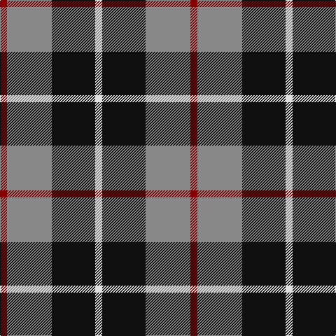

This page is one **sett** — a single exact thread-count. It belongs to the [tartan](/tartans/r5o32k31w5/)
(the same proportion at any scale), whose colour order is pattern [RRKW](/stripes/rrkw/).

Sourced from register-of-tartans.  It is a [4 stripe tartan](/stripes/stripes4/).

Original link https://www.tartanregister.gov.uk/tartanDetails.aspx?ref=2190

2 attestations — the source records this cloth was collapsed from (oldest owns this page)

<ul>
<li>01/01/1988 — Loganair (register-of-tartans, <a href="https://www.tartanregister.gov.uk/tartanDetails.aspx?ref=2190">record</a>)</li>
<li>pre 1988 — Loganair (Corporate) (tartans-authority, <a href="http://www.tartansauthority.com/tartan-ferret/display/1629/">record</a>)</li>
</ul>

## Register references

External register numbers recorded for this tartan.

- Scottish Register of Tartans: [2190](https://www.tartanregister.gov.uk/tartanDetails.aspx?ref=2190)
- Scottish Tartans Authority (ITI): 1629
- Scottish Tartans World Register: 1629

## Thread count
DR/10 N64 K62 LN/10

## Palette

Palette: <strong>Tartan Register</strong>
<table><thead><tr><th>Colour</th><th>Threads</th><th>Shade</th><th>Base</th><th>OKLCh</th></tr></thead><tbody><tr><td>DR/</td><td style="text-align:right;font-variant-numeric:tabular-nums">10</td><td><code style="background-color:#880000;">#880000</code> <small style="color:#888">#880000</small></td><td>R <code style="background-color:#CC0000;">#CC0000</code></td><td><small style="color:#888">oklch(39.4% 0.162 29.2)</small></td></tr><tr><td>N</td><td style="text-align:right;font-variant-numeric:tabular-nums">64</td><td><code style="background-color:#888888;">#888888</code> <small style="color:#888">#888888</small></td><td>R <code style="background-color:#CC0000;">#CC0000</code></td><td><small style="color:#888">oklch(62.7% 0.000 89.9)</small></td></tr><tr><td>K</td><td style="text-align:right;font-variant-numeric:tabular-nums">62</td><td><code style="background-color:#101010;">#101010</code> <small style="color:#888">#101010</small></td><td>K <code style="background-color:#000000;">#000000</code></td><td><small style="color:#888">oklch(17.3% 0.000 89.9)</small></td></tr><tr><td>LN/</td><td style="text-align:right;font-variant-numeric:tabular-nums">10</td><td><code style="background-color:#E0E0E0;">#E0E0E0</code> <small style="color:#888">#E0E0E0</small></td><td>W <code style="background-color:#F7F7F7;">#F7F7F7</code></td><td><small style="color:#888">oklch(90.7% 0.000 89.9)</small></td></tr></tbody></table>

# Sample pattern

## Nearest tartans

The nearest existing variants by ΔTartan distance, with this tartan at the top so the swatches line up against it.

ΔTartan

Tartan

Sett

—

<a href="/ttd/edit/#slug=r5o32k31w5~x2">Loganair</a> <a class="nn-out" href="/setts/s4/r5o32k31w5~x2/" title="open its dictionary page">↗</a>

0.11

<a href="/ttd/edit/#slug=r5o32k31w5">Loganair Uniform Skirt Corporate Tartan Tartan Number: 1629. Earliest known date: c.1985 Half actual count for display. Used until 1988 See products available Copyright © Blair Urquhart, Comrie, 2015</a> <a class="nn-out" href="/setts/s4/r5o32k31w5/" title="open its dictionary page">↗</a>

0.40

<a href="/ttd/edit/#slug=r3o16k16lb3~x4">Thompson, Dress (Clan)</a> <a class="nn-out" href="/setts/s4/r3o16k16lb3~x4/" title="open its dictionary page">↗</a>

0.79

<a href="/ttd/edit/#slug=o5dp3o18k16ly3~x4">New York State Police Pipe Band</a> <a class="nn-out" href="/setts/s5/o5dp3o18k16ly3~x4/" title="open its dictionary page">↗</a>

0.87

<a href="/ttd/edit/#slug=r5y32k31w5~x2">Loganair, Uniform Skirt</a> <a class="nn-out" href="/setts/s4/r5y32k31w5~x2/" title="open its dictionary page">↗</a>

0.93

<a href="/ttd/edit/#slug=k4w3k4y9r1~x4">Oban Grey</a> <a class="nn-out" href="/setts/s5/k4w3k4y9r1~x4/" title="open its dictionary page">↗</a>

0.97

<a href="/ttd/edit/#slug=k4w3k4o9r1~x4">Oban Grey District Tartan Tartan Number: 1237. Earliest known date: pre 2003 Not an official district but a name chosen by the weavers. See products available Copyright © Blair Urquhart, Comrie, 2015</a> <a class="nn-out" href="/setts/s5/k4w3k4o9r1~x4/" title="open its dictionary page">↗</a>

1.00

<a href="/ttd/edit/#slug=g21db34r14w6~x2">Harbison (2015)</a> <a class="nn-out" href="/setts/s4/g21db34r14w6~x2/" title="open its dictionary page">↗</a>

1.08

<a href="/ttd/edit/#slug=r1dg6db6w1~x4">Salt Spring Island</a> <a class="nn-out" href="/setts/s4/r1dg6db6w1~x4/" title="open its dictionary page">↗</a>

1.09

<a href="/ttd/edit/#slug=k3lb3k3n10r1~x6">Greystone (Burberry Grey)</a> <a class="nn-out" href="/setts/s5/k3lb3k3n10r1~x6/" title="open its dictionary page">↗</a>

1.09

<a href="/ttd/edit/#slug=r1k6y6b1~x10">Mayer, Chris (Personal)</a> <a class="nn-out" href="/setts/s4/r1k6y6b1~x10/" title="open its dictionary page">↗</a>

## Neighbour map

Every grey dot is one of 14299 variants placed by the first two principal components of the ΔTartan feature space (44% of its variance). Red is this tartan; blue dots are its nearest — click one to open its page.

<svg viewBox="0 0 640 380" role="img" style="max-width:100%;height:auto;border:1px solid #e0e0e0;border-radius:4px;display:block" xmlns="http://www.w3.org/2000/svg"><image href="/nn/cloud.v1.png" width="640" height="380"/><a href="/setts/s4/r5o32k31w5/"><circle cx="209.3" cy="239.4" r="4" fill="#3465a4"><title>Loganair Uniform Skirt Corporate Tartan Tartan Number: 1629. Earliest known date: c.1985 Half actual count for display. Used until 1988 See products available Copyright © Blair Urquhart, Comrie, 2015</title></circle></a><a href="/setts/s4/r3o16k16lb3~x4/"><circle cx="192.7" cy="253.0" r="4" fill="#3465a4"><title>Thompson, Dress (Clan)</title></circle></a><a href="/setts/s5/o5dp3o18k16ly3~x4/"><circle cx="235.5" cy="233.9" r="4" fill="#3465a4"><title>New York State Police Pipe Band</title></circle></a><a href="/setts/s4/r5y32k31w5~x2/"><circle cx="197.4" cy="237.5" r="4" fill="#3465a4"><title>Loganair, Uniform Skirt</title></circle></a><a href="/setts/s5/k4w3k4y9r1~x4/"><circle cx="187.5" cy="223.6" r="4" fill="#3465a4"><title>Oban Grey</title></circle></a><a href="/setts/s5/k4w3k4o9r1~x4/"><circle cx="185.8" cy="222.5" r="4" fill="#3465a4"><title>Oban Grey District Tartan Tartan Number: 1237. Earliest known date: pre 2003 Not an official district but a name chosen by the weavers. See products available Copyright © Blair Urquhart, Comrie, 2015</title></circle></a><a href="/setts/s4/g21db34r14w6~x2/"><circle cx="176.1" cy="265.6" r="4" fill="#3465a4"><title>Harbison (2015)</title></circle></a><a href="/setts/s4/r1dg6db6w1~x4/"><circle cx="199.8" cy="254.4" r="4" fill="#3465a4"><title>Salt Spring Island</title></circle></a><a href="/setts/s5/k3lb3k3n10r1~x6/"><circle cx="231.0" cy="209.1" r="4" fill="#3465a4"><title>Greystone (Burberry Grey)</title></circle></a><a href="/setts/s4/r1k6y6b1~x10/"><circle cx="191.8" cy="243.9" r="4" fill="#3465a4"><title>Mayer, Chris (Personal)</title></circle></a><circle cx="210.3" cy="241.0" r="5" fill="#c00000"/></svg>

ID: /setts/s4/r5o32k31w5~x2/
