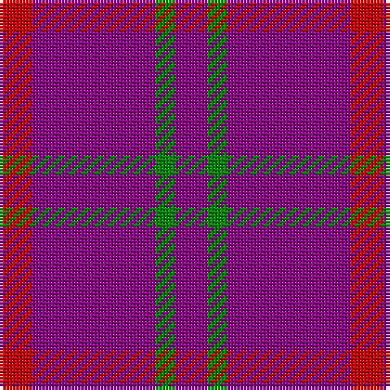

This page is one **sett** — a single exact thread-count. It belongs to the [tartan](/tartans/r5p19g3p5/)
(the same proportion at any scale), whose colour order is pattern [BGBR](/stripes/bgbr/).

Sourced from weddslist.  It is a [4 stripe tartan](/stripes/stripes4/).

Original link http://www.weddslist.com/cgi-bin/tartans/pg.pl?source=sts

## Thread count
R/10 P38 G6 P/10

## Palette

Palette: <strong>custom</strong>
<table><thead><tr><th>Colour</th><th>Threads</th><th>Shade</th><th>Base</th><th>OKLCh</th></tr></thead><tbody><tr><td>R/</td><td style="text-align:right;font-variant-numeric:tabular-nums">10</td><td><code style="background-color:#C00000;">#C00000</code> <small style="color:#888">#C00000</small></td><td>R <code style="background-color:#CC0000;">#CC0000</code></td><td><small style="color:#888">oklch(50.7% 0.208 29.2)</small></td></tr><tr><td>P</td><td style="text-align:right;font-variant-numeric:tabular-nums">38</td><td><code style="background-color:#800080;">#800080</code> <small style="color:#888">#800080</small></td><td>B <code style="background-color:#2A418A;">#2A418A</code></td><td><small style="color:#888">oklch(42.1% 0.193 328.4)</small></td></tr><tr><td>G</td><td style="text-align:right;font-variant-numeric:tabular-nums">6</td><td><code style="background-color:#008000;">#008000</code> <small style="color:#888">#008000</small></td><td>G <code style="background-color:#006100;">#006100</code></td><td><small style="color:#888">oklch(52.0% 0.177 142.5)</small></td></tr><tr><td>P/</td><td style="text-align:right;font-variant-numeric:tabular-nums">10</td><td><code style="background-color:#800080;">#800080</code> <small style="color:#888">#800080</small></td><td>B <code style="background-color:#2A418A;">#2A418A</code></td><td><small style="color:#888">oklch(42.1% 0.193 328.4)</small></td></tr></tbody></table>

# Sample pattern

## Nearest tartans

The nearest existing variants by ΔTartan distance, with this tartan at the top so the swatches line up against it.

ΔTartan

Tartan

Sett

—

<a href="/ttd/edit/#slug=r5p19g3p5~x2">Highland Spring</a> <a class="nn-out" href="/setts/s4/r5p19g3p5~x2/" title="open its dictionary page">↗</a>

1.00

<a href="/ttd/edit/#slug=dp5g2dp19r5~x2">Highland Spring Corporate Tartan Tartan Number: 130. Earliest known date: 1987 Highland Spring manufacture bottled drinking water at Blackford in Perthshire, Scotland. See products available Copyright © Blair Urquhart, Comrie, 2015</a> <a class="nn-out" href="/setts/s4/dp5g2dp19r5~x2/" title="open its dictionary page">↗</a>

1.48

<a href="/ttd/edit/#slug=dp3g1dp9r3~x4">Highland Spring (1988) (Corporate)</a> <a class="nn-out" href="/setts/s4/dp3g1dp9r3~x4/" title="open its dictionary page">↗</a>

1.97

<a href="/setts/s6/dp3g1dp9r3~x4/">Highland Spring (1988)</a>

2.30

<a href="/ttd/edit/#slug=r2p20db9p20g2~x2">Scottish Netball Association</a> <a class="nn-out" href="/setts/s5/r2p20db9p20g2~x2/" title="open its dictionary page">↗</a>

2.44

<a href="/ttd/edit/#slug=r12dp3r7dp52dg4dp4~x2">Lynch Variant</a> <a class="nn-out" href="/setts/s6/r12dp3r7dp52dg4dp4~x2/" title="open its dictionary page">↗</a>

2.64

<a href="/ttd/edit/#slug=dp30m5dp5b4dp4g12~x2">International Festival of Authors (C</a> <a class="nn-out" href="/setts/s6/dp30m5dp5b4dp4g12~x2/" title="open its dictionary page">↗</a>

2.64

<a href="/ttd/edit/#slug=db27r5db27r3db3r30db23~x2">Unidentified Plaid #10</a> <a class="nn-out" href="/setts/s7/db27r5db27r3db3r30db23~x2/" title="open its dictionary page">↗</a>

2.68

<a href="/ttd/edit/#slug=r2dp20db9dp20g2~x2">Scottish Netball (1987) (Corporate)</a> <a class="nn-out" href="/setts/s5/r2dp20db9dp20g2~x2/" title="open its dictionary page">↗</a>

2.72

<a href="/ttd/edit/#slug=dp20t8g8db8dp33r3~x2">McIntosh, Stuart (Personal)</a> <a class="nn-out" href="/setts/s6/dp20t8g8db8dp33r3~x2/" title="open its dictionary page">↗</a>

2.78

<a href="/ttd/edit/#slug=db1r9db2r9lo1~x4">Brooks Brothers Tattersall Red</a> <a class="nn-out" href="/setts/s5/db1r9db2r9lo1~x4/" title="open its dictionary page">↗</a>

## Neighbour map

Every grey dot is one of 14299 variants placed by the first two principal components of the ΔTartan feature space (44% of its variance). Red is this tartan; blue dots are its nearest — click one to open its page.

<svg viewBox="0 0 640 380" role="img" style="max-width:100%;height:auto;border:1px solid #e0e0e0;border-radius:4px;display:block" xmlns="http://www.w3.org/2000/svg"><image href="/nn/cloud.v1.png" width="640" height="380"/><a href="/setts/s4/dp5g2dp19r5~x2/"><circle cx="561.7" cy="271.6" r="4" fill="#3465a4"><title>Highland Spring Corporate Tartan Tartan Number: 130. Earliest known date: 1987 Highland Spring manufacture bottled drinking water at Blackford in Perthshire, Scotland. See products available Copyright © Blair Urquhart, Comrie, 2015</title></circle></a><a href="/setts/s4/dp3g1dp9r3~x4/"><circle cx="502.2" cy="275.3" r="4" fill="#3465a4"><title>Highland Spring (1988) (Corporate)</title></circle></a><a href="/setts/s6/dp3g1dp9r3~x4/"><circle cx="551.8" cy="265.0" r="4" fill="#3465a4"><title>Highland Spring (1988)</title></circle></a><a href="/setts/s5/r2p20db9p20g2~x2/"><circle cx="543.6" cy="272.8" r="4" fill="#3465a4"><title>Scottish Netball Association</title></circle></a><a href="/setts/s6/r12dp3r7dp52dg4dp4~x2/"><circle cx="530.0" cy="190.3" r="4" fill="#3465a4"><title>Lynch Variant</title></circle></a><a href="/setts/s6/dp30m5dp5b4dp4g12~x2/"><circle cx="364.8" cy="209.6" r="4" fill="#3465a4"><title>International Festival of Authors (C</title></circle></a><a href="/setts/s7/db27r5db27r3db3r30db23~x2/"><circle cx="437.3" cy="257.1" r="4" fill="#3465a4"><title>Unidentified Plaid #10</title></circle></a><a href="/setts/s5/r2dp20db9dp20g2~x2/"><circle cx="555.9" cy="281.1" r="4" fill="#3465a4"><title>Scottish Netball (1987) (Corporate)</title></circle></a><a href="/setts/s6/dp20t8g8db8dp33r3~x2/"><circle cx="387.3" cy="215.6" r="4" fill="#3465a4"><title>McIntosh, Stuart (Personal)</title></circle></a><a href="/setts/s5/db1r9db2r9lo1~x4/"><circle cx="606.7" cy="273.8" r="4" fill="#3465a4"><title>Brooks Brothers Tattersall Red</title></circle></a><circle cx="501.5" cy="278.9" r="5" fill="#c00000"/></svg>

ID: /setts/s4/r5p19g3p5~x2/
