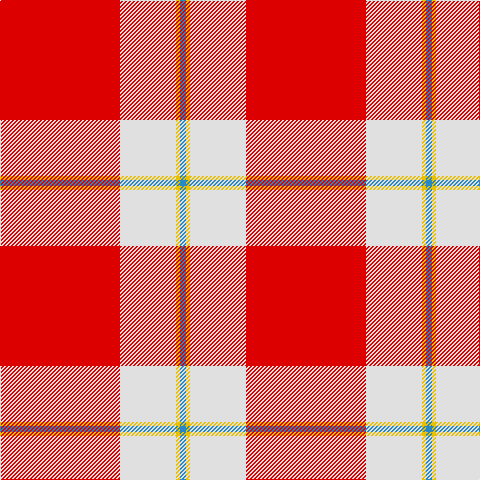

**Bands:** [RWYB](/stripes/rwyb/) · **Stripes:** [R W LY T](/stripes/stripes4/) R W LY T

This was sourced from register-of-tartans.  It is a [4 band tartan](/bands/bands4/).

Original link https://www.tartanregister.gov.uk/tartanDetails.aspx?ref=11283

## Attestations

This cloth appears in 2 source records; the oldest owns this page.

- 01/03/2015 — Willis, H Graham (register-of-tartans, [record](https://www.tartanregister.gov.uk/tartanDetails.aspx?ref=11283))
- 2015 — Willis, H Graham (tartans-authority, [record](http://www.tartansauthority.com/tartan-ferret/display/11283/))

## Register references

External register numbers recorded for this tartan.

- Scottish Register of Tartans: [11283](https://www.tartanregister.gov.uk/tartanDetails.aspx?ref=11283)

## Thread count
R/120 LN56 Y4 B/6

## Palette
Each colour and its ΔE from the base-6 reference it is a variant of.

| Colour | Shade | Base | ΔE (OKLab) |
|---|---|---|---|
| B | <code style="background-color:#2888C4;">#2888C4</code> `#2888C4` | B <code style="background-color:#2A418A;">#2A418A</code> | 0.21 |
| LN | <code style="background-color:#E0E0E0;">#E0E0E0</code> `#E0E0E0` | W <code style="background-color:#F7F7F7;">#F7F7F7</code> | 0.07 |
| R | <code style="background-color:#DC0000;">#DC0000</code> `#DC0000` | R <code style="background-color:#CC0000;">#CC0000</code> | 0.03 |
| Y | <code style="background-color:#E8C000;">#E8C000</code> `#E8C000` | Y <code style="background-color:#F2BF00;">#F2BF00</code> | 0.02 |

# Sample pattern

## Nearest tartans

The nearest existing variants by ΔTartan distance.

1. [MacLaine of Lochbuie](/setts/s4/r32dg8lb4ly1/) — ΔT 1.50
1. [Nicolson Dress (Clan)](/setts/s5/r62db8w20k3g4~x2/) — ΔT 1.59
1. [MacGregor - 2005 (Black - Personal)](/setts/s6/r41w19r7w8w1k3~x2/) — ΔT 1.62
1. [Davet (2014)](/setts/s6/t5k1w11k1r42k1~x2/) — ΔT 1.64
1. [Davet (2014)](/setts/s6/lg5k1w11k1r42k1~x2/) — ΔT 1.67
1. [Unidentified Locket](/setts/s4/db4r50dg25w2~x2/) — ΔT 1.69
1. [Sildesalaten](/setts/s5/r32w4dt7ly2t2~x5/) — ΔT 1.80
1. [Sildesalaten](/setts/s5/r32lb4dt7ly2t2~x5/) — ΔT 1.86
1. [Washington State University Cougar](/setts/s7/r6w3n6lb10r38w2n4/) — ΔT 1.87
1. [Loch Morar Trade Tartan Tartan Number: 1701. Earliest known date: pre 2003 Nothing See products available Copyright © Blair Urquhart, Comrie, 2015](/setts/s5/r38w9r3do9w3~x2/) — ΔT 1.89

## Neighbour map

Every grey dot is one of 14299 variants placed by the first two principal components of the ΔTartan feature space (44% of its variance). Red is this tartan; blue dots are its nearest — click one to open its page.

<svg viewBox="0 0 640 380" role="img" style="max-width:100%;height:auto;border:1px solid #e0e0e0;border-radius:4px;display:block" xmlns="http://www.w3.org/2000/svg"><image href="/nn/cloud.v1.png" width="640" height="380"/><a href="/setts/s4/r32dg8lb4ly1/"><circle cx="490.6" cy="155.4" r="4" fill="#3465a4"><title>MacLaine of Lochbuie</title></circle></a><a href="/setts/s5/r62db8w20k3g4~x2/"><circle cx="375.7" cy="127.1" r="4" fill="#3465a4"><title>Nicolson Dress (Clan)</title></circle></a><a href="/setts/s6/r41w19r7w8w1k3~x2/"><circle cx="408.6" cy="120.3" r="4" fill="#3465a4"><title>MacGregor - 2005 (Black - Personal)</title></circle></a><a href="/setts/s6/t5k1w11k1r42k1~x2/"><circle cx="464.5" cy="90.9" r="4" fill="#3465a4"><title>Davet (2014)</title></circle></a><a href="/setts/s6/lg5k1w11k1r42k1~x2/"><circle cx="457.5" cy="85.0" r="4" fill="#3465a4"><title>Davet (2014)</title></circle></a><a href="/setts/s4/db4r50dg25w2~x2/"><circle cx="414.8" cy="174.9" r="4" fill="#3465a4"><title>Unidentified Locket</title></circle></a><a href="/setts/s5/r32w4dt7ly2t2~x5/"><circle cx="403.6" cy="134.6" r="4" fill="#3465a4"><title>Sildesalaten</title></circle></a><a href="/setts/s5/r32lb4dt7ly2t2~x5/"><circle cx="417.2" cy="142.4" r="4" fill="#3465a4"><title>Sildesalaten</title></circle></a><a href="/setts/s7/r6w3n6lb10r38w2n4/"><circle cx="413.2" cy="141.2" r="4" fill="#3465a4"><title>Washington State University Cougar</title></circle></a><a href="/setts/s5/r38w9r3do9w3~x2/"><circle cx="414.5" cy="182.1" r="4" fill="#3465a4"><title>Loch Morar Trade Tartan Tartan Number: 1701. Earliest known date: pre 2003 Nothing See products available Copyright © Blair Urquhart, Comrie, 2015</title></circle></a><circle cx="431.5" cy="145.4" r="5" fill="#c00000"/></svg>

ID: /setts/s4/r60w28ly2t3~x2/
